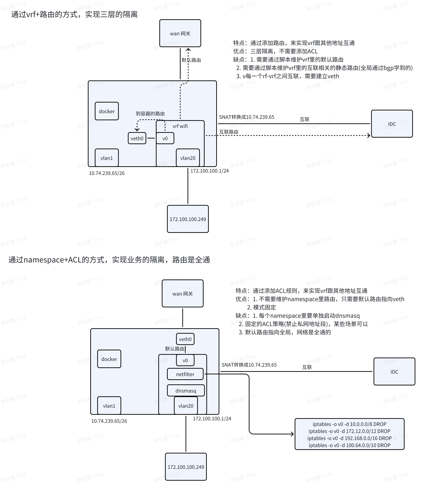

1. 屈臣氏环境准备
   1. 屈臣氏版本用的5.14.15内核，需要升级内核才能正常使用vrf功能
   2. 按屈臣氏规划，配置好接口和vlan相关参数，建立好互联
2. 升级kernel和iproute版本
   1. ```Bash
      yum install -y kernel-ml-5.16.16-1.el7.x86_64 kernel-ml-headers-5.16.16-1.el7.x86_64 kernel-ml-devel-5.16.16-1.el7.x86_64
      yum install iproute
      ```
3. 增加内核配置，确保DNSMASQ能处理vrf接口的dhcp报文。
   1. /etc/sysctl.conf里添加后，执行sysctl -p
   2. ```Bash
      net.ipv4.tcp_l3mdev_accept = 1
      net.ipv4.udp_l3mdev_accept = 1
      net.ipv4.raw_l3mdev_accept = 1
      ```

   3. 重启dnsmasq服务
4. 通过iprule创建并配置vrf：

```Bash
# 创建vrf
vrfname=wifi
ip link add $vrfname type vrf table 1000
ip link set $vrfname up
ip route add vrf $vrfname unreachable default metric 4278198272

# 把local表的优先级调整比vrf低
ip rule add table local pref 2000
ip rule del pref 0

# 把vlan加入vrf
ip link set dev vlan20 vrf wifi

# vrf里添加默认路由到网关
ip route add vrf $vrfname default via 10.168.1.1
# 因为wan是在默认的vrf，回包会进入默认vrf，所以需要添加路由回到vrf
ip route add 172.100.100.0/24 dev wifi
ip route add 172.100.102.0/23 dev wifi
```

5. 

6. 测试：

1. 正常上网功能
   1. ```Bash
      # vrf里添加路由
      ip route add 0.0.0.0/0 via 10.168.1.1 vrf wifi
      ```

   2. 客户端接入到vlan20后，可以正常通过DHCP获取到地址
   3. 可以正常访问公网
2. 网络隔离功能：
   1. 可以ping通 CPE上vlan20的接口ip地址(同vrf内的地址)
   2. ping不通全局的接口ip地址
   3. ping不通其他vrf内的接口ip地址
3. 网络互通功能：
   1. 使用veth，打通vrf和全局
      1. ```Bash
         # 创建veth，并设置ip
         ip link add v0 type veth
         ip link set dev v0 up 
         ip link set dev veth0 up
         ip addr add dev v0 1.1.1.1/30
         ip addr add dev veth0 1.1.1.2/30
         # 把veth一端放入到vrf
         ip link set v0 vrf wifi
         ```

      2. 客户端访问docker内的guestwifi认证程序，添加以下路由，客户端能正常访问容器，正常访问认证页面
      3. ```Bash
         # vrf里添加路由
         ip route add 172.100.101.0/24 via 1.1.1.2 vrf wifi
         ```

      4. 客户端访问IDC的guestwifi认证程序
         1. **方式一：**添加以下路由，访问不通10.82.44.106，抓包发现snat规则匹配不上(指定了出接口ipip+)
         2. ```Bash
            ip route add 10.82.44.106/32 via 1.1.1.2 vrf wifi
            ```

         3. **方式二：**添加以下路由：可以正常访问10.82.44.106，snat规则可以正常匹配，但是后期bgp路由变化时，不能自动更新vrf里的路由
         4. ```Bash
            ip route add 10.82.44.106/32 dev ipip25882i vrf wifi
            ```
   2. 通过veth后，会影响SNAT规则：
      1. 添加SNAT规则:172.100.100.0/22->10.82.44.106/32，出接口ipip+，转换成10.74.239.65
      2. ```Bash
         iptables -t nat -I POSTROUTING 2 -s 172.100.100.0/22 -d 10.82.44.106/32 -o ipip+ -j SNAT --to-source 10.74.239.65
         ```

      3. 添加以下iptables日志规则
      4. ```Bash
         iptables -t mangle -I PREROUTING -d 10.82.44.106 -j LOG --log-prefix 'manglePREROUTING:'
         iptables -t mangle -I POSTROUTING -d 10.82.44.106 -j LOG --log-prefix 'manglePOSTROUTING:'
         iptables -t nat -I PREROUTING -d 10.82.44.106 -j LOG --log-prefix 'natPREROUTING:'
         iptables -t nat -I POSTROUTING -d 10.82.44.106 -j LOG --log-prefix 'natPOSTROUTING:'
         ```

      5. 客户端上ping 10.82.44.106查看系统日志：发现nat表的natPOSTROUTING只匹配了一次，并且出接口是vrf的接口名称，跟规则的出接口ipip+对应不上
      6. ```Plain
         manglePREROUTING:IN=vlan20 OUT= SRC=172.100.100.249 DST=10.82.44.106 LEN=84 TOS=0x00 PREC=0x00 TTL=64 ID=17440 DF PROTO=ICMP TYPE=8 CODE=0 ID=62671 SEQ=1 
         natPREROUTING:IN=vlan20 OUT= SRC=172.100.100.249 DST=10.82.44.106 LEN=84 TOS=0x00 PREC=0x00 TTL=65 ID=17440 DF PROTO=ICMP TYPE=8 CODE=0 ID=62671 SEQ=1 
         manglePREROUTING:IN=wifi OUT= SRC=172.100.100.249 DST=10.82.44.106 LEN=84 TOS=0x00 PREC=0x00 TTL=65 ID=17440 DF PROTO=ICMP TYPE=8 CODE=0 ID=62671 SEQ=1 
         manglePOSTROUTING:IN=wifi OUT=v0 SRC=172.100.100.249 DST=10.82.44.106 LEN=84 TOS=0x00 PREC=0x00 TTL=65 ID=17440 DF PROTO=ICMP TYPE=8 CODE=0 ID=62671 SEQ=1 MARK=0x8 
         natPOSTROUTING:IN=wifi OUT=v0 SRC=172.100.100.249 DST=10.82.44.106 LEN=84 TOS=0x00 PREC=0x00 TTL=65 ID=17440 DF PROTO=ICMP TYPE=8 CODE=0 ID=62671 SEQ=1 MARK=0x8 
         manglePREROUTING:IN=veth0 OUT= SRC=172.100.100.249 DST=10.82.44.106 LEN=84 TOS=0x00 PREC=0x00 TTL=65 ID=17440 DF PROTO=ICMP TYPE=8 CODE=0 ID=62671 SEQ=1 MARK=0x8 
         manglePOSTROUTING:IN=veth0 OUT=ipip25882i SRC=172.100.100.249 DST=10.82.44.106 LEN=84 TOS=0x00 PREC=0x00 TTL=65 ID=17440 DF PROTO=ICMP TYPE=8 CODE=0 ID=62671 SEQ=1 MARK=0x8 
         ```

      7. 修改SNAT规则，去掉出接口限制，规则可以匹配上，但是从veth接口上抓包，发现就已经被NAT了。从veth0再次进入全局时，发现源地址是本机ip，直接被kernel drop了
      8. ```Bash
         iptables -t nat -I POSTROUTING 2 -s 172.100.100.0/22 -d 10.82.44.106/32 -j SNAT --to-source 10.74.239.65
         ```

         1. iptables日志:
         
      9. ```Bash
         manglePREROUTING:IN=vlan20 OUT= SRC=172.100.100.249 DST=10.82.44.106 LEN=84 TOS=0x00 PREC=0x00 TTL=64 ID=45721 DF PROTO=ICMP TYPE=8 CODE=0 ID=64351 SEQ=1 
         natPREROUTING:IN=vlan20 OUT= SRC=172.100.100.249 DST=10.82.44.106 LEN=84 TOS=0x00 PREC=0x00 TTL=65 ID=45721 DF PROTO=ICMP TYPE=8 CODE=0 ID=64351 SEQ=1 
         manglePREROUTING:IN=wifi OUT= SRC=172.100.100.249 DST=10.82.44.106 LEN=84 TOS=0x00 PREC=0x00 TTL=65 ID=45721 DF PROTO=ICMP TYPE=8 CODE=0 ID=64351 SEQ=1 
         manglePOSTROUTING:IN=wifi OUT=v0 SRC=172.100.100.249 DST=10.82.44.106 LEN=84 TOS=0x00 PREC=0x00 TTL=65 ID=45721 DF PROTO=ICMP TYPE=8 CODE=0 ID=64351 SEQ=1 MARK=0x8 
         natPOSTROUTING:IN=wifi OUT=v0 SRC=172.100.100.249 DST=10.82.44.106 LEN=84 TOS=0x00 PREC=0x00 TTL=65 ID=45721 DF PROTO=ICMP TYPE=8 CODE=0 ID=64351 SEQ=1 MARK=0x8 
         manglePREROUTING:IN=veth0 OUT= SRC=10.74.239.65 DST=10.82.44.106 LEN=84 TOS=0x00 PREC=0x00 TTL=65 ID=45721 DF PROTO=ICMP TYPE=8 CODE=0 ID=64351 SEQ=1 MARK=0x8 
         natPREROUTING:IN=veth0 OUT= SRC=10.74.239.65 DST=10.82.44.106 LEN=84 TOS=0x00 PREC=0x00 TTL=66 ID=45721 DF PROTO=ICMP TYPE=8 CODE=0 ID=64351 SEQ=1 MARK=0x8
         ```

1. 遗留问题：