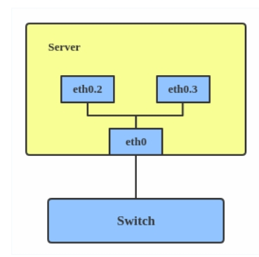

# linux网络虚拟化

linux下有丰富的虚拟网络功能，是云计算时代的基础

接口查询帮助： ip link help

```Shell
TYPE := { vlan | veth | vcan | dummy | ifb | macvlan | macvtap |
          bridge | bond | team | ipoib | ip6tnl | ipip | sit | vxlan |
          gre | gretap | ip6gre | ip6gretap | vti | nlmon | team_slave |
          bond_slave | ipvlan | geneve | bridge_slave | vrf | macsec }
ip link help [ TYPE ]
```

## bridge、bridge_slave 

Linux网桥的行为类似于网络交换机。它在与其连接的接口之间转发数据包。它通常用于在路由器，网关或虚拟机与主机上的网络命名空间之间转发数据包。它还支持STP，VLAN过滤和多播侦听。

```Shell
ip link add br0 type bridge
ip link set eth0 master br0
ip link set tap1 master br0
ip link set tap2 master br0
ip link set veth1 master br0
```

## vrf(Virtual Routing and Forwarding)

- Linux内核的Virtual Routing and Forwarding (VRF) 是由路由表和一组网络设备组成的路由实例。

## vlan(Virtual LAN)

VLAN（也称为虚拟LAN）通过向网络数据包添加标签来分隔广播域。VLAN使网络管理员可以将同一台交换机下或不同交换机之间的主机分组。



```Shell
ip link add link eth0 name eth0.2 type vlan id 2
ip link add link eth0 name eth0.3 type vlan id 3
```

## veth(Virtual Ethernet)

VETH（虚拟以太网）设备是本地以太网隧道。设备是成对创建的，如下图所示。


## dummy

- dummy 接口的工作方式和 loopback 接口类似，但是你可以创建任意多的 dummy 接口。它提供路由数据包的功能，但实际上又不进行转发。dummy 接口主要有两个用途：
  - 用于主机内的程序通信
  - dummy 接口总是 up（除非显式将管理状态设置为 down），在拥有多个物理接口的网络上，可以将 service 地址设置为 loopback 接口或 dummy 接口的地址，这样 service 地址不会因为物理接口的状态而受影响

## ifb(Intermediate Functional Block)

-  ifb驱动模拟一块虚拟网卡，它可以被看作是一个只有TC过滤功能的虚拟网卡，说它只有过滤功能，是因为它并不改变数据包的方向，即对于往外发的数据包被重定向到ifb之后，经过ifb的TC过滤之后，依然是通过重定向之前的网卡发出去，对于一个网卡接收的数据包，被重定向到ifb之后，经过ifb的TC过滤之后，依然被重定向之前的网卡继续进行接收处理，不管是从一块网卡发送数据包还是从一块网卡接收数据包，重定向到ifb之后，都要经过一个经由ifb虚拟网卡的dev_queue_xmit操作。
- 官方文档：[networking:ifb [Wiki\] (linuxfoundation.org)](https://wiki.linuxfoundation.org/networking/ifb)

## macvlan、macvtap 、ipvlan

1. macvlan 这种技术能将一块物理网卡虚拟成多块虚拟网卡，它可以为一张物理同时要求物理网卡打开混杂模式。针对每个mac地址，都可以设置IP地址
   1. macvlan并不创建网络，只创建虚拟网卡
   2. macvlan 是 Linux kernel 支持的新特性，支持的版本有 v3.9-3.19 和 4.0+，比较稳定的版本推荐 4.0+
   3. 根据 macvlan 子接口之间的通信模式，macvlan 有四种网络模式：
      1. private 模式
      2. vepa(virtual ethernet port aggregator) 模式 （默认）
      3. bridge 模式
      4. passthru 模式
2. MACVTAP 的实现基于传统的 MACVLAN. 和 TAP 设备一样，每一个 MACVTAP 设备拥有一个对应的 Linux 字符设备，并拥有和 TAP 设备一样的 IOCTL 接口，因此能直接被 KVM/Qemu使用，方便地完成网络数据交换工作. 引入 MACVTAP 设备的目标是：简化虚拟化环境中的交换网络，代替传统的 Linux TAP 设备加 Bridge 设备组合，同时支持新的虚拟化网络技术，如 802.1 Qbg.
3. ipvlan是linux kernel比较新颖的特性，稳定的版本>=4.2，和macvlan类似，都是从一个主机接口虚拟出多个虚拟网络接口，ipvlan虚拟出的子接口共有物理接口的mac地址，但可配置不同的ip地址。ipvlan是linux kernel比较新颖的特性，从3.19版本就开始支持ipvlan，但是比较稳定推荐的版本是 >=4.2，ipvlan有两种不同的工作模式：L2和L3
   1. L2模式
      1. Ipvlan的L2模式和macvlan的bridge模式工作原理很相似，父接口作为交换机来转发子接口的数据。同一个网络的子接口可以通过父接口来转发数据，而如果想发送到其他网络，报文则会通过父接口的路由转发出去。
   2. L3模式
      1. L3模式下，ipvlan有点像路由器的功能，它在各个虚拟网络和主机网络之间进行不同网络报文的路由转发工作。只要父接口相同，即使虚拟机/容器不在同一个网络，也可以互相ping通对方，因为ipvlan会在中间做报文的转发工作。

L3模式下的虚拟接口不会接收到多播或者广播的报文（ipvlan的虚拟接口会显示NOARP标志），在这个模式下，所有的网络报文都会发送给父接口，因此所有的ARP过程或者多播都是在底层的父接口完成的。需要注意的是：外部网络默认情况下是不知道ipvlan虚拟出来的网络的，如果不在外部路由器上配置好对应的路由规则，ipvlan的网络是不能被外部直接访问的。

## bond、 team、bond_slave、team_slave

## vxlan

- VXLAN（虚拟可扩展局域网）是一种隧道协议，旨在解决IEEE 802.1q中有限的VLAN ID（4,096）的问题。由[IETF RFC 7348](https://tools.ietf.org/html/rfc7348)描述。
- 通过24位网段ID（又称为VXLAN网络标识符（VNI）），VXLAN最多允许2 ^ 24（16,777,216）个虚拟LAN，这是VLAN容量的4,096倍。

VXLAN将带有VXLAN标头的第2层帧封装到UDP-IP数据包中，如下所示：


## NVGRE

1. NVGRE的全称是Network Virtualization using Generic Routing Encapsulation，即使用通用路由协议封装的网络虚拟化。NVGRE通过使用封装策略来创建大量的VLAN子网，这些子网可以扩展到分散的数据中心和2、3层网络
2. 与VXLAN不同的是，NVGRE没有采用标准传输协议（TCP/UDP），而是借助通用路由封装协议（GRE）。NVGRE使用GRE头部的低24位作为租户网络标识符（TNI），与VXLAN一样也可以支持1600万个虚拟网络。

## geneve

1. Generic Network Virtualization Encapsulation的简称，网络虚拟化协议，这个协议的元数据本身是可扩展的。这样，就算需求变化了，这个协议也能扩展以满足需求。这个协议就是GENEVE
2. 


## ipip、gre、gretap、ip6gre、ip6gretap


## macsec (Media Access Control Security)


## ipoib (IP-over-InfiniBand)


## ip6tnl


## sit


## vti


## nlmon (NetLink Monitor)


## vcan(Virtual CAN)
