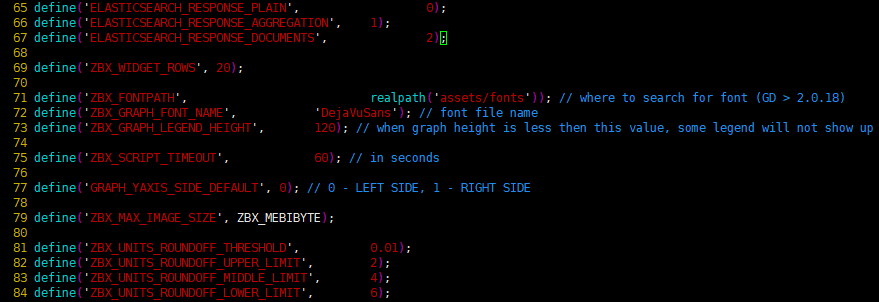

## Linux

### 常用命令

##### 线上查询及帮助

###### man

查看命令帮助，命令的词典，更复杂的还有info，但不常用。

###### help

查看Linux内置命令的帮助，比如cd命令。

##### 文件和目录操作

###### ls

全拼list，功能是列出目录的内容及其内容属性信息。

###### cd

全拼change directory，功能是从当前工作目录切换到指定的工作目录。

###### cp

全拼copy，其功能为复制文件或目录。

###### find

查找的意思，用于查找目录及目录下的文件。

###### mkdir

全拼make directories，其功能是创建目录。

###### mv

全拼move，其功能是移动或重命名文件。

###### pwd

全拼print working directory，其功能是显示当前工作目录的绝对路径。

###### rename

用于重命名文件。

###### rm

全拼remove，其功能是删除一个或多个文件或目录。

###### rmdir

全拼remove empty directories，功能是删除空目录。

###### touch

创建新的空文件，改变已有文件的时间戳属性。

###### tree

功能是以树形结构显示目录下的内容。

###### basename

显示文件名或目录名。

###### dirname

显示文件或目录路径。

###### chattr

改变文件的扩展属性。

###### lsattr

查看文件扩展属性。

###### file

显示文件的类型。

###### md5sum

计算和校验文件的MD5值。


##### 查看文件及内容处理

###### cat

全拼concatenate，功能是用于连接多个文件并且打印到屏幕输出或重定向到指定文件中。

###### tac

tac是cat的反向拼写，因此命令的功能为反向显示文件内容。

###### more

分页显示文件内容。

###### less

分页显示文件内容，more命令的相反用法。

###### head

显示文件内容的头部。

###### tail

显示文件内容的尾部。

###### cut

将文件的每一行按指定分隔符分割并输出。

###### split

分割文件为不同的小片段。

###### paste

按行合并文件内容。

###### sort

对文件的文本内容排序。

###### uniq

去除重复行。oldboy

###### wc

统计文件的行数、单词数或字节数。

###### iconv

转换文件的编码格式。

###### dos2unix

将DOS格式文件转换成UNIX格式。

###### diff

全拼difference，比较文件的差异，常用于文本文件。

###### vimdiff

命令行可视化文件比较工具，常用于文本文件。

###### rev

反向输出文件内容。

###### grep/egrep

过滤字符串，三剑客老三。

###### join

按两个文件的相同字段合并。

###### tr

替换或删除字符。

###### vi/vim

命令行文本编辑器。


##### 文件压缩及解压缩命令

###### tar

打包压缩。oldboy

###### unzip

解压文件。

###### gzip

gzip压缩工具。

###### zip

压缩工具。


##### 信息显示命令

###### uname

显示操作系统相关信息的命令。

###### hostname

显示或者设置当前系统的主机名。

###### dmesg

显示开机信息，用于诊断系统故障。

###### uptime

显示系统运行时间及负载。

###### stat

显示文件或文件系统的状态。

###### du

计算磁盘空间使用情况。

###### df

报告文件系统磁盘空间的使用情况。

###### top

实时显示系统资源使用情况。

###### free

查看系统内存。

###### date

显示与设置系统时间。

###### cal

查看日历等时间信息。


##### 搜索文件命令

###### which

查找二进制命令，按环境变量PATH路径查找。

###### find

从磁盘遍历查找文件或目录。

###### whereis

查找二进制命令，按环境变量PATH路径查找。

###### locate

从数据库 (/var/lib/mlocate/mlocate.db) 查找命令，使用updatedb更新库。


##### 用户管理命令

###### useradd

添加用户。

###### usermod

修改系统已经存在的用户属性。

###### userdel

删除用户。

###### groupadd

添加用户组。

###### passwd

修改用户密码。

###### chage

修改用户密码有效期限。

###### id

查看用户的uid,gid及归属的用户组。

###### su

切换用户身份。

###### visudo

编辑/etc/sudoers文件的专属命令。

###### sudo

以另外一个用户身份（默认root用户）执行事先在sudoers文件允许的命令。


##### 基础网络操作

###### telnet

使用TELNET协议远程登录。

###### ssh

使用SSH加密协议远程登录。

###### scp

全拼secure copy，用于不同主机之间复制文件。

###### wget

命令行下载文件。

###### ping

测试主机之间网络的连通性。

###### route

显示和设置linux系统的路由表。

###### ifconfig

查看、配置、启用或禁用网络接口的命令。

###### ifup

启动网卡。

###### ifdown

关闭网卡。

###### netstat

查看网络状态。

###### ss

查看网络状态。


##### 深入网络操作

###### nmap

网络扫描命令。

###### lsof

全名list open files，也就是列举系统中已经被打开的文件。

###### mail

发送和接收邮件。

###### mutt

邮件管理命令。

###### nslookup

交互式查询互联网DNS服务器的命令。

###### dig

查找DNS解析过程。

###### host

查询DNS的命令。

###### traceroute

追踪数据传输路由状况。

###### tcpdump

命令行的抓包工具。


##### 磁盘与文件系统

挂载文件系统。

###### umount

卸载文件系统。

###### fsck

检查并修复Linux文件系统。

###### dd

转换或复制文件。

###### dumpe2fs

导出ext2/ext3/ext4文件系统信息。

###### dump

ext2/3/4文件系统备份工具。

###### fdisk

磁盘分区命令，适用于2TB以下磁盘分区。

###### parted

磁盘分区命令，没有磁盘大小限制，常用于2TB以下磁盘分区。

###### mkfs

格式化创建Linux文件系统。

###### partprobe

更新内核的硬盘分区表信息。

###### e2fsck

检查ext2/ext3/ext4类型文件系统。

###### mkswap

创建Linux交换分区。

###### swapon

启用交换分区。

###### swapoff

关闭交换分区。

###### sync

将内存缓冲区内的数据写入磁盘。

###### resize2fs

调整ext2/ext3/ext4文件系统大小。

##### 系统权限及用户授权

###### chmod

改变文件或目录权限。

###### chown

改变文件或目录的属主和属组。

###### chgrp

更改文件用户组。

###### umask

显示或设置权限掩码。

##### 查看系统用户登陆信息

###### whoami

显示当前有效的用户名称，相当于执行id -un命令。

###### who

显示目前登录系统的用户信息。

###### w

显示已经登陆系统的用户列表，并显示用户正在执行的指令。

###### last

显示登入系统的用户。

###### lastlog

显示系统中所有用户最近一次登录信息。

###### users

显示当前登录系统的所有用户的用户列表。

###### finger

查找并显示用户信息。

##### 内置命令及其它

###### echo

打印变量，或直接输出指定的字符串

###### printf

将结果格式化输出到标准输出。

###### rpm

管理rpm包的命令。

###### yum

自动化简单化地管理rpm包的命令。

###### watch

周期性的执行给定的命令，并将命令的输出以全屏方式显示。

###### alias

设置系统别名。

###### unalias

取消系统别名。

###### date

查看或设置系统时间。

###### clear

清除屏幕，简称清屏。

###### history

查看命令执行的历史纪录。

###### eject

弹出光驱。

###### time

计算命令执行时间。

###### nc

功能强大的网络工具。

###### xargs

将标准输入转换成命令行参数。

###### exec

调用并执行指令的命令。

###### export

设置或者显示环境变量。

###### unset

删除变量或函数。

###### type

用于判断另外一个命令是否是内置命令。

###### bc

命令行科学计算器


##### 系统管理与性能监视

###### chkconfig

管理Linux系统开机启动项。

###### vmstat

虚拟内存统计。

###### mpstat

显示各个可用CPU的状态统计。

###### iostat

统计系统IO。

###### sar

全面地获取系统的CPU、运行队列、磁盘 I/O、分页（交换区）、内存、 CPU中断和网络等性能数据。

###### ipcs

用于报告Linux中进程间通信设施的状态，显示的信息包括消息列表、共享内存和信号量的信息。

###### ipcrm

用来删除一个或更多的消息队列、信号量集或者共享内存标识。

###### strace

用于诊断、调试Linux用户空间跟踪器。我们用它来监控用户空间进程和内核的交互，比如系统调用、信号传递、进程状态变更等。

###### ltrace

命令会跟踪进程的库函数调用,它会显现出哪个库函数被调用。

##### 关机/重启/注销和查看系统信息

###### shutdown

关机。

###### halt

关机。

###### poweroff

关闭电源。

###### logout

退出当前登录的Shell。

###### exit

退出当前登录的Shell。

###### Ctrl+d

退出当前登录的Shell的快捷键。


##### 进程管理

###### bg

将一个在后台暂停的命令，变成继续执行  （在后台执行）。

###### fg

将后台中的命令调至前台继续运行。

###### jobs

查看当前有多少在后台运行的命令。

###### kill

终止进程。

###### killall

通过进程名终止进程。

###### pkill

通过进程名终止进程。

###### crontab

定时任务命令。

###### ps

显示进程的快照。

###### pstree

树形显示进程。

###### nice/renice

调整程序运行的优先级。

###### nohup

忽略挂起信号运行指定的命令。

###### pgrep

查找匹配条件的进程。

###### runlevel

查看系统当前运行级别。

###### init

切换运行级别。

###### service

启动、停止、重新启动和关闭系统服务，还可以显示所有系统服务的当前状态。


### Ansible 

#### 概念

ansible基于Python开发，是基于 paramiko 开发的,并且基于模块化工作,基于ssh来和远
程主机通讯的

控制主机对被管节点的操作方式可分为两类，即`adhoc`和`playbook`：

- ad-hoc模式(点对点模式)
  　　使用单个模块，支持批量执行单条命令。ad-hoc 命令是一种可以快速输入的命令，而且不需要保存起来的命令。**就相当于bash中的一句话shell。**
- playbook模式(剧本模式)
  　　是Ansible主要管理方式，也是Ansible功能强大的关键所在。**playbook通过多个task集合完成一类功能**，

##### 常用模块

ping,command,shell,copy,file,fetch,cron,yum,apt,service,user,group,script,setup(filter,tree)

##### 命令执行过程

1. 加载自己的配置文件，默认`/etc/ansible/ansible.cfg`；
2. 查找对应的主机配置文件，找到要执行的主机或者组；
3. 加载自己对应的模块文件，如 command；
4. 通过ansible将模块或命令生成对应的临时py文件(python脚本)， 并将该文件传输至远程服务器；
5. 对应执行用户的家目录的`.ansible/tmp/XXX/XXX.PY`文件；
6. 给文件 +x 执行权限；
7. 执行并返回结果；
8. 删除临时py文件，`sleep 0`退出；

##### ansible 程序结构

安装目录如下(yum安装)：
　　配置文件目录：/etc/ansible/
　　执行文件目录：/usr/bin/
　　Lib库依赖目录：/usr/lib/pythonX.X/site-packages/ansible/
　　Help文档目录：/usr/share/doc/ansible-X.X.X/
　　Man文档目录：/usr/share/man/man1/

##### ansible配置文件

ansible 的配置文件为`/etc/ansible/ansible.cfg`，常见的参数：

```
library = /usr/share/ansible		#指向存放Ansible模块的目录，支持多个目录方式，只要用冒号（：）隔开就可以
forks = 5		#并发连接数，默认为5
sudo_user = root		#设置默认执行命令的用户
remote_port = 22		#指定连接被管节点的管理端口，默认为22端口，建议修改，能够更加安全
host_key_checking = False		#设置是否检查SSH主机的密钥，值为True/False。关闭后第一次连接不会提示配置实例
timeout = 60		#设置SSH连接的超时时间，单位为秒
log_path = /var/log/ansible.log		#指定一个存储ansible日志的文件（默认不记录日志
```

##### 命令集

`/usr/bin/ansible`　　Ansibe AD-Hoc 临时命令执行工具，常用于临时命令的执行
`/usr/bin/ansible-doc` 　Ansible 模块功能查看工具
`/usr/bin/ansible-galaxy`　　下载/上传优秀代码或Roles模块 的官网平台，基于网络的
`/usr/bin/ansible-playbook`　　Ansible 定制自动化的任务集编排工具
`/usr/bin/ansible-pull`　　Ansible远程执行命令的工具，拉取配置而非推送配置（使用较少，海量机器时使用，对运维的架构能力要求较高）
`/usr/bin/ansible-vault`　　Ansible 文件加密工具
`/usr/bin/ansible-console`　　Ansible基于Linux Consoble界面可与用户交互的命令执行工具

##### 命令格式

```shell
ansible <host-pattern> [-f forks] [-m module_name] [-a args]
```

`-a MODULE_ARGS`　　　#模块的参数，如果执行默认COMMAND的模块，即是命令参数，如： “date”，“pwd”等等
`-k`，`--ask-pass` #ask for SSH password。登录密码，提示输入SSH密码而不是假设基于密钥的验证
`--ask-su-pass` #ask for su password。su切换密码
`-K`，`--ask-sudo-pass` #ask for sudo password。提示密码使用sudo，sudo表示提权操作
`--ask-vault-pass` #ask for vault password。假设我们设定了加密的密码，则用该选项进行访问
`-B SECONDS` #后台运行超时时间
`-C` #模拟运行环境并进行预运行，可以进行查错测试
`-c CONNECTION` #连接类型使用
`-f FORKS` #并行任务数，默认为5
`-i INVENTORY` #指定主机清单的路径，默认为`/etc/ansible/hosts`
`--list-hosts` #查看有哪些主机组
`-m MODULE_NAME` #执行模块的名字，默认使用 command 模块，所以如果是只执行单一命令可以不用 -m参数
`-o` #压缩输出，尝试将所有结果在一行输出，一般针对收集工具使用
`-S` #用 su 命令
`-R SU_USER` #指定 su 的用户，默认为 root 用户
`-s` #用 sudo 命令
`-U SUDO_USER` #指定 sudo 到哪个用户，默认为 root 用户
`-T TIMEOUT` #指定 ssh 默认超时时间，默认为10s，也可在配置文件中修改
`-u REMOTE_USER` #远程用户，默认为 root 用户
`-v` #查看详细信息，同时支持`-vvv`，`-vvvv`可查看更详细信息

#### playbook

 ansible 用于配置，部署，和管理被控节点的剧本。

##### 格式

playbook由YMAL语言编写，YMAL格式类似JSON的文件格式

​       1、文件的第一行应该以 "---" (三个连字符)开始，表明YMAL文件的开始。
　　2、在同一行中，#之后的内容表示注释，类似于shell，python和ruby。
　　3、YMAL中的列表元素以”-”开头然后紧跟着一个空格，后面为元素内容。
　　4、同一个列表中的元素应该保持相同的缩进。否则会被当做错误处理。
　　5、play中hosts，variables，roles，tasks等对象的表示方法都是键值中间以":"分隔表示，":"后面还要增加一个空格。

##### 核心元素

`Hosts`：主机组；
`Tasks`：任务列表；
`Variables`：变量，设置方式有四种；
`Templates`：包含了模板语法的文本文件；
`Handlers`：由特定条件触发的任务；

##### 基本组件

`Hosts`：运行指定任务的目标主机
`remoute_user`：在远程主机上执行任务的用户；
`sudo_user`：
`tasks`：任务列表

```yaml
tasks：
　　　　　　– name: TASK_NAME
　　　　　　 module: arguments
　　　　　　 notify: HANDLER_NAME
　　　　　　 handlers:
　　　　　　– name: HANDLER_NAME
　　　　　　 module: arguments

```

`handlers`：任务，在特定条件下触发；接收到其它任务的通知时被触发；

　(1) 某任务的状态在运行后为changed时，可通过“notify”通知给相应的handlers；
　(2) 任务可以通过“tags“打标签，而后可在ansible-playbook命令上使用-t指定进行调用；

实例 nginx.yaml

```yaml
---
- hosts: web
  remote_user: root
  tasks:

    - name: install nginx
      yum: name=nginx state=present
    - name: copy nginx.conf
      copy: src=/tmp/nginx.conf dest=/etc/nginx/nginx.conf backup=yes
      notify: reload　　　　#当nginx.conf发生改变时，通知给相应的handlers
      tags: reloadnginx　　　#打标签
    - name: start nginx service
      service: name=nginx state=started
      tags: startnginx　　　#打标签

  handlers:　　#注意，前面没有-，是两个空格
    - name: reload
      service: name=nginx state=restarted　　#为了在进程中能看出来

```

测试标签

在里面已经打上了一个标签，所以可以直接引用标签。但是我们需要先把服务关闭，再来运行剧本并引用标签：

```bash
 ansible web -m shell -a 'systemctl stop nginx'
 ansible-playbook nginx.yml -t startnginx
```

测试notify

触发条件是配置文件被改变,例如改变nginx端口

```bash
[root@server ansible]# vim /tmp/nginx.conf
	listen       8080;
```

重新加载剧本

```bash
ansible-playbook nginx.yml -t reloadnginx
 #查看nginx端口已改变
[root@server ansible]# ansible web -m shell -a 'ss -ntlp | grep nginx'
192.168.37.122 | SUCCESS | rc=0 >>
LISTEN     0      128          *:8080                     *:*                   users:(("nginx",pid=2097,fd=6),("nginx",pid=2096,fd=6))

192.168.37.133 | SUCCESS | rc=0 >>
LISTEN     0      128          *:8080                     *:*                   users:(("nginx",pid=3061,fd=6),("nginx",pid=3060,fd=6))
```

##### variables

`variables`是变量，有四种定义方法

`facts` ：可直接调用,利用`setup`模块来获取，然后在playbook中直接使用

用户自定义变量

​	通过命令行传入：`ansible-playbook`命令的命令行中的`-e VARS, --extra-vars=VARS`，这样就可以直接把自定义的变量传入。

`直接定义`

```yaml	
vars:
　　- var1: value1
　　- - var2: value2
```

###### 例子

使用全局替换(:% s/nginx/\{\{\ rpmname\ \}\}/g)把我们刚刚编辑的文件修改下

```yaml
---
- hosts: web
  remote_user: root
  tasks:

    - name: install {{ rpmname }}
      yum: name={{ rpmname }} state=present
    - name: copy {{ rpmname }}.conf
      copy: src=/tmp/{{ rpmname }}.conf dest=/etc/{{ rpmname }}/{{ rpmname }}.conf backup=yes
      notify: reload　　　　#当{{ rpmname }}.conf发生改变时，通知给相应的handlers
      tags: reload{{ rpmname }}　　　#打标签
    - name: start {{ rpmname }} service
      service: name={{ rpmname }} state=started
      tags: start{{ rpmname }}　　　#打标签

  handlers:　　#注意，前面没有-，是两个空格
    - name: reload
      service: name={{ rpmname }} state=restarted　　#为了在进程中能看出来
```

拷贝配置文件

在被监管的机器上安装什么服务的话，就直接在我们的server端上把该服务的配置文件拷贝到我们的`/tmp/`目录下

以安装`keepalived`服务为例

```bash
[root@server ansible]# cp /etc/keepalived/keepalived.conf /tmp/keepalived.conf
```

运行剧本，并以命令行传入变量名

```bash
[root@server ansible]# ansible-playbook nginx.yml -e rpmname=keepalived
```

修改剧本，直接在内部定义变量

```yaml
---
- hosts: web
  remote_user: root
  vars: 
    - rpmname: keepalived
  tasks:
    - name: install {{ rpmname }}
      yum: name={{ rpmname }} state=present
    - name: copy {{ rpmname }}.conf
      copy: src=/tmp/{{ rpmname }}.conf dest=/etc/{{ rpmname }}/{{ rpmname }}.conf backup=yes
      notify: reload　　　　#当{{ rpmname }}.conf发生改变时，通知给相应的handlers
      tags: reload{{ rpmname }}　　　#打标签
    - name: start {{ rpmname }} service
      service: name={{ rpmname }} state=started
      tags: start{{ rpmname }}　　　#打标签

  handlers:　　#注意，前面没有-，是两个空格
    - name: reload
      service: name={{ rpmname }} state=restarted　　#为了在进程中能看出来
```

运行剧本

```bash
[root@server ansible]# ansible-playbook nginx.yml
```

 `通过roles传递变量`


`Host Inventory`

直接在主机清单中定义,

向不同的主机传递不同的变量：

```
　　IP/HOSTNAME varaiable=value var2=value2
```

向组中的主机传递相同的变量：

```
　　[groupname:vars]
　　variable=value
```

##### 模板 templates

模板是一个文本文件，嵌套有脚本（使用模板编程语言编写），Jinja2：Jinja2是python的一种模板语言，以Django的模板语言为原本

`模板支持`

```python
字符串：使用单引号或双引号；
　　数字：整数，浮点数；
　　列表：[item1, item2, ...]
　　元组：(item1, item2, ...)
　　字典：{key1:value1, key2:value2, ...}
　　布尔型：true/false
　　算术运算：
　　　　+, -, *, /, //, %, **
　　比较操作：
　　　　==, !=, >, >=, <, <=
　　逻辑运算：
　　　　and, or, not
```

通常来说，模板都是通过引用变量来运用的。

###### 举例

**①** **定义模板**
　　我们直接把之前定义的`/tmp/nginx.conf`改个名，然后编辑一下，就可以定义成我们的模板文件了：

```
[root@server ansible]# cd /tmp
[root@server tmp]# mv nginx.conf nginx.conf.j2
[root@server tmp]# vim nginx.conf.j2
	worker_processes  {{ ansible_processor_vcpus }};
	listen       {{ nginxport }};
```

**② 修改剧本**
　　我们现在需要去修改剧本来定义变量：

```
[root@server ansible]# vim nginx.yml
```


**③ 运行剧本**

```bash
 ansible-playbook nginx.yml -t reloadnginx
```

##### 条件测试

`when`语句：在task中使用，jinja2的语法格式。
举例如下：

```
tasks:
- name: install conf file to centos7
  template: src=files/nginx.conf.c7.j2
  when: ansible_distribution_major_version == "7"
- name: install conf file to centos6
  template: src=files/nginx.conf.c6.j2
  when: ansible_distribution_major_version == "6"
```

`循环`：迭代，需要重复执行的任务；
　　对迭代项的引用，固定变量名为"item"，而后，要在task中使用with_items给定要迭代的元素列表；
举例如下：

```
tasks:
- name: unstall web packages
  yum: name={{ item }} state=absent
  with_items:
  - httpd
  - php
  - php-mysql
```

##### 字典

ansible playbook 还支持字典功能。举例如下：

```
- name: install some packages
  yum: name={{ item }} state=present
  with_items:
    - nginx
    - memcached
    - php-fpm
- name: add some groups
  group: name={{ item }} state=present
  with_items:
    - group11
    - group12
    - group13
- name: add some users
  user: name={{ item.name }} group={{ item.group }} state=present
  with_items:
    - { name: 'user11', group: 'group11' }
    - { name: 'user12', group: 'group12' }
    - { name: 'user13', group: 'group13' }
```

##### roles

###### 简介

​	roles就是通过分别将变量(vars)、文件(file)、任务(tasks)、模块(modules)及处理器(handlers)放置于单独的目录中，并可以便捷地include它们的一种机制。角色一般用于基于主机构建服务的场景中，但也可以是用于构建守护进程等场景中。

###### 角色集合

`roles`
`mysql/`
`httpd`
`nginx/`
`files/`：存储由copy或script等模块调用的文件；
`tasks/`：此目录中至少应该有一个名为main.yml的文件，用于定义各task；其它的文件需要由main.yml进行“包含”调用；
`handlers/`：此目录中至少应该有一个名为main.yml的文件，用于定义各handler；其它的文件需要由main.yml进行“包含”调用；
`vars/`：此目录中至少应该有一个名为main.yml的文件，用于定义各variable；其它的文件需要由main.yml进行“包含”调用；
`templates/`：存储由template模块调用的模板文本；
`meta/`：此目录中至少应该有一个名为main.yml的文件，定义当前角色的特殊设定及其依赖关系；其它的文件需要由main.yml进行“包含”调用；
`default/`：此目录中至少应该有一个名为main.yml的文件，用于设定默认变量；

###### 实例

**1. 在roles目录下生成对应的目录结构**

```bash
[root@server ansible]# cd roles/
[root@server roles]# ls
[root@server roles]# mkdir -pv ./{nginx,mysql,httpd}/{files,templates,vars,tasks,handlers,meta,default}
[root@server roles]# tree
.
├── httpd
│   ├── default
│   ├── files
│   ├── handlers
│   ├── meta
│   ├── tasks
│   ├── templates
│   └── vars
├── mysql
│   ├── default
│   ├── files
│   ├── handlers
│   ├── meta
│   ├── tasks
│   ├── templates
│   └── vars
└── nginx
    ├── default
    ├── files
    ├── handlers
    ├── meta
    ├── tasks
    ├── templates
    └── vars

24 directories, 0 files
```

**2. 定义配置文件**
　　我们需要修改的配置文件为`/tasks/main.yml`，下面，我们就来修改一下：

```bash
[root@server roles]# vim nginx/tasks/main.yml
- name: cp
  copy: src=nginx-1.10.2-1.el7.ngx.x86_64.rpm dest=/tmp/nginx-1.10.2-1.el7.ngx.x86_64.rpm
- name: install
  yum: name=/tmp/nginx-1.10.2-1.el7.ngx.x86_64.rpm state=latest
- name: conf
  template: src=nginx.conf.j2 dest=/etc/nginx/nginx.conf
  tags: nginxconf
  notify: new conf to reload
- name: start service
  service: name=nginx state=started enabled=true
```

**3. 放置我们所需要的文件到指定目录**
　　因为我们定义的角色已经有了新的组成方式，所以我们需要把文件都放到指定的位置，这样，才能让配置文件找到这些并进行加载。
　　rpm包放在`files`目录下，模板放在`templates`目录下：

```bash
[root@server nginx]# cp /tmp/nginx-1.10.2-1.el7.ngx.x86_64.rpm ./files/
[root@server nginx]# cp /tmp/nginx.conf.j2 ./templates/
[root@server nginx]# tree
.
├── default
├── files
│   └── nginx-1.10.2-1.el7.ngx.x86_64.rpm
├── handlers
├── meta
├── tasks
│   └── main.yml
├── templates
│   └── nginx.conf.j2
└── vars

7 directories, 3 files
```

**4. 修改变量文件**
　　我们在模板中定义的变量，也要去配置文件中加上：

```bash
[root@server nginx]# vim vars/main.yml
nginxprot: 9999
```

**5. 定义handlers文件**
　　我们在配置文件中定义了`notify`，所以我么也需要定义`handlers`，我们来修改配置文件：

```bash
[root@server nginx]# vim handlers/main.yml
- name: new conf to reload
  service: name=nginx state=restarted
```

**6. 定义剧本文件**
　　接下来，我们就来定义剧本文件，由于大部分设置我们都单独配置在了roles里面，所以，接下来剧本就只需要写一点点内容即可：

```bash
[root@server ansible]# vim roles.yml 
- hosts: web
  remote_user: root
  roles:
    - nginx
```

**7. 启动服务**
　　剧本定义完成以后，我们就可以来启动服务了：

```bash
[root@server ansible]# ansible-playbook roles.yml
```

**8 .查看服务**

启动过后照例查看端口号：

```bash
[root@server ansible]# ansible web -m shell -a "ss -ntulp |grep 9999"
192.168.37.122 | SUCCESS | rc=0 >>
tcp    LISTEN     0      128       *:9999                  *:*                   users:(("nginx",pid=7831,fd=6),("nginx",pid=7830,fd=6),("nginx",pid=7829,fd=6))

192.168.37.133 | SUCCESS | rc=0 >>
tcp    LISTEN     0      128       *:9999                  *:*                   users:(("nginx",pid=9654,fd=6),("nginx",pid=9653,fd=6),("nginx",pid=9652,fd=6))
```

### tcpdump

#### 常用过滤规则


1. option 可选参数：将在后边一一解释。
2. proto 类过滤器：根据协议进行过滤，可识别的关键词有： tcp, udp, icmp, ip, ip6, arp, rarp,ether,wlan, fddi, tr, decnet
3. type 类过滤器：可识别的关键词有：host, net, port, portrange，这些词后边需要再接参数。
4. direction 类过滤器：根据数据流向进行过滤，可识别的关键字有：src, dst，同时你可以使用逻辑运算符进行组合，比如 src or dst

#### 输出内容结构

```shell
21:26:49.013621 IP 172.20.20.1.15605 > 172.20.20.2.5920: Flags [P.], seq 49:97, ack 106048, win 4723, length 48

```

```bash
1. 第一列：时分秒毫秒 21:26:49.013621
2. 第二列：网络协议 IP
3. 第三列：发送方的ip地址+端口号，其中172.20.20.1是 ip，而15605 是端口号
4. 第四列：箭头 >， 表示数据流向
5. 第五列：接收方的ip地址+端口号，其中 172.20.20.2 是 ip，而5920 是端口号
6. 第六列：冒号
7. 第七列：数据包内容，包括Flags 标识符，seq 号，ack 号，win 窗口，数据长度 length，其中 [P.] 表示 PUSH 标志位为 1，更多标识符见下面
```

##### Flags标识符

- `[S]` : SYN（开始连接）
- `[P]` : PSH（推送数据）
- `[F]` : FIN （结束连接）
- `[R]` : RST（重置连接）
- `[.]` : 没有 Flag （意思是除上面四种类型外的其他情况，有可能是 ACK 也有可能是 URG）

#### 过滤规则

##### 基于IP地址过滤host

```bash
# 指定 host ip 进行过滤
tcpdump host 192.168.10.100
# 根据源ip进行过滤
tcpdump -i eth2 src 192.168.10.100
# 根据目标ip进行过滤
tcpdump -i eth2 dst 192.168.10.200
```

##### 基于网段过滤 net

```bash
# 指定网段
tcpdump net 192.168.10.0/24
# 根据源网段进行过滤
tcpdump src net 192.168
 # 根据目标网段进行过滤
tcpdump dst net 192.168

```

##### 基于端口过滤 port

```bash
# 指定特定端口
tcpdump port 8088
# 根据源端口进行过滤
tcpdump src port 8088
# 根据目标端口进行过滤
tcpdump dst port 8088
# 指定多个端口
tcpdump port 80 or port 8088
tcpdump port 80 or 8088
# 指定端口范围
tcpdump portrange 8000-8080
tcpdump src portrange 8000-8080
tcpdump dst portrange 8000-8080
# 默认端口 http == 80，https == 443
tcpdump tcp port http
```

##### 基于协议进行过滤 proto

常见的网络协议有：tcp, udp, icmp, http, ip,ipv6 等

```bash
tcpdump icmp
```

protocol 可选值：ip, ip6, arp, rarp, atalk, aarp, decnet, sca, lat, mopdl, moprc, iso, stp, ipx, or netbeui

##### 基本IP协议的版本进行过滤

```bash
tcpdump 'ip proto tcp'
# or
tcpdump ip proto 6
# or
tcpdump 'ip protochain tcp'
# or 
tcpdump ip protochain 6
```

```bash
tcpdump 'ip && tcp'
tcpdump 'ip proto tcp'
# or
tcpdump 'ip6 && tcp'
tcpdump 'ip6 proto tcp'

```

#### 可选参数解析

##### 设置不解析域名

- `-n`：不把ip转化成域名，直接显示 ip，避免执行 DNS lookups 的过程，速度会快很多
- `-nn`：不把协议和端口号转化成名字，速度也会快很多。
- `-N`：不打印出host 的域名部分.。比如,，如果设置了此选现，tcpdump 将会打印'nic' 而不是 'nic.ddn.mil'.

##### 过滤结果输出到文件

 `-w` 参数后接一个以 `.pcap` 后缀命令的文件名，就可以将 tcpdump 抓到的数据保存到文件中。

```bash
tcpdump icmp -w icmp.pcap
```

##### 从文件中读取包数据

```bash
tcpdump icmp -r all.pcap
```

##### 控制详细内容的输出

- `-v`：产生详细的输出. 比如包的TTL，id标识，数据包长度，以及IP包的一些选项。同时它还会打开一些附加的包完整性检测，比如对IP或ICMP包头部的校验和。
- `-vv`：产生比-v更详细的输出. 比如NFS回应包中的附加域将会被打印, SMB数据包也会被完全解码。（摘自网络，目前我还未使用过）
- `-vvv`：产生比-vv更详细的输出。比如 telent 时所使用的SB, SE 选项将会被打印, 如果telnet同时使用的是图形界面，[手机游戏账号拍卖平台](https://www.fgba.net/)其相应的图形选项将会以16进制的方式打印出来（摘自网络，目前我还未使用过）

##### 控制时间的显示

- `-t`：在每行的输出中不输出时间
- `-tt`：在每行的输出中会输出时间戳
- `-ttt`：输出每两行打印的时间间隔(以毫秒为单位)
- `-tttt`：在每行打印的时间戳之前添加日期的打印（此种选项，输出的时间最直观）

##### 显示数据包的头部

- `-x`：以16进制的形式打印每个包的头部数据（但不包括数据链路层的头部）
- `-xx`：以16进制的形式打印每个包的头部数据（包括数据链路层的头部）
- `-X`：以16进制和 ASCII码形式打印出每个包的数据(但不包括连接层的头部)，这在分析一些新协议的数据包很方便。
- `-XX`：以16进制和 ASCII码形式打印出每个包的数据(包括连接层的头部)，这在分析一些新协议的数据包很方便。

##### 过滤指定网卡的数据包

- `-i`：指定要过滤的网卡接口，如果要查看所有网卡，可以 `-i any`

##### 过滤特定流向的数据包

- `-Q`： 选择是入方向还是出方向的数据包，可选项有：in, out, inout，也可以使用 --direction=[direction] 这种写法

##### 其他常用参数

- `-A`：以ASCII码方式显示每一个数据包(不显示链路层头部信息). 在抓取包含网页数据的数据包时, 可方便查看数据
- `-l` : 基于行的输出，便于你保存查看，或者交给其它工具分析
- `-q` : 简洁地打印输出。即打印很少的协议相关信息, 从而输出行都比较简短.
- `-c` : 捕获 count 个包 tcpdump 就退出
- `-s` : tcpdump 默认只会截取前 `96` 字节的内容，要想截取所有的报文内容，可以使用 `-s number`， `number` 就是你要截取的报文字节数，如果是 0 的话，表示截取报文全部内容。
- `-S` : 使用绝对序列号，而不是相对序列号
- `-C`：file-size，tcpdump 在把原始数据包直接保存到文件中之前, 检查此文件大小是否超过file-size. 如果超过了, 将关闭此文件,另创一个文件继续用于原始数据包的记录. 新创建的文件名与-w 选项指定的文件名一致, 但文件名后多了一个数字.该数字会从1开始随着新创建文件的增多而增加. file-size的单位是百万字节(nt: 这里指1,000,000个字节,并非1,048,576个字节, 后者是以1024字节为1k, 1024k字节为1M计算所得, 即1M=1024 ＊ 1024 ＝ 1,048,576)
- `-F`：使用file 文件作为过滤条件表达式的输入, 此时命令行上的输入将被忽略.

##### 对输出内容进行控制的参数

- `-D` : 显示所有可用网络接口的列表
- `-e` : 每行的打印输出中将包括数据包的数据链路层头部信息
- `-E` : 揭秘IPSEC数据
- `-L` ：列出指定网络接口所支持的数据链路层的类型后退出
- `-Z`：后接用户名，在抓包时会受到权限的限制。如果以root用户启动tcpdump，tcpdump将会有超级用户权限。
- `-d`：打印出易读的包匹配码
- `-dd`：以C语言的形式打印出包匹配码.
- `-ddd`：以十进制数的形式打印出包匹配码

#### 过滤规则组合

##### 逻辑运算符

- and：所有的条件都需要满足，也可以表示为 `&&`
- or：只要有一个条件满足就可以，也可以表示为 `||`
- not：取反，也可以使用 `!`

```bash
# 来自10.5.2.3，发往任意主机的3389端口的包
tcpdump src 10.5.2.3 and dst port 3389
```

```bash
tcpdump 'src 10.0.2.4 and (dst port 3389 or 22)'
```

##### 符号

- `=`：判断二者相等
- `==`：判断二者相等
- `!=`：判断二者不相等

关键字的接口

- if：表示网卡接口名、
- proc：表示进程名
- pid：表示进程 id
- svc：表示 service class
- dir：表示方向，in 和 out
- eproc：表示 effective process name
- epid：表示 effective process ID

```bash
tcpdump "( if=en0 and proc =nc ) || (if != en0 and dir=in)"
```

#### 特殊过滤规则

##### 使用tcpflags进行过滤


tcpdump 支持我们根据数据包的标志位进行过滤

```less
proto [ expr:size ]
```

- `proto`：可以是熟知的协议之一（如ip，arp，tcp，udp，icmp，ipv6）
- `expr`：可以是数值，也可以是一个表达式，表示与指定的协议头开始处的字节偏移量。
- `size`：是可选的，表示从字节偏移量开始取的字节数量。

1. tcpflags 别名常量，相当于13。代表着与指定的协议头开头相关的字节偏移量，也就是标志位，所以 tcp[tcpflags] 等价于 tcp[13] ，对应下图中的报文位置。


2. tcp-fin, tcp-syn, tcp-rst, tcp-push, tcp-ack, tcp-urg 这些同样可以理解为别名常量，分别代表 1，2，4，8，16，32，64。


###### syn包

```bash
tcp[tcpflags] == tcp-syn
```

- 使用数字表示偏移量

```bash
tcpdump -i eth0 "tcp[13] & 2 != 0"
```

- 使用别名常量表示偏移量

```bash
$ tcpdump -i eth0 "tcp[tcpflags] & tcp-syn != 0"

```

- 使用混合写法

```bash
tcpdump -i eth0 "tcp[tcpflags] & 2 != 0" 
# or
tcpdump -i eth0 "tcp[13] & tcp-syn != 0"
```

 

###### syn + ack 包

```bash
tcpdump -i eth0 'tcp[13] == 2 or tcp[13] == 16'
tcpdump -i eth0 'tcp[tcpflags] == tcp-syn or tcp[tcpflags] == tcp-ack'
tcpdump -i eth0 "tcp[tcpflags] & (tcp-syn|tcp-ack) != 0"

tcpdump -i eth0 'tcp[13] = 18'
# or
tcpdump -i eth0 'tcp[tcpflags] = 18'

```

icmp 别名常量

```bash
icmp-echoreply, icmp-unreach, icmp-sourcequench, 
icmp-redirect, icmp-echo, icmp-routeradvert,
icmp-routersolicit, icmp-timx-ceed, icmp-paramprob, 
icmp-tstamp, icmp-tstampreply,icmp-ireq, 
icmp-ireqreply, icmp-maskreq, icmp-maskreply
```

##### 基于包大小进行过滤

```bash
tcpdump less 32 
tcpdump greater 64 
tcpdump <= 128
```

##### 基于Mac地址过滤

```bash
tcpdump ether host [ehost]
tcpdump ether dst [ehost]
tcpdump ether src [ehost]
```

##### 过滤通过指定网关的数据包

```bash
tcpdump gateway [host]
```

##### 过滤广播/多播数据包

```bash
tcpdump ether broadcast
tcpdump ether multicast

tcpdump ip broadcast
tcpdump ip multicast

tcpdump ip6 multicast
```


#### 高级使用

##### 抓取 HTTP 的 POST 请求解析

```bash
tcpdump -s 0 -A -vv 'tcp[((tcp[12:1] & 0xf0) >> 2):4]'
```

解析

- `tcp[n]`：表示 tcp 报文里 第 n 个字节
- `tcp[n:c]`：表示 tcp 报文里从第n个字节开始取 c 个字节，tcp[12:1] 表示从报文的第12个字节（因为有第0个字节，所以这里的12其实表示的是13）开始算起取一个字节，也就是 8 个bit。可以得知这 8 个bit 其实就是下图中的红框圈起来的位置，而在这里我们只要前面 4个bit，也就是实际数据在整个报文首部中的偏移量。


- `&`：是and 操作符，比如 `0011 & 0010 = 0010`
- `>>`：是位运算里的右移操作，比如 `0111 >> 2 = 0001`
- `0xf0`：是 10 进制的 240 的 16 进制表示，但对于位操作来说，10进制和16进制都将毫无意义，我们需要的是二进制，将其转换成二进制后是：11110000，这个数有什么特点呢？前面个 4bit 全部是 1，后面4个bit全部是0，往后看你就知道这个特点有什么用了。

```
tcp[12:1] & 0xf0 
↓
10110110 && 11110000 = 10110000
```

```
tcp[12:1] & 0xf0) >> 2
↓
(tcp[12:1] & 0xf0) >> 4 ) << 2 
↓
10110000  #前面 4 位（1011）才是正确的偏移量
↓
0x47455420
↓
tcp[((tcp[12:1] & 0xf0) >> 2):4]
```

```bas
0x47   -->   71    -->  G
0x45   -->   69    -->  E
0x54   -->   84    -->  T
0x20   -->   32    -->  空格

```


##### 从 HTTP 请求头中提取 HTTP 的 User-Agent

- 从 HTTP 请求头中提取 HTTP 的 User-Agent：

```bash
tcpdump -nn -A -s1500 -l | grep "User-Agent:"
```

- 通过 `egrep` 可以同时提取User-Agent 和主机名（或其他头文件）

```bash
tcpdump -nn -A -s1500 -l | egrep -i 'User-Agent:|Host:'
```

##### 抓取 HTTP GET 和 POST 请求

- 抓取 HTTP GET 请求包

```bash
tcpdump -s  -A -vv 'tcp[((tcp[12:1] & 0xf0) >> 2):4] = 0x47455420'
# or
tcpdump -vvAls0 | grep 'GET'
```

- 抓取 HTTP POST 请求包

```bash
tcpdump -s  -A -vv 'tcp[((tcp[12:1] & 0xf0) >> 2):4] = 0x504f5354'
# or 
tcpdump -vvAls0 | grep 'POST'
```

该方法不能保证抓取到 HTTP POST 有效数据流量，因为一个 POST 请求会被分割为多个 TCP 数据包

##### 找出发包数最多的 IP

```bash
tcpdump -nnn -t -c 200 | cut -f 1,2,3,4 -d '.' | sort | uniq -c | sort -nr | head -n 20
```

- **cut -f 1,2,3,4 -d '.'** : 以 `.` 为分隔符，打印出每行的前四列。即 IP 地址。
- **sort | uniq -c** : 排序并计数
- **sort -nr** : 按照数值大小逆向排序

##### 抓取 DNS 请求和响应

```bash
tcpdump -i any -s0 port 53 DNS 的默认端口是 53
```

##### 切割 pcap 文件

当抓取大量数据并写入文件时，可以自动切割为多个大小相同的文件。例如，下面的命令表示每 3600 秒创建一个新文件 `capture-(hour).pcap`，每个文件大小不超过 `200*1000000` 字节

```bash
tcpdump  -w /tmp/capture-%H.pcap -G 3600 -C 200
```

 `capture-{1-24}.pcap`，24 小时之后，之前的文件就会被覆盖。

##### 提取 HTTP POST 请求中的密码

从 HTTP POST 请求中提取密码和主机名

```bash
tcpdump -s 0 -A -n -l | egrep -i "POST /|pwd=|passwd=|password=|Host:"
```

##### 提取 HTTP 请求的 URL

提取 HTTP 请求的主机名和路径

```bash
tcpdump -s 0 -v -n -l | egrep -i "POST /|GET /|Host:"
```

##### 抓取 HTTP 有效数据包

抓取 80 端口的 HTTP 有效数据包，排除 TCP 连接建立过程的数据包（SYN / FIN / ACK）

```bash
tcpdump 'tcp port 80 and (((ip[2:2] - ((ip[0]&0xf)<<2)) - ((tcp[12]&0xf0)>>2)) != 0)'

```

maos操作技巧

```bash
$ ssh root@remotesystem 'tcpdump -s0 -c 1000 -nn -w - not port 22' | /Applications/Wireshark.app/Contents/MacOS/Wireshark -k -i -

$ ssh root@remotesystem 'tcpdump -s0 -c 1000 -nn -w - port 53' | /Applications/Wireshark.app/Contents/MacOS/Wireshark -k -i -

```

### iproute2

- 解释

iproute2是取代网络工具（`ifconfig`、`vconfig`、`route`、`arp`等）的Linux网络工具包。大多数网络功能在`ip`命令中统一。还有用于管理流量策略（QoS）和`ss`（`netstat`替换）的`tc`

该列表只会不断增长：VRF、网络命名空间、基于策略的路由等。`ip`命令提供对所有这些功能的访问。它还提供了更统一的语法：例如，`ip link set dev eno1 nomaster`将与桥接端口、链接聚合组和VRF一起工作；

- 配置文件路径

`/etc/iproute2`中有配置文件，主要用于将符号名称分配给网络堆栈实体，如路由表。每次运行`ip`命令时，都会重新读取这些文件，

#### ip

##### 全局说明

- 缩写

```bash
ip address add 192.0.2.1/24 dev eth0
# or
ip addr a 192.0.2.1/24 dev eth0
# or
ip a a 192.0.2.1/24 dev eth0
```

- 省略

```ba	
show和list单词总是可以省略的：ip address等同于ip address show和ip address list。
```

- dev不能缩写

```bash
ip a a 192.0.2.1/24 dev eth0
```

- 机器可读的输出

```bash
-o（--oneline）
用反斜杠替换每个换行符。自最早版本以来一直支持。
-br（--brief）
产生简洁的、面向机器的输出。非常适合用awk/cut进行解剖。至少从4.11开始支持。
-j（--json）
生成JSON输出，非常适合非shell脚本。支持--pretty和--brief选项。至少自4.13以来一直支持。
```

##### IPv4 or IPv6

iproute2接受虚线十进制掩码和前缀长度值。

```bash
192.0.2.10/24
192.0.2.10/255.255.255.0
```

###### 显示所有地址

```bash
ip address show #所有show命令都可以与-4或-6选项一起使用，以仅显示IPv4或IPv6地址。
```

###### 显示单个接口的地址

```shell
ip address show ${interface name}
# 示例：
ip address show eth0
```

###### 仅显示运行接口的地址

```
ip address show up
```

###### 仅显示静态或动态IPv6地址

仅显示静态配置的地址：

```
ip address show [dev ${interface}] permanent
```

###### 仅显示通过自动配置学习的地址：

```
ip address show [dev ${interface}] dynamic
```

###### 将地址添加到接口中

```
ip address add ${address}/${mask} dev ${interface name}
```

示例：

```
ip address add 192.0.2.10/27 dev eth0

ip address add 2001:db8:1::/48 dev tun10
```

您可以添加任意数量的地址。

如果您添加多个地址，您的机器将接受所有地址的数据包。您添加的第一个地址将成为“主要地址”。默认情况下，它用作传出数据包的源地址的接口的主要地址。您设置的所有附加地址都将成为次要地址。

###### 添加一个带有人类可读描述的地址

```
ip address add ${address}/${mask} dev ${interface name} label ${interface name}:${description} 
```

示例：

```
ip address add 192.0.2.1/24 dev eth0 label eth0:WANaddress
```

由于一些向后兼容性问题，标签必须以接口名称开头，后跟冒号，否则您将收到错误。将标签控制在16个字符以内，否则您将收到此错误：`RTNETLINK answers: Numerical result out of range`。

备注

对于IPv6地址，此命令无效。它会正确添加地址，但会忽略标签。

###### 从界面中删除地址

```
ip address delete ${address}/${prefix} dev ${interface name}
```

示例：

```
ip address delete 192.0.2.1/24 dev eth0

ip address delete 2001:db8::1/64 dev tun1
```

需要一个接口名称——内核不会尝试自动猜测您要从哪个接口中删除该地址。这种猜测并不总是明确的：Linux确实允许在多个接口上配置相同的地址，并且它具有有效的用例（在思科世界中，这被称为“未编号接口”）。

###### 从界面中删除所有地址

```
ip address flush dev ${interface name}
```

示例：

```
ip address flush dev eth1
```

默认情况下，此命令同时删除IPv4和IPv6地址。如果您只想删除IPv4或IPv6地址，请使用`ip -4 address flush`或`ip -6 address flush`。

###### 更改主地址

无法交换主IPv4和辅助IPv4地址或显式设置新的主IPv4地址。尝试始终先设置主地址。

如果sysctl变量`net.ipv4.conf.${interface}.promote_secondaries`设置为1，当您删除主地址时，第一个次要地址将成为主地址。您可以使用`net.ipv4.conf.default.promote_secondaries=1`全局启用此行为。

请注意，当`promote_secondaries`设置为0时，删除主地址也会从其界面中删除**所有**辅助地址。此设置因Linux发行版而异，因此在尝试更改主地址之前，请仔细检查。

如果删除主地址，辅助IPv6地址始终被提升为主地址。

##### Neighbor（ARP和NDP）表

此命令支持美国（`ip neighbor`）和英国（`ip neighbour`）拼写变体。

###### 查看邻居表

```
ip neighbor show
```

所有“显示”命令都支持`-4`和`-6`选项，仅查看IPv4（ARP）或IPv6（NDP）邻居。默认情况下，所有邻居都会显示。

###### 查看指定网卡的邻居

```
ip neighbor show dev ${interface name}
```

示例：`ip neighbor show dev eth0`

###### 清除指定网卡邻居

```
ip neighbor flush dev ${interface name}
```

示例：`ip neighbor flush dev eth1`

###### 添加邻居表

```
ip neighbor add ${network address} lladdr ${link layer address} dev ${interface name}
```

示例：`ip neighbor add 192.0.2.1 lladdr 22:ce:e0:99:63:6f dev eth0`

它的一个用例是数据链路层安全的一种形式。您可以在界面上完全禁用ARP，并手动添加授权设备的MAC地址。

###### 删除邻居表

```
ip neighbor delete ${network address} lladdr ${link layer address} dev ${interface name}
```

示例：`ip neighbor delete 192.0.2.1 lladdr 22:ce:e0:99:63:6f dev eth0`

允许您删除静态条目或删除自动学习的条目，而无需刷新表。

##### 网络接口

`ip link`家族的命令执行所有接口类型通用的操

###### 显示所有网络接口信息

```bash
ip link show
ip link list
```

###### 显示指定网络接口信息

```bash
ip link show dev ${interface name}

```

```bash
# 示例：
ip link show dev eth0
ip link show dev tun10 # 省略dev词
```


###### 开启和关闭网络接口

```bash
ip link set dev ${interface name} up

ip link set dev ${interface name} down

```

```bash
# 示例：
ip link set dev eth0 down
ip link set dev br0 up
# 注意：虚拟链接（隧道、VLAN等）总是在“向下”状态下创建。你需要把它们提出来开始使用它们。
```

###### 设置网络接口别名

```bash
ip link set dev ${interface name} alias "${description}"
```

```bash
ip link set dev eth0 alias "LAN interface"

# 链接别名显示在ip link show输出中，如下：
2: eth0: <BROADCAST,MULTICAST,UP,LOWER_UP> mtu 1500 qdisc mq state UP mode DEFAULT qlen 1000
    link/ether 22:ce:e0:99:63:6f brd ff:ff:ff:ff:ff:ff
    alias LAN interface
```

###### 添加网络接口替代名称

内核将链接名称的长度限制为15个字符。为了克服这一限制，可以将替代名称添加到链接中。

```bash
ip link property add dev ${interface name} altname ${alternative name}
```

```bash
# 示例：
ip link property add dev eth0 altname eno1 altname enp3s0
# 替代名称可用于引用iproute命令中的链接。
$ ip link show eno1
2: eth0: <BROADCAST,MULTICAST,UP,LOWER_UP> mtu 1500 qdisc fq_codel state UP mode DEFAULT group default qlen 1000
    link/ether 52:54:00:11:af:63 brd ff:ff:ff:ff:ff:ff
    altname eno1
    altname enp3s0
```

###### 重命名网络接口

```bash
ip link set dev ${old interface name} name ${new interface name}
```

```bash
# 示例：
ip link set dev eth0 name lan
# 请注意，您无法重命名活动界面。在重命名它之前,需要把网络接口down
```

###### 更改网络接口MAC地址

```bash
ip link set dev ${interface name} address ${address}
```

```bash
# 以太网设备的MAC地址。要更改MAC地址，您需要像 
ip link set dev eth0 address 22:ce:e0:99:63:6f
```

###### 更改网络接口MTU

```bash
ip link set dev ${interface name} mtu ${MTU value}
```

```shell
# 示例：
ip link set dev tun0 mtu 1480
MTU代表“最大传输单元”，是接口可以一次传输的帧的最大尺寸。
除了减少隧道中的碎片化外，这还用于提高支持所谓的“巨型帧”（高达9000字节的帧）的千兆以太网链路的性能。如果您的所有设备都支持千兆以太网，您可能想做类似ip link set dev eth0 mtu 9000的事情。
请注意，您可能也需要在L2交换机上配置它，其中一些默认禁用巨型帧。
```

###### 删除指定网络接口

```bash
ip link delete dev ${interface name}
# 只能删除虚拟链接，如VLAN、桥接或隧道。对于物理接口，此命令没有效果。
```

###### 启用或禁用指定接口ARP

```bash
ip link set ${interface name} arp on
ip link set ${interface name} arp off
```

###### 创建VLAN接口

```bash
ip link add name ${VLAN interface name} link ${parent interface name} type vlan id ${tag}
# 示例：
ip link add name eth0.110 link eth0 type vlan id 110
```

Linux支持的唯一VLAN类型是IEEE 802.1q VLAN；不支持ISL等遗留实现。您可以为VLAN接口使用任何名称。`eth0.110`是传统格式，但不是必需的。任何类似以太网的设备都可以是VLAN接口的父体：桥接、键合、L2隧道（GRETAP、L2TPv3...）。

###### 创建VLAN堆叠

VLAN堆叠（又名802.1ad QinQ）是一种通过另一个VLAN传输VLAN标记流量的方式。它的常见用例是这样的：假设您是服务提供商，并且您有一个客户希望使用您的网络基础设施将部分网络相互连接。他们在网络中使用多个VLAN，因此普通租赁的VLAN不是一种选择。使用QinQ，您可以在客户流量进入您的网络时向其添加第二个标签，并在退出时删除该标签，这样就不会有冲突，也无需浪费VLAN号码。

服务标签是提供商用于通过其网络传输客户端流量的VLAN标签。客户端标签是客户设置的标签。请注意，客户端VLAN接口的链接MTU不会自动调整；您需要自己处理，并将客户端接口MTU减少至少4字节，或相应地增加父MTU。符合标准的QinQ从Linux 3.10开始可用。

```bash
ip link add name ${service interface} link ${physical interface} type vlan proto 802.1ad id ${service tag}

ip link add name ${client interface} link ${service interface} type vlan proto 802.1q id ${client tag}
```

```bash
# 示例
ip link add name eth0.100 link eth0 type vlan proto 802.1ad id 100 # Create a service tag interface
ip link add name eth0.100.200 link eth0.100 type vlan proto 802.1q id 200 # Create a client tag interface
```

###### 创建虚拟MAC（MACVLAN）接口

```bash
ip link add name ${macvlan interface name} link ${parent interface} type macvlan
# 示例：
ip link add name peth0 link eth0 type macvlan
#MACVLAN接口就像单个接口上的“辅助MAC地址”。从用户的角度来看，它们看起来像普通的以太网接口，并处理其MAC地址的所有流量。
```

###### 创建虚拟接口

```bash
ip link add name ${dummy interface name} type dummy
# 示例：
ip link add name dummy0 type dummy
```

###### 创建桥接接口

桥接接口是虚拟以太网交换机。您可以使用它们将Linux盒子变成缓慢的L2交换机，或启用虚拟机管理程序主机上的虚拟机之间的通信

```bash
ip link add name ${bridge name} type bridge
# 示例：
ip link add name br0 type bridge
```

###### 添加桥接端口

添加到桥接器的接口成为虚拟交换机端口。它仅在数据链路层上运行，并停止所有网络层操作。

```bash
ip link set dev ${interface name} master ${bridge name}
# 示例：
ip link set dev eth0 master br0
```

###### 删除桥接端口

```bash
ip link set dev ${interface name} nomaster
# 示例：
ip link set dev eth0 nomaster
```

###### 创建接口聚合（bond）接口

```bash
ip link add name ${name} type bond
# 示例：
ip link add name bond1 type bond
```

###### 创建中间功能块接口

中间功能块设备与tc一起用于流量重定向和镜像。

```bash
ip link add ${interface name} type ifb
# 示例：
ip link add ifb10 type ifb
```

###### 创建一对虚拟以太网接口

虚拟以太网（veth）设备总是成对出现，并作为双向管道工作：任何进入其中一个设备的东西都会从另一个设备中出来。它们与网络命名空间和容器（OpenVZ或LXC）等系统分区功能结合使用，用于将一个分区连接到另一个分区。

```bash
ip link add name ${first device name} type veth peer name ${second device name}
# 示例：
ip link add name veth-host type veth peer name veth-guest
```

这些设备可能以向下或向上状态创建。在最新版本（在5.10中测试）中，它们已下降。最好假设他们已经关闭，并始终使用`ip link set ${intf} up`。

##### 接口组

链路组类似于托管交换机中的端口范围。您可以将网络接口添加到一个编号组，并同时对该组的所有接口执行操作。未分配给任何组的链接属于0组（“默认”）。

###### 向组内添加接口

```bash
ip link set dev ${interface name} group ${group number}
# 示例：
ip link set dev eth0 group 42
ip link set dev eth1 group 42
```

###### 从组内删除接口

这可以通过将其分配给默认组来完成。

```bash
ip link set dev ${interface name} group 0
ip link set dev ${interface} group default
# 示例：
ip link set dev tun10 group 0
```

###### 为组分配别名

组名在`/etc/iproute2/group`文件中配置。组0的符号名称“默认”不是iproute2内置的；它来自默认组配置文件。您可以按照相同的`${number} ${name}`格式添加自己的，每行一个。您最多可以有255个命名组。

一旦您配置了组名，其编号和名称可以在`ip`命令中互换使用。

示例：

```bash
echo "10    customer-vlans" >> /etc/iproute2/group
```

之后，您可以在所有操作中使用该名称，例如：

```bash
ip link set dev eth0.100 group customer-vlans
```

###### 对组进行操作

```bash
ip link set group ${group number} ${operation and arguments}
```

示例：

```bash
ip link set group 42 down
ip link set group uplinks mtu 1200
```

###### 查看特定组的的信息

使用带有`group ${group}`修饰符的常规信息查看命令。

示例：

```bash
ip link list group 42
ip address show group customers
```

##### TUN和TAP设备

TUN和TAP设备允许用户空间程序模拟网络设备。两者之间的区别在于，TAP设备与以太网帧（L2设备）一起工作，而TUN与IP数据包（L3设备）一起工作。TUN/TAP设备有两种类型：持久和瞬态。瞬态TUN/TAP设备由用户空间程序在打开特殊设备时创建，并在关联的文件描述符关闭时自动销毁。

###### 查看TUN/TAP设备

```bash
ip tuntap show

# 缩写
ip tuntap 
```

此命令是确定某些设备是否处于TUN或TAP模式的唯一方法。

###### 添加管理员用户使用的TUN/TAP设备

```bash
ip tuntap add dev ${interface name} mode ${mode}
# 示例：
ip tuntap add dev tun0 mode tun
ip tuntap add dev tap9 mode tap
```

###### 添加普通用户使用的TUN/TAP设备

```bash
ip tuntap add dev ${interface name} mode ${mode} user ${user} group ${group}
# 示例：
ip tuntap add dev tun1 mode tun user me group mygroup
ip tuntap add dev tun2 mode tun user 1000 group 1001
```

###### 使用备用数据包格式添加TUN/TAP设备

将元信息添加到通过文件描述符接收的每个数据包中。很少有程序期望此信息，而不期望此信息的程序在此模式下的设备无法正常运行。

```bash
ip tuntap add dev ${interface name} mode ${mode} pi
# 示例：
ip tuntap add dev tun1 mode tun pi
```

###### 添加TUN/TAP忽略流量控制

通常，发送到TUN/TAP设备的数据包与发送到任何其他设备的数据包的传输方式相同：它们被放入由交通控制引擎（由`tc`命令配置）处理的队列中。这可以绕过，从而禁用此TUN/TAP设备的交通控制引擎。

```bash
ip tuntap add dev ${interface name} mode ${mode} one_queue
# 示例：
ip tuntap add dev tun1 mode tun one_queue
```

###### 删除 TUN/TAP 设备

```bash
ip tuntap delete dev ${interface name} mode ${mode}
```

```bash
# 示例：
ip tuntap delete dev tun0 mode tun
ip tuntap delete dev tap1 mode tap
```

注意：您必须指定模式。该模式不会显示在`ip link show`中，因此，如果您不知道它是TUN还是TAP设备，请咨询`ip tuntap show`的输出。

##### 隧道接口

将整个数据包封装到另一个协议中来模拟路由网络上的直接连接。

Linux目前支持IPIP（IPv4中的IPv4）、SIT（IPv4中的IPv6）、IP6IP6（IPv6中的IPv6）、IPIP6（IPv6中的IPv4）、GRE（几乎任何东西）和VTI（IPsec中的IPv4）。

请注意，隧道是在DOWN状态下创建的；您需要调出它们。

在本节中`${local endpoint address}`和`${remote endpoint address}`是指分配给物理接口的地址，而`${address}`是指分配给隧道接口的地址。

###### 创建IPIP隧道

```bash
ip tunnel add ${interface name} mode ipip local ${local endpoint address} remote ${remote endpoint address}

# 示例：
ip tunnel add tun0 mode ipip local 192.0.2.1 remote 198.51.100.3
ip link set dev tun0 up
ip address add 10.0.0.1/30 dev tun0
```

###### 创建SIT（6in4）隧道

这种类型的隧道通常用于提供具有IPv6连接的IPv4连接网络。有所谓的“隧道经纪人”向所有感兴趣的人提供它，例如Hurricane Electric的tunnebroker.net。

```bash
ip tunnel add ${interface name} mode sit local ${local endpoint address} remote ${remote endpoint address}
# 示例：
ip tunnel add tun9 mode sit local 192.0.2.1 remote 198.51.100.3
ip link set dev tun9 up
ip address add 2001:db8:1::1/64 dev tun9
```

###### 创建一个IPIP6隧道

```bash
ip -6 tunnel add ${interface name} mode ipip6 local ${local endpoint address} remote ${remote endpoint address}
# 示例：
ip -6 tunnel add tun8 mode ipip6 local 2001:db8:1::1 remote 2001:db8:1::2
```

###### 创建IP6IP6隧道

```bash
ip -6 tunnel add ${interface name} mode ip6ip6 local ${local endpoint address} remote ${remote endpoint address}
# 示例：
ip -6 tunnel add tun3 mode ip6ip6 local 2001:db8:1::1 remote 2001:db8:1::2
ip link set dev tun3 up
ip address add 2001:db8:2:2::1/64 dev tun3

```

###### 创建L2 GRE隧道设备

静态GRE隧道传统上用于封装IPv4或IPv6数据包，但[RFC](https://tools.ietf.org/html/rfc2784)不会将GRE有效负载限制为L3协议数据包。可以封装任何东西，包括以太网帧。然而，在Linux中，`gre`封装特指L3设备，而对于能够传输以太网帧的L2设备，您需要使用`gretap`封装。

```bash
# L2 GRE over IPv4
ip link add ${interface name} type gretap local ${local endpoint address} remote ${remote endpoint address}

# L2 GRE over IPv6
ip link add ${interface name} type ip6gretap local ${local endpoint address} remote ${remote endpoint address}
```

这些隧道可以与其他物理和虚拟接口桥接。

```bash
# 示例
ip link add gretap0 type gretap local 192.0.2.1 remote 203.0.113.3
ip link add gretap1 type ip6gretap local 2001:db8:dead::1 remote 2001:db8:beef::2
```

###### GRE隧道

```bash
ip tunnel add ${interface name} mode gre local ${local endpoint address} remote ${remote endpoint address}
# 示例：
ip tunnel add tun6 mode gre local 192.0.2.1 remote 203.0.113.3
ip link set dev tun6 up
ip address add 192.168.0.1/30 dev tun6
ip address add 2001:db8:1::1/64 dev tun6
```

GRE可以同时封装IPv4和IPv6。然而，默认情况下，它使用IPv4进行传输，对于IPv6上的GRE，有一个单独的隧道模式，ip6gre。

###### 创建多对一GRE隧道

它只是一个标识符，允许路由器区分一个隧道和另一个隧道，因此您可以在相同的端点之间创建多个隧道。

```bash
ip tunnel add ${interface name} mode gre local ${local endpoint address} remote ${remote endpoint address} key ${key value}

# 示例：
ip tunnel add tun4 mode gre local 192.0.2.1 remote 203.0.113.6 key 123
ip tunnel add tun5 mode gre local 192.0.2.1 remote 203.0.113.6 key 124

```

您还可以以点十进制IPv4格式指定密钥。

###### 创建一对多GRE隧道

```bash
ip tunnel add ${interface name} mode gre local ${local endpoint address} key ${key value}

# 示例：
ip tunnel add tun8 mode gre local 192.0.2.1 key 1234
ip link set dev tun8 up
ip address add 10.0.0.1/27 dev tun8
```

在没有远程端点地址的情况下，密钥是识别隧道流量的唯一方法，因此需要`${key value}`。

这种类型的隧道允许您使用相同的隧道接口与多个端点进行通信。它通常用于具有多个端点相互通信的复杂VPN设置（在思科术语中，“动态多点VPN”）。

由于没有明确的远程端点地址，因此仅仅创建一个隧道显然是不够的。您的系统需要知道其他端点在哪里。在现实生活中，NHRP（下一跳分辨率协议）被用于它。

对于测试，您可以手动添加对等体（给定远程端点在其物理接口上使用203.0.113.6地址，在隧道上使用10.0.0.2地址）：

```bash
ip neighbor add 10.0.0.2 lladdr 203.0.113.6 dev tun8
```

您也必须在远程端点上执行此操作：

```bash
ip neighbor add 10.0.0.1 lladdr 192.0.2.1 dev tun8
```

###### 在IPv6上创建GRE隧道

```bash
ip -6 tunnel add name ${interface name} mode ip6gre local ${local endpoint} remote ${remote endpoint}
```

###### 删除隧道

```bash
ip tunnel del ${interface name}
# 示例：
ip tunnel del gre1
```

请注意，在较旧的iproute2版本中，此命令不支持完整的`delete`语法，只支持`del`。最新版本允许完整和缩写形式（在iproute2-ss131122中测试）。

###### 修改隧道

```bash
ip tunnel change ${interface name} ${options}
# 示例：
ip tunnel change tun0 remote 203.0.113.89
ip tunnel change tun10 key 23456
```

注意：显然，您无法将密钥添加到之前未键控的隧道中。不确定这是一个错误还是一个功能。此外，由于明显的原因，您无法即时更改隧道模式。

###### 查看隧道

```bash
ip tunnel show
ip tunnel show ${interface name}

# 示例：
$ ip tun show tun99
tun99: gre/ip  remote 10.46.1.20  local 10.91.19.110  ttl inherit 
```

##### L2TPv3

[L2TPv3](https://tools.ietf.org/html/rfc3931)是一种通常用于L2伪线的隧道协议。

在许多发行版本中，L2TPv3是作为模块编译的，默认情况下可能不会加载。如果运行任何`ip l2tp`命令产生错误，如`RTNETLINK answers: No such file or directory`，并且`Error talking to the kernel`，您需要加载`l2tp_netlink`和`l2tp_eth`内核模块。如果您想在IP上而不是UDP上使用L2TPv3，也请加载`l2tp_ip`。

与Linux中的其他隧道协议实现相比，L2TPv3术语有些落后。您创建一个*隧道*，然后将*会话*绑定到它。您可以将具有不同标识符的多个会话绑定到同一个隧道。虚拟网络接口（默认情况下称为`l2tpethX`）与会*话*而不是*隧道*相关联。

您只能使用iproute2创建*静态*（非托管）L2TPv3隧道。如果您想将L2TP用于远程访问VPN，或者需要动态创建的伪线，您需要一个用户空间守护进程来处理它。这超出了本文档的范围。

###### 在UDP上创建L2TPv3隧道

```bash
ip l2tp add tunnel \
tunnel_id ${local tunnel numeric identifier} \
peer_tunnel_id ${remote tunnel numeric identifier} \
udp_sport ${source port} \
udp_dport ${destination port} \
encap udp \
local ${local endpoint address} \
remote ${remote endpoint address}
```

示例：

```bash
ip l2tp add tunnel \
tunnel_id 1 \
peer_tunnel_id 1 \
udp_sport 5000 \
udp_dport 5000 \ 
encap udp \
local 192.0.2.1 \ 
remote 203.0.113.2
```

注意：两个端点上的隧道标识符和其他设置必须匹配。

###### 通过IP创建一个L2TPv3隧道

```bash
ip l2tp add tunnel \
tunnel_id ${local tunnel numeric identifier} \
peer_tunnel_id {remote tunnel numeric identifier } \
encap ip \
local 192.0.2.1 \
remote 203.0.113.2
```

在IP而不是UDP中封装L2TPv3帧会减少开销，但可能会给NAT后面的端点带来问题。

###### 创建一个L2TPv3会话

```bash
ip l2tp add session tunnel_id ${local tunnel identifier} \
session_id ${local session numeric identifier} \
peer_session_id ${remote session numeric identifier}
```

```bash
# 示例：
ip l2tp add session tunnel_id 1 \ 
session_id 10 \
peer_session_id 10
```

注意：`tunnel_id`值必须与现有隧道的值匹配（如果不存在，iproute2不会创建隧道）。两个端点上的会话标识符必须匹配。

一旦您创建隧道和会话，`l2tpethX`接口将以DOWN状态出现。将状态更改为[UP](https://baturin.org/docs/iproute2/#ip-link-set-up-down)，并将其与另一个接口桥接或为其分配地址。

###### 删除 L2TPv3 会话

```bash
ip l2tp del session tunnel_id ${tunnel identifier} \
session_id ${session identifier}
```

示例：`ip l2tp del session tunnel_id 1 session_id 1`

###### 删除L2TPv3隧道

```bash
ip l2tp del tunnel tunnel_id ${tunnel identifier}
# 示例：
ip l2tp del tunnel tunnel_id 1
```

注意：在删除隧道本身之前，您需要删除与隧道关联的所有会话。

###### 查看L2TPv3隧道信息

```bash
ip l2tp show tunnel
ip l2tp show tunnel tunnel_id ${tunnel identifier}
# 示例：
ip l2tp show tunnel tunnel_id 12
```

###### 查看L2TPv3会话信息

```bash
ip l2tp show session
ip l2tp show session session_id ${session identifier} \
tunnel_id ${tunnel identifier}
# 示例：
ip l2tp show session session_id 1 tunnel_id 12
```

##### VXLAN

VXLAN是一种专为分布式交换网络设计的隧道协议。它通常用于虚拟化设置，以将虚拟网络拓扑与底层物理网络的拓扑解耦。

VXLAN可以在多播或单播模式下工作，并支持使用VNI（虚拟网络标识符）隔离虚拟网络，类似于以太网网络中的VLAN。

多播模式的缺点是，您需要使用多播路由协议，通常是PIM-SM，以使其在路由网络上工作，但如果您设置了它，则无需手动创建所有VXLAN连接。

VXLAN的底层封装协议是UDP。

###### 创建单播VXLAN链接

```bash
ip link add name ${interface name} type vxlan \ 
   id <0-16777215> \ 
   dev ${source interface}\ 
   remote ${remote endpoint address} \ 
   local ${local endpoint address} \ 
   dstport ${VXLAN destination port}
```

示例：

```bash
ip link add name vxlan0 type vxlan \ 
   id 42 dev eth0 remote 203.0.113.6 local 192.0.2.1 dstport 4789
```

注意：`id`选项是VXLAN网络标识符（VNI）。

###### 创建多播VXLAN链接

```bash
ip link add name ${interface name} type vxlan \ 
   id <0-16777215> \ 
   dev ${source interface} \ 
   group ${multicast address} \ 
   dstport ${VXLAN destination port}
```

示例：

```bash
ip link add name vxlan0 type vxlan \ 
   id 42 dev eth0 group 239.0.0.1 dstport 4789
```

之后，您需要并与另一个接口进行桥接或为其分配地址。

##### 路由表

对于IPv4路由，您可以使用前缀长度或虚线十进制子网掩码。也就是说，192.0.2.0/24和192.0.2.0/255.255.255.0都同样可以接受。

Linux内核不会保留无法到达的下一跳的路由。如果链接下降，所有使用该链接的路由都会从路由表中永久删除。您可能没有注意到这种行为，因为在许多情况下，当链接上下时，额外的软件（例如NetworkManager或rp-pppoe）会负责恢复路由。

###### 查看所有路由

```bash
ip route
ip route show
```

您可以使用`-4`和`-6`选项仅查看IPv4或IPv6路由。默认情况下，仅显示IPv4路由。要查看IPv6路由，请使用`ip -6 route`。

###### 查看网络及其所有子网的路由

```bash
ip route show to root ${address}/${mask}
```

例如，如果您在网络中使用192.168.0.0/24子网，并且它被分为192.168.0.0/25和192.168.0.128/25，则可以看到所有带有`ip route show to root 192.168.0.0/24`的路由。

注意：“to”一词在所有“show”命令中都是可选的。

###### 查看网络和所有超网的路由

```bash
ip route show to match ${address}/${mask}
```

如果您想查看到192.168.0.0/24的路由和所有较大的子网，请使用`ip route show to match 192.168.0.0/24`。

路由器更喜欢更具体的路由而不是不太具体的路由，因此，当特定子网的流量以错误方式发送时，这通常有助于调试，因为缺少通往该子网的路由，但存在通往更大子网的路由。

###### 查看到确切子网的路线

```shell
ip route show to exact ${address}/${mask}
```

如果您想查看192.168.0.0/24的路线，但不想查看，例如192.168.0.0/25和192.168.0.0/16，您可以使用`ip route show to exact 192.168.0.0/24`。

###### 只查看内核实际使用的路线

```bash
ip route get ${address}/${mask}
```

示例：`ip route get 192.168.0.0/24`。

请注意，此命令总是返回一条路线。在大多数情况下，这不是问题，但在多路径路由设置中，结果可能无法反映完整画面，因此也不要忘记查看相应的“显示”命令输出。

###### 查看路由缓存（仅限前3.6内核）

```bash
ip route show cached
```

在3.6版本之前，Linux使用路由缓存。在旧内核中，此命令显示路由缓存的内容。它可以与上面描述的修饰符一起使用。在较新的内核中，它无所作为。

###### 通过网关添加路由

```bash
ip route add ${address}/${mask} via ${next hop}
```

示例：

```bash
ip route add 192.0.2.128/25 via 192.0.2.1

ip route add 2001:db8:1::/48 via 2001:db8:1::1
```

###### 通过网络接口添加路由

```bash
ip route add ${address}/${mask} dev ${interface name}
# 示例：
ip route add 192.0.2.0/25 dev ppp0
```

接口路由通常与PPP隧道等点对点接口一起使用。由于没有可能将多个主机连接到点对点接口，因此在这些情况下也无需明确指定网关地址。

###### 添加一条没有一致性检查网关可访问性的路线

```bash
ip route add ${address}/${mask} dev ${interface name} onlink
# 示例：
ip route add 192.0.2.128/25 via 203.0.113.1 dev eth0 onlink
```

`onlink`关键字禁用内核的网关一致性检查，并允许通过看起来无法访问的网关添加路由。在隧道配置和容器/虚拟化网络中非常有用，其中同一链路上的多个网络使用单个网关。

###### 更改或替换路线

对于修改路由，有`ip route change`和`ip route replace`命令。它们之间的区别在于，如果您尝试更改不存在的路由，`change`命令将产生错误。`replace`命令将创建一个路由，如果它还不存在。


```bash
# 示例：
ip route change 192.168.2.0/24 via 10.0.0.1
ip route replace 192.0.2.1/27 dev tun0
```

###### 删除一条路由

```bash
ip route delete ${route specifier}
```


```bash
# 示例：
ip route delete 10.0.1.0/25 via 10.0.0.1
ip route delete default dev ppp0
```

###### 默认路线

有一个创建默认路由的快捷方式。

```bash
ip route add default via ${address}/${mask}

ip route add default dev ${interface name}
```

这些相当于：

```bash
ip route add 0.0.0.0/0 via ${address}/${mask}

ip route add 0.0.0.0/0 dev ${interface name}
```

对于IPv6路由，`default`等同于::/0。

```bash
ip -6 route add default via 2001:db8::1
```

###### 黑洞路由

```bash
ip route add blackhole ${address}/${mask}
# 示例：
ip route add blackhole 192.0.2.1/32。
```

前往与黑洞路线匹配的目的地的流量被默默丢弃。

黑洞路由有两个用例。首先，它们可以作为非常快速的出站流量过滤器，例如，使已知的僵尸网络控制器无法访问，或保护网络内的服务器免受传入的DDoS攻击。其次，它们可以用来欺骗路由协议守护进程，让其认为如果您只有通往网络部分的真实路由，但又想将其聚合起来，则认为您有通往网络的路由。

###### 其他特殊路由

还有其他几种特殊用途的路由。

```bash
ip route add unreachable ${address}/${mask}
ip route add prohibit ${address}/${mask}
ip route add throw ${address}/${mask}
```

这些路由使系统丢弃数据包，并向发件人回复ICMP错误消息。

- `unreachable`：发送ICMP“无法联系到主机”。
- `prohibit`：发送ICMP“行政禁止”。
- `throw`：发送“net无法到达”。

与黑洞路由不同，这些不能推荐用于阻止不需要的流量（例如DDoS），因为它们为每个丢弃的数据包生成一个回复数据包，从而创造更大的流量。它们可能适合实施内部访问策略，但防火墙通常是一个更好的主意。

“投掷”路由可用于实现基于策略的路由。在非默认的表格中，它们会停止查找过程，但不会发送ICMP错误消息。

###### 具有不同指标的路线

```bash
ip route add ${address}/${mask} via ${gateway} metric ${number}
```

示例：

```bash
ip route add 192.168.2.0/24 via 10.0.1.1 metric 5
ip route add 192.168.2.0 dev ppp0 metric 10
```

如果同一网络有多个路由具有不同的度量值，内核更喜欢度量*最低*的路由。

这个概念的一个重要部分是，当接口崩溃时，因此事件而变得无用的路由从路由表中消失，系统将回退到具有更高度量值的路由。此功能通常用于实现到重要目的地的备份连接。

###### 多路径路由

```bash
ip route add ${addresss}/${mask} nexthop via ${gateway 1} weight ${number} nexthop via ${gateway 2} weight ${number}
```

多路径路由使系统根据权重跨多个链路平衡数据包（首选权重较高，因此权重为2的网关/接口的流量大约是权重1的网关/接口的两倍）。您可以拥有任意数量的网关，并且可以混合网关和接口路由：

```bash
ip route add default nexthop via 192.168.1.1 weight 1 nexthop dev ppp0 weight 10
```

警告：这种类型的负载平衡的缺点是，数据包不能保证通过它们进入的同一链接发回。这被称为“不对称路由”。对于只是转发数据包而不进行任何本地流量处理的路由器来说，这通常很好，在某些情况下甚至是不可避免的。

如果您的系统进行一些本地处理（例如NAT），这可能会导致传入连接出现问题。在这种情况下，您应该使用有状态的L4负载平衡设置。

##### 基于策略的路由

Linux中基于策略的路由（PBR）设计如下：首先创建自定义路由表，然后创建规则，告诉内核表用于哪些数据包。

一些表是预定义的：

```bash
local（表255）：包含到本地和广播地址的控制路由。
main（表254）：包含所有非PBR路由。如果您在添加路由时没有指定表，它将转到此表。
default（表253）：保留用于后处理，通常未使用。
当您向它们添加第一条路由时，用户定义的表会自动创建。
```


###### 创建策略路线

```bash
ip route add ${route options} table ${table id or name}
# 示例：
ip route add 192.0.2.0/27 via 203.0.113.1 table 10
ip route add 0.0.0.0/0 via 192.168.0.1 table ISP2
ip route add 2001:db8::/48 dev eth1 table 100
```

注意：您也可以使用路由表部分中描述的任何路由选项进行策略路由，唯一的区别是末尾的table ${table id/name}部分。

数字表标识符和名称可以互换使用。要创建您自己的符号名称，请编辑/etc/iproute2/rt_tables配置文件。

delete、change、replace和所有其他路由操作也适用于任何表。

ip route ... table main或ip route ... table 254与没有表部分的命令具有完全相同的效果。

###### 查看策略路由

```bash
ip route show table ${table id or name}
# 示例：
ip route show table 100
ip route show table test
```

注意：在这种情况下，您需要show词；像ip route table 120这样的速记不起作用，因为命令是模棱两可的。

###### 一般规则语法

```bash
ip rule add ${options} <lookup ${table id or name}|blackhole|prohibit|unreachable>
```

如果使用lookup操作，匹配${options}（如下所述）的流量将根据具有指定名称/id的表而不是“main”/254表进行路由。

blackhole、prohibit和unreachable的操作就像在默认表中一样。

对于IPv6规则，使用ip -6，其余的语法是一样的。

table ${table id or name}可以用作lookup ${table id or name}的快捷方式。

###### 创建匹配源网络的规则

```bash
ip rule add from ${source network} ${action}
# 示例：
ip rule add from 192.0.2.0/24 lookup 10
ip -6 rule add from 2001:db8::/32 prohibit
```

注意：all关键字都可以用作0.0.0.0/0或::/0的快捷方式

###### 创建一个规则来匹配目标网络

```bash
ip rule add to ${destination network} ${action}
# 示例：
ip rule add to 192.0.2.0/24 blackhole
ip -6 rule add to 2001:db8::/32 lookup 100
```

###### 创建一个规则来匹配ToS字段值

```bash
ip rule add tos ${ToS value} ${action}
# 示例：
ip rule add tos 0x10 lookup 110。
```

###### 创建匹配防火墙标记值的规则

```bash
ip rule add fwmark ${mark} ${action}
# 示例：
ip rule add fwmark 0x11 lookup 100。
```

确保在路由决定之前处理的防火墙链中设置标记，否则使用该标记的PBR规则将不起作用。您可以在Phil Hagen的博客中找到一个优秀的netfilter流程图。对于转发流量，mangle FORWARD应该是一个好地方，例如iptables -t mangle -I FORWARD -s 192.0.2.1 -j MARK --set-mark 0x11。

###### 创建一个规则来匹配入站接口

```bash
ip rule add iif ${interface name} ${action}
# 示例：
ip rule add iif eth0 lookup 10
ip rule add iif lo lookup 20
```

带有iif lo（环回）的规则将匹配本地生成的流量。

###### 创建一个规则来匹配出站接口

```
ip rule add oif ${interface name} ${action}
示例：ip rule add oif eth0 lookup 10。
```

注意：这仅适用于本地生成的流量。

###### 创建匹配用 户ID范围的规则

```bash
ip rule add uidrange <${start}-${end}>
# 示例：
ip rule add uidrange 1000-1100 lookup 10
ip rule add uidrange 3000-3000 lookup 20
```

要将规则应用于单个用户，请对范围的开始和结束使用相同的UID。

###### 设置规则优先级

```bash
ip rule add ${options} ${action} priority ${value}
# 示例：
ip rule add from 192.0.2.0/25 lookup 10 priority 10
ip rule add from 192.0.2.0/24 lookup 20 priority 20
```

注意：规则从最低优先级到最高优先级遍历，并在第一场比赛中停止处理，因此您需要将更具体的规则放在不太具体的规则之前。上面的示例展示了192.0.2.0/24及其子网192.0.2.0/25的规则。如果优先级被颠倒，并将/25的规则放在/24的规则之后，就永远无法达到。

###### 显示所有规则

```bash
ip rule show
ip -6 rule show
```

###### 删除规则

```bash
ip rule del ${options} ${action}
# 示例：
ip rule del 192.0.2.0/24 lookup 10
```

注意：您可以从ip rule show或ip -6 rule show的输出中复制/粘贴。

###### 删除所有规则

```bash
ip rule flush
ip -6 rule flush
```

注意：此操作具有高度破坏性。即使您没有配置任何规则，默认情况下也会为您创建一些基本规则，例如from all lookup main规则。在未配置的机器上，你可以看到以下内容：

```bash
$ ip rule show
0:	from all lookup local
32766:	from all lookup main
32767:	from all lookup default
```

```bash
$ ip -6 rule show
0:	from all lookup local
32766:	from all lookup main
```

The from all lookup local rule is special and cannot be deleted. The from all lookup main is not, there may be valid reasons not to have it, e.g., if you want to route only traffic you created explicit rules for. As a side effect, if you do ip rule flush, that rule will be deleted, which will make the system stop routing any traffic until you restore your rules.

##### VRF

VRF（虚拟路由和转发）是一种在单独的路由表中隔离网络路由的机制。它允许具有冲突地址范围的多个网络在同一路由器中共存。它最常见的用例是多租户设置和提供商支持的VPN，客户可以使用自己的网络地址。

与基于策略的路由的主要区别是，PBR中使用的“正常”非默认表只分隔静态路由，而不是连接路由，因此它们无法解决地址冲突。当网络接口绑定到VRF时，来自它的所有连接的路由都将移动到一个单独的路由表。

与网络命名空间不同，VRF仅在网络层上工作。它们不会创建网络堆栈的单独副本，不会干扰LLDP等L2协议，一个进程可以将套接字绑定到多个VRF（对动态路由协议或IPsec守护程序有用）。

###### 创建一个VRF

```bash
ip link add ${name} type vrf table ${table}
# 示例：
sudo ip link add foo type vrf table 100
```

如果路由表100不存在，它将自动创建。

###### 查看已配置的VRF

```bash
ip vrf show
ip link show vrf ${vrf}
```

ip vrf show的输出仅显示VRF和路由表之间的关联，但不显示VRF和网络接口之间的关联。要查看VRF的所有接口，请使用ip link show vrf ${vrf}。

###### 将接口绑定到VRF

```bash
ip link set ${interface} master ${vrf}
# 示例：
ip link set eth0 master foo。
```

与接口相关的所有连接路由都将移动到VRF表中。例如，如果eth0具有地址192.0.2.1/24，并且VRF实例foo使用表100，则到192.0.0/24的路由将从主表中消失，并重新出现在表100中。

###### 从VRF中删除接口

```bash
ip link set ${interface} nomaster
```

与该接口关联的连接路由将移回主表。

###### 在VRF中运行命令

```bash
ip vrf exec ${vrf} ${command}
# 示例：
ip vrf exec ping 192.0.2.100。
```

该过程的流量将根据VRF表路由进行路由，因此对故障排除很有用。

##### 网络命名空间

网络命名空间是单台机器中的孤立网络堆栈实例。它们可用于安全域分离、管理虚拟机之间的流量流等。

每个命名空间都是网络堆栈的完整副本，具有自己的接口、地址、路由等。您可以在命名空间内运行进程，并将命名空间桥接到物理接口。

###### 创建一个命名空间

```bash
ip netns add ${namespace name}
# 示例：
ip netns add foo
```

###### 列出现有的命名空间

```bash
ip netns list
```

###### 删除一个命名空间

```bash
ip netns delete ${namespace name}
# 示例：
ip netns delete foo。
```


###### 在命名空间中运行进程

```bash
ip netns exec ${namespace name} ${command}
# 示例：
ip netns exec foo /bin/sh
```

注意：将进程分配给非默认命名空间需要根权限。

您可以在命名空间中运行任何进程，特别是，您可以运行/sbin/ip本身。本节中像ip netns exec foo ip link list这样的命令并不特别：我们只是在命名空间中执行另一个ip副本。您也可以在命名空间中运行交互式shell。

###### 列出分配给命名空间的所有进程

```bash
ip netns pids ${namespace name}
```

输出将是PID列表。

###### 识别进程的主要命名空间

```bash
ip netns identify ${pid}
示例：ip netns identify 9000。
```


###### 将网络接口分配给命名空间

```bash
ip link set dev ${interface name} netns ${namespace name}
ip link set dev ${interface name} netns ${pid}

# 示例：
ip link set dev eth0.100 netns foo
```

注意：一旦您将接口分配给命名空间，它将从默认命名空间中消失，您必须通过ip netns exec ${netspace name}执行所有操作，如ip netns exec ${netspace name} ip link set dev dummy0 down。

此外，当您将接口移动到另一个命名空间时，它会丢失所有现有配置，例如在其上配置的IP地址，并进入DOWN状态。您需要将其带回并重新配置。

如果您指定PID而不是命名空间名称，则接口将分配给具有该PID的进程的主要命名空间。通过这种方式，您可以将接口重新分配回默认命名空间，例如，

```bash
ip netns exec ${namespace name} ip link set dev ${intf} netns 1 #（因为init或其他具有PID 1的进程几乎可以保证在默认命名空间中）。
```

###### 将一个命名空间连接到另一个命名空间

这可以通过创建一对veth链接并将其分配给不同的命名空间来完成。

假设您想将名为“foo”的命名空间连接到默认命名空间。首先，创建一对 veth 设备：

```bash
ip link add name veth1 type veth peer name veth2
```

将 veth2 移动到命名空间 foo：

```bash
ip link set dev veth2 netns foo。
```

带上veth2，并在“foo”命名空间中添加一个地址：

```bash
ip netns exec foo ip link set dev veth2 up
```

ip netns exec foo ip address add 10.1.1.1/24 dev veth2
向veth1添加一个地址，该地址保留在默认命名空间中：

```bash
ip address add 10.1.1.2/24 dev veth1
```

现在，您可以ping 10.1.1.1，这位于foo命名空间中，并设置在该命名空间的其他接口中配置的子网的路由。

如果您想要切换而不是路由，您可以将这些veth接口与相应命名空间中的其他接口桥接。相同的技术可用于将命名空间连接到物理网络。

##### 多播和路由

多播主要由应用程序和路由守护程序处理，因此您在这里可以也应该手动完成的不多。与多播相关的`ip`命令对调试最有用。

###### 查看多播组

```bash
ip maddress show
ip maddress show ${interface name}
```

示例：

```bash
$ ip maddress show dev lo
1:	lo
	inet  224.0.0.1
	inet6 ff02::1
	inet6 ff01::1
```

###### 添加链接层多播地址

您无法手动加入IP多播组，但您可以添加多播MAC地址（即使很少需要）。

```bash
ip maddress add ${MAC address} dev ${interface name}
# 示例：
ip maddress add 01:00:5e:00:00:ab dev eth0
```

###### 查看多播路线

多播路由无法手动添加，因此此命令只能显示路由守护进程安装的多播路由。它支持与单播路由查看命令（`iif`、`table`、`from`等）相同的修饰符。

```bash
ip mroute show
```

##### 网络事件监控

您可以使用iproute2监控某些网络事件，例如网络配置、路由表和ARP/NDP表的更改。

###### 监控所有事件

您可以在没有参数的情况下调用命令，也可以显式指定`all`。

```bash
ip monitor
ip monitor all
```

###### 监控特定事件

```bash
ip monitor ${event type}
```

事件类型可以是：

- 接口

  接口状态：上下下的接口，创建或销毁的虚拟接口等。

- IP地址

  链接地址更改。

- 路由

  路由表更改。

- mroute

  多播路由更改。

- 邻居

  邻居（ARP和NDP）表的变化。

当有不同的IPv4和IPv6子系统时，通常的`-4`和`-6`选项允许您仅显示指定协议的事件。

```bash
ip -4 monitor route
ip -6 monitor neigh
ip -4 monitor address
```

###### 阅读由rtmon生成的日志文件

iproute2包括一个名为`rtmon`的程序，其目的基本相同，但将事件写入二进制日志文件，而不是显示它们。您可以使用`ip monitor`命令读取这些日志文件。

```bash
ip monitor ${event type} file ${path to the log file}
```

rtmon语法与`ip monitor`的语法相似，只是事件类型仅限于`link`、`address`、`route``all`；地址系列在`-family`选项中指定。

```bash
rtmon [-family <inet|inet6>] [<route|link|address|all>] file ${log file path}
```

##### netconf

###### 查看所有接口的sysctl配置

```bash
ip netconf show
```

###### 查看特定接口的sysctl配置

```bash
ip netconf show dev ${interface}
# 示例：
ip netconf show dev eth0
```


#### tc

tc 则是属于 iproute2 中的 流量控制 部分，正如 tc 的全称 “traffic control” 。

```bash
                Userspace programs
                     ^
                     |
     +---------------+-----------------------------------------+
     |               Y                                         |
     |    -------> IP Stack                                    |
     |   |              |                                      |
     |   |              Y                                      |
     |   |              Y                                      |
     |   ^              |                                      |
     |   |  / ----------> Forwarding ->                        |
     |   ^ /                           |                       |
     |   |/                            Y                       |
     |   |                             |                       |
     |   ^                             Y          /-qdisc1-\   |
     |   |                            Egress     /--qdisc2--\  |
  --->->Ingress                       Classifier ---qdisc3---- | ->
     |   Qdisc                                   \__qdisc4__/  |
     |                                            \-qdiscN_/   |
     |                                                         |
     +----------------------------------------------------------+

```


tc 使用帮助
NAME

    tc # − 显示/操作 流量控制的设置

SYNOPSIS

    tc qdisc [ add | change | replace | link ] dev DEV [ parent qdisc-id | root ] [ handle qdisc-id ] qdisc [ qdisc specific parameters ]
    
    tc class [ add | change | replace ] dev DEV parent qdisc-id [ classid class-id ] qdisc [ qdisc specific parameters ]
    
    tc filter [ add | change | replace ] dev DEV [ parent qdisc-id | root ] protocol protocol prio priority filtertype [ filtertype specific parameters ] flowid flow-id
    
    tc [-s | -d ] qdisc show [ dev DEV ]
    
    tc [-s | -d ] class show dev DEV
    
    tc filter show dev DEV

DESCRIPTION

    tc 用于 Linux内核 的流量控制配置。流量控制包含以下内容:
    SHAPING
        当流量被重塑时，网络的传输速率将会在控制之下。重塑不仅仅能够减低可用的网络
        带宽————它还能用于平滑网络突发的情况，从而改善网络的状况。重塑发生在
        egress 处。
    SCHEDULING
        通过重新调整 packets 的传输调度策略，这可能能够改善网络的交互性，同时仍然
        保证批量传输的带宽。重新排序也被称为优先级排序，只发生在 egress 处。
    POLICING
        当流量控制被重塑时，policing 也会参与到流量控制中。 Policiing 仅仅发生在
        ingress。
    DROPPING
        可以设置流量的带宽，当流量超过设定值时，则立即丢弃。egress 和 ingress 处
        均发生。

QDISCS

    qdisc 是 queueing discipline 的简称， qdisc 是理解流量控制的基础。每当内核
    需要发送一个 packet 到接口时，packet 都会入队到与接口绑定的 qdisc。紧接着，
    内核会从 qdisc 获取尽可能多的数据包，并将它们提供给网络适配器驱动程序。
    
    一个简单的 qdisc 是 pfifo 型，它根本不进行任何处理，是一个纯粹的先进先出队
    列。但是，当网络接口无法立即处理流量时，它会存储流量。
    CLASSES
    一些 qdiscs 可以包含类 ———— 流量可以排队到内部任意某个 class 里，也就是在 
    qdiscs 中。当内核试图从一个 具有类的qdiscs 中取出一个 packet 
    时，这个 packet 可能来自于 qdiscs 中的任意一个类。

FILTERS

    一个 具有类的qdiscs 使用过滤器来决定 packet 究竟该入队到哪一个类。每当流量
    到达一个具有子类的类时，都需要对其进行分类。许多办法都可以达到这样一个效果，
    其中的一个方案就是使用过滤器。所有附加在类上的过滤器都会被调用，直到一个
    过滤器返回结果才停止，也有可能存在其他的标准根据具体的 qdiscs。
    
    又一点是值得注意的，就是过滤器是不知道发生了什么事情的，它们只是依附在
    qdiscs 上而已。

CLASSLESS QDISCS

    具有类的 qdisc 分别是：
    [p|b]fifo
        Simplest usable qdisc, pure First In, First Out behaviour. Limited in packets or in bytes.
    pfifo_fast
        Standard qdisc for ’Advanced Router’ enabled kernels. Consists of a three-band queue which honors Type of Service flags, as well as the priority that may be assigned to a packet.
        red Random Early Detection simulates physical congestion by randomly dropping packets when nearing configured bandwidth allocation. Well suited to very large bandwidth applications.
        sfq Stochastic Fairness Queueing reorders queued traffic so each ’session’ gets to send a packet in turn.
        tbf The Token Bucket Filter is suited for slowing traffic down to a precisely configured rate. Scales well to large bandwidths.

CONFIGURING CLASSLESS QDISCS

    在 无类的qdiscs 的情况下，无类的qdiscs 只能连接在设备的根目录下。完整语法：
    tc qdisc add dev DEV root QDISC QDISC-PARAMETERS
    在没有配置qdisc的情况下，pfifo_fast qdisc是自动默认值。

CLASSFUL QDISCS

    有类的qdisc 分别是：
        CBQ Class Based Queueing implements a rich linksharing hierarchy of classes. It contains shaping elements as well as prioritizing capabilities. Shaping is performed using link idle time calculations based on average packet size and underlying link bandwidth. The latter may be ill-defined for some interfaces.
        HTB The Hierarchy Token Bucket implements a rich linksharing hierarchy of classes with an emphasis on conforming to existing practices. HTB facilitates guaranteeing bandwidth to classes, while also allowing specification of upper limits to inter-class sharing. It contains shaping elements, based on TBF and can prioritize classes.
        PRIO The PRIO qdisc is a non-shaping container for a configurable number of classes which are dequeued in order. This allows for easy prioritization of traffic, where lower classes are only able to send if higher ones have no packets available. To facilitate configuration, Type Of Service bits are honored by default.

##### 相关模块

- nettem
- tbr
- sqf
- Class Based Queueding (CBQ)
- Hierachical Token Bucket (HTB)
- Multi Band Priority Queueding (PRIO)
- Hardware Multiqueue-aware Multi Band Queuing (MULTIQ)
- Random Early Detection(RED)
- Stochastic Fair Blue(SEQ)
- Token Bucket Filter(TBF)
- Network emulator(NETEM)
- Quick Fair Queueding sheduler(QFQ)
- Heavy-Hitter Filter(HHF)
- Ingress Qdisc
- Traffic-Control Index(TCINDEX)
- Universal 32bit comparisons w/ hashing (U32)
- Extended Matches
- U32 key

##### 带宽

```bash
bit or a bare number     Bits per second
kbit   Kilobits per second
mbit   Megabits per second
gbit   Gigabits per second
tbit   Terabits per second
bps    Bytes per second
kbps   Kilobytes per second
mbps   Megabytes per second
gbps   Gigabytes per second
tbps   Terabytes per second
```

带宽转换关系

```bash
1Mbit = 1024 Kbit = 1024 * 1024 bps => byte/s
```


##### netem

Netem 通过模拟广域网的特性，位测试协议提供了网络仿真功能。当前版本模拟传输延迟、丢包、重复包和包乱序。最好在网桥或路由器上使用netem。

###### 延迟

```bash
tc qdisc add dev eth0 root netem delay 100ms #固定延迟值
tc qdisc change dev eth0 root netem delay 100ms 10ms #100ms±10ms 随机变化
tc qdisc change dev eth0 root netem delay 100ms 10ms 25% #100ms±10ms 随机延迟出现的概率
tc qdisc change dev eth0 root netem delay 100ms 20ms distribution normal #延迟分布使用表格的方式来指定非均匀分布 （normal、pareto、paretonormal）
```

###### 丢包

tc 命令中以百分比的形式规定随机丢包的形式。最小的可能非零值为：1 / 0XFFFFFFFF = 0.0000000232%

```bash
tc qdisc change dev eth0 root netem loss 0.1%
tc qdisc change dev eth0 root netem loss 0.4% 25%
```

###### 重包

```bash
tc qdisc change dev eth0 root netem duplicate 1%
```

###### 数据包损坏

```bash
tc qdisc change dev eth0 root netem corrupt 0.1%
```

###### 包重排序

1. 指定排序 gap 固定序列，并每N个数据包重新排序一次。

   ```bash
   tc qdisc change dev eth0 root netem gap 5 delay 10ms
   ```

   

2. 重新排序更像现实生活。它会导致一定比例的数据包顺序错误。

   ```bash
   tc qdisc change dev eth0 root netem delay 10ms reorder 25% 50%
   tc qdisc change dev eth0 root netem delay 100ms 75ms
   ```

###### 速率控制

```bas	
# DELAY_MS=40
# RATE_MBIT=10
# BUF_PKTS=33
# BDP_BYTES=$(echo "($DELAY_MS/1000.0)*($RATE_MBIT*1000000.0/8.0)" | bc -q -l)
# BDP_PKTS=$(echo "$BDP_BYTES/1500" | bc -q)
# LIMIT_PKTS=$(echo "$BDP_PKTS+$BUF_PKTS" | bc -q)
# tc qdisc replace dev eth0 root netem delay ${DELAY_MS}ms rate ${RATE_MBIT}Mbitlimit ${LIMIT_PKTS}
```

###### 其他

```bash
tc qdisc add dev eth0 root handle 1:0 netem delay 100ms
tc qdisc add dev eth0 parent 1:1 handle 10: tbf rate 256kbit buffer 1600 limit 3000
tc -s qdisc ls dev eth0
qdisc netem 1: limit 1000 delay 100.0ms
Sent 0 bytes 0 pkts (dropped 0, overlimits 0 )
qdisc tbf 10: rate 256Kbit burst 1599b lat 26.6ms
Sent 0 bytes 0 pkts (dropped 0, overlimits 0 )


tc qdisc add dev eth0 root handle 1:0 netem delay 100ms
tc qdisc add dev eth0 parent 1:1 handle 10: tbf rate 256kbit buffer 1600 limit 3000
tc -s qdisc ls dev eth0

qdisc netem 1: limit 1000 delay 100.0ms
Sent 0 bytes 0 pkts (dropped 0, overlimits 0 )
qdisc tbf 10: rate 256Kbit burst 1599b lat 26.6ms
Sent 0 bytes 0 pkts (dropped 0, overlimits 0 )
```


##### Ifb

```bash
                Userspace programs
                     ^
                     |
     +---------------+-----------------------------------------+
     |               Y                                         |
     |             IP Stack <-------------------------------------------------------|
     |                  |                                      |                    |
     |                  Y                                      |                    |
     |                  Y                                      |                    |
     |                  |                                      |                    |
     |                    Forwarding ->                        |                    |
     |                                 |                       |                    |
     |                                 Y                       |                    |
     |                                 |                       |                    |
     |                                 Y          /-qdisc1-\   |                    |
     |                                Egress     /--qdisc2--\  |                    |
  --->->Ingress                       Classifier ---qdisc3---- | ->                 |
     |   Qdisc                                   \__qdisc4__/  |                    |
     |     |                                      \-qdiscN_/   |                    |
     |     |                                                   |                    |
     +-----|----------------------------------------------------+                   |
           |                    ens33                                               |
           |                                                                        |
           |         +---------------+-----------------------------------------+    |        
           |         |                                                         |    |        
           |         |                                                         |    |        
           |         |                                                         |    |        
           |         |                                                         |    |        
           |         |                                                         |    |        
           |         |                                                         |    |        
           |         |      / ----------> Forwarding ->                        |    |        
           |         |     /                           |                       |    |        
           |         |    /                            Y                       |    |        
           |         |   |                             |                       |    |        
           |         |   ^                             Y          /-qdisc1-\   |    |        
           |         |   |                            Egress     /--qdisc2--\  |    |        
           |--------->->Ingress                       Classifier ---qdisc3---- | ---|
                     |   Qdisc                                   \__qdisc4__/  |
                     |                                            \-qdiscN_/   |
                     |                                                         |
                     +----------------------------------------------------------+
                                            ifb

```

###### 实现原理

1. 将 ifb 虚拟网卡拉起来
2. 将 真实网卡(例如ens33) 的 Ingress 重定向到 ifb 的 Ingress
3. 对 ifb 的 Engress 进行控制

###### 配置示例

```bash
# 加载ifb驱动并创建ifb网卡(使用ifconfig -a 如果看到已有则无需该步骤)
modprobe ifb numifbs=1
# up网卡
ip link set dev ifb0 up
 
# 清除原有的根队列(根据实际情况操作,非必要) 
tc qdisc del dev eth0 root 		2>/dev/null
tc qdisc del dev eth0 ingress 2>/dev/null
tc qdisc del dev ifb0 root 		2>/dev/null
 
#  将eth0的ingress流量全部重定向到 ifb0 处理
tc qdisc add dev eth0 handle ffff: ingress
tc filter add dev eth0 parent ffff: protocol ip u32 match u32 0 0 action mirred egress redirect dev ifb0
 
# eth0的出向限速:eth0添加根队列,使用htb,添加1:1类,使用htb 
tc qdisc add dev eth0 root handle 1: htb r2q 625 default 65
tc class add dev eth0 parent 1: classid 1:1 htb rate 1000Mbit
 
# eth0的入向限速:ifb0添加根队列,使用htb,添加1:1类,使用htb 
tc qdisc add dev ifb0 root handle 1: htb r2q 625 default 65
tc class add dev ifb0 parent 1: classid 1:1 htb rate 1000Mbit
 
# eth0的出向限速:eth0设备添加子类\对应的filter配置规则和子类的队列
tc class add dev eth0 parent 1:1 classid 1:10 htb rate 10Mbit
tc filter add dev eth0 parent 1: protocol all prio 1 u32 match ip dst 192.168.0.2 classid 1:10
tc qdisc add dev eth0 parent 1:10 handle 10: sfq
 
# eth0的出向限速:eth0设备添加子类\对应的filter配置规则和子类的队列 
tc class add dev eth0 parent 1:1 classid 1:11 htb rate 20Mbit
tc filter add dev eth0 parent 1: protocol all prio 1 u32 match ip dst 192.168.0.3 classid 1:11
tc qdisc add dev eth0 parent 1:11 handle 11: sfq
 
 
# eth0的入向限速:ifb0设备添加子类\对应的filter配置规则和子类的队列
tc class add dev ifb0 parent 1:1 classid 1:10 htb rate 10Mbit
tc filter add dev ifb0 parent 1: protocol all prio 1 u32 match ip src 192.168.0.2 classid 1:10
tc qdisc add dev ifb0 parent 1:10 handle 10: sfq
 
 
# eth0的入向限速:ifb0设备添加子类\对应的filter配置规则和子类的队列 
tc class add dev ifb0 parent 1:1 classid 1:11 htb rate 20Mbit
tc filter add dev ifb0 parent 1: protocol all prio 1 u32 match ip src 192.168.0.3 classid 1:11
tc qdisc add dev ifb0 parent 1:11 handle 11: sfq

```

参考例子：https://www.freesion.com/article/51681050461/

### 监控

#### Zabbix

##### Linux环境说明

###### 安装要求

运行需要物理内存和磁盘空间。如果刚接触 Zabbix，128 MB 的物理内存和 256 MB 的可用磁盘空间可能是一个很好的起点。

```bash
[root@localhost ~]# cat /etc/redhat-release 
CentOS Linux release 7.6.1810 (Core)  
systemctl stop firewalld.service              #关闭防火墙
systemctl disable firewalld.service           #开机禁止启动防火墙
cat /etc/selinux/config  

# This file controls the state of SELinux on the system.
# SELINUX= can take one of these three values:
#     enforcing - SELinux security policy is enforced.
#     permissive - SELinux prints warnings instead of enforcing.
#     disabled - No SELinux policy is loaded.
SELINUX=disabled                                  关闭selinux
# SELINUXTYPE= can take one of three two values:
#     targeted - Targeted processes are protected,
#     minimum - Modification of targeted policy. Only selected processes are protected. 
#     mls - Multi Level Security protection.
SELINUXTYPE=targeted 

```

selinux setenforce 0 临时关闭  

getenforce 结果为Disabled 为关闭 检查selinux是否关闭

##### 搭建LAMP环境

```bash
yum install -y httpd MariaDB-client  php php-mysql php-gd libjpeg* php-ldap php-odbc php-pear php-xml php-xmlrpc php-mhash

rpm -qa httpd php  MariaDB-client                         安装后检查应用版本
php-5.4.16-48.el7.x86_64
httpd-2.4.6-97.el7.centos.x86_64
MariaDB-client-10.5.11-1.el7.centos.x86_64
```

###### 编辑httpd

```bash
vim /etc/httpd/conf/httpd.conf

95 ServerName www.zabbix.com:80                             #修改主机名，URL
164     DirectoryIndex index.html index.php                  #修改首页文件格式
```

###### 编辑配置PHP，配置中国时区

```bash
vim /etc/php.ini
 
878 date.timezone = PRC
```

##### 创建数据库和用户

```shell
#新建zabbix用户
create user 'zabbix'@'%' identified by 'zabbix'
#新建zabbix数据库
create database zabbix character set utf8 collate utf8_bin;
#增加用户授权并刷新权限
grant all privileges on zabbix.* to 'zabbix'@'%' identified by 'zabbix';
flush privileges;
```

##### 安装zabbix,依赖包+组件

```shell
#依赖包安装 MariaDB-client为远程mysql工具
yum -y install   MariaDB-client net-snmp net-snmp-devel curl curl-devel libxml2 libxml2-devel libevent-devel.x86_64 javacc.noarch  javacc-javadoc.noarch javacc-maven-plugin.noarch javacc*

#安装php支持zabbix组件
yum install php-bcmath php-mbstring -y  
#安装zabbix的yum源
rpm -ivh http://repo.zabbix.com/zabbix/4.0/rhel/7/x86_64/zabbix-release-4.0-1.el7.noarch.rpm     

#安装zabbix组件
yum install zabbix-server-mysql zabbix-web-mysql -y 

#导入sql数据到创建的数据库
zcat /usr/share/doc/zabbix-server-mysql-4.0.9/create.sql.gz | mysql -uzabbix -p -h 192.168.99.225 zabbix
```

Enter password: #导入数据到数据库zabbix中(最后一个zabbix是数据库zabbix)，且因为用户zabbix是%(任意主机)，所以登录时需要加上数据库主机ip(-h 192.168.99.200）密码是用户zabbix登陆密码zabbix

##### 修改zabbix配置文件

```bash
vim /etc/zabbix/zabbix_server.conf  #配置数据库密码

[root@localhost ~]# grep -n '^'[a-Z] /etc/zabbix/zabbix_server.conf 
38:LogFile=/var/log/zabbix/zabbix_server.log
49:LogFileSize=0
72:PidFile=/var/run/zabbix/zabbix_server.pid
82:SocketDir=/var/run/zabbix
91:DBHost=192.168.99.225
100:DBName=zabbix
116:DBUser=zabbix
124:DBPassword=zabbix
139:DBPort=3306
356:SNMPTrapperFile=/var/log/snmptrap/snmptrap.log
471:Timeout=4
514:AlertScriptsPath=/usr/lib/zabbix/alertscripts
525:ExternalScripts=/usr/lib/zabbix/externalscripts
561:LogSlowQueries=3000
```

###### 修改时区

```bash
 vim /etc/httpd/conf.d/zabbix.conf
```


##### 启动相关服务

```bash
#启动zabbix服务并加入开机自启动
systemctl enable zabbix-server      
systemctl start zabbix-server

#启动httpd服务并加入开机自启动
systemctl start httpd        
systemctl enable httpd
```

##### web配置

###### 浏览器访问  http://ip/zabbix


U：`Admin` P：`zabbix`


##### zabbix-agent

###### 安装zabbix-agent并修改配置文件

```bash
yum install zabbix-agent -y
vim /etc/zabbix/zabbix_agentd.conf
grep -n '^'[a-Z] /etc/zabbix/zabbix_agentd.conf
13:PidFile=/var/run/zabbix/zabbix_agentd.pid
32:LogFile=/var/log/zabbix/zabbix_agentd.log
43:LogFileSize=0
98:Server=192.168.200.156
139:ServerActive=127.0.0.1
150:Hostname=Zabbix server
268:Include=/etc/zabbix/zabbix_agentd.d/*.conf
```

###### 启动zabbix-agent

```bash
systemctl start zabbix-agent.service      启动客户端
systemctl enable zabbix-agent.service    开机启动客户端
```

##### web中文化

zabbix网站页面进行汉化


移动到zabbix目录，并改为DejaVuSans.ttf

```
wget http://xze.197946.com/wenquanyiziti.zip
unzip wenquanyiziti.zip
cp ~/文泉驿点阵正黑.ttf  /usr/share/zabbix/assets/fonts/DejaVuSans.ttf
```

修改配置文件字体名称

```shell
 vim /usr/share/zabbix/include/defines.inc.php
```




重启httpd，zabbix-server,zabbix-agent，

```shell
systemctl restart httpd
systemctl restart zabbix-server，zabbix-agent
```


#### Prometheus

##### 简介

##### 安装

##### 使用


#### OpenFalcon

##### 简介

###### 组件介绍

组件包括Agent

##### 安装

## 数据库

### Redis

#### 概念

##### 出现原因

###### 关系型数据库面临的问题

- 拓展困难
- 读写慢
- 成本高
- 有限的支撑容量

###### 数据库访问的新需求

- 低延迟的读写速度
- 支撑海量的数据和流量
- 大规模集群的管理
- 庞大运营成本的考量

CAP定理（CAP theorem）

- `一致性`（Consistency)—所有节点在同一时间具有相同的数据`
- `可用性`（Availability）—保证每个请求不管成功或者失败都有响应
- `分隔容忍`（Partition tolerance）—系统中任意信息的丢失或失败不会影响系统的继续运作

##### 优缺点

###### 优点

- 简单的扩展
- 快速的读写
- 低廉的成本

###### 缺点

- 不提供对SQL的支持
- 支持的特性不够丰富
- 现有产品的不够成熟

##### Nosql分类和部分代表


##### 企业常见Nosql应用

- 纯NoSQL架构（Nosql为主）
- 以NoSQL为数据源的架构（Nosql为主）
- NoSQL作为镜像（nosql为辅）
- NoSQL为镜像（同步模式，nosql为辅）
- MySQL和NoSQL组合（nosql为辅）
- 其他应用（L缓存数据可以分为`内存`模式和磁盘`持久化`模式）

#### Redis

​		redis是一个`key-value`存储系统。和Memcached类似，它支持存储的value类型相对更多，包括`string(字符串)`、`list(链表)`、`set(集合)`、`zset(sortedset --有序集合)`和`hash（哈希类型）`。数据都是缓存在内存中。redis会周期性的把更新的数据写入磁盘或者把修改操作写入追加的记录文件，并且在此基础上实现了master-slave(主从)同步

##### 特性

1. 完全居于内存，数据实时的读写内存，定时闪回到文件中。采用单线程,避免了不必要的上下文切换和竞争条件；
2. 支持高并发量，官方宣传支持10万级别的并发读写；
3. 支持持久存储，机器重启后的，重新加载模式，不会掉数据；
4. 海量数据存储，分布式系统支持，数据一致性保证，方便的集群节点添加/删除；
5. Redis不仅仅支持简单的k/v类型的数据，同时还提供list，set，zset，hash等数据结构的存储；
6. 灾难恢复–memcache挂掉后，数据不可恢复; redis数据丢失后可以通过aof恢复；
7. 虚拟内存–Redis当物理内存用完时，可以将一些很久没用到的value 交换到磁盘；
8. Redis支持数据的备份，即master-slave模式的数据备份。

##### 架构


各功能模块说明如下：
`File Event`: 处理文件事件，接受它们发来的命令请求（读事件），并将命令的执行结果返回给客户端（写事件）)
`Time Event`: 时间事件(更新统计信息，清理过期数据，附属节点同步，定期持久化等)
`AOF`: 命令日志的数据持久化
`RDB`：实际的数据持久化
`Lua Environment` : Lua 脚本的运行环境. 为了让 Lua 环境符合 Redis 脚本功能的需求，Redis 对 Lua 环境进行了一系列的修改，包括添加函数库、更换随机函数、保护全局变量，等等
`Command table(命令表)`：在执行命令时，根据字符来查找相应命令的实现函数。
`Share Objects（对象共享）`：
主要存储常见的值：
　　a.各种命令常见的返回值，例如返回值OK、ERROR、WRONGTYPE等字符；
　　b. 小于 redis.h/REDIS_SHARED_INTEGERS (默认1000)的所有整数。通过预分配的一些常见的值对象，并在多个数据结构之间共享对象，程序避免了重复分配的麻烦。也就是说，这些常见的值在内存中只有一份。
`Databases`：Redis数据库是真正存储数据的地方。当然，数据库本身也是存储在内存中的。

##### 启动流程


#####  安装

###### 安装方式

- yum安装
- 源码包安装

###### 程序路径

配置文件：`/etc/redis.conf`
主程序：`/usr/bin/redis-server`
客户端：`/usr/bin/redis-cli`
Unit `File:/usr/lib/systemd/system/redis.service`
数据目录：`/var/lib/redis`
监听：`6379/tcp`

##### 使用

###### 配置文件

 `网络`配置项(NETWORK)

```shell
### NETWORK ###
bind IP   #监听地址
port PORT    #监听端口
protected-mode yes    #是否开启保护模式，默认开启。要是配置里没有指定bind和密码。开启该参数后，redis只会本地进行访问，拒绝外部访问。
tcp-backlog 511   #定义了每一个端口最大的监听队列的长度
unixsocket /tmp/redis.sock    #也可以打开套接字监听
timeout 0    #连接的空闲超时时长；
```

`通用`配置项

```
### GENERAL ###
daemonize no    #是否以守护进程启动
supervised no    #可以通过upstart和systemd管理Redis守护进程，这个参数是和具体的操作系统相关的
pidfile "/var/run/redis/redis.pid"    #pid文件
loglevel notice   #日志等级
logfile "/var/log/redis/redis.log"    #日志存放文件
databases 16     #设定数据库数量，默认为16个，每个数据库的名字均为整数，从0开始编号，默认操作的数据库为0；
	切换数据库的方法：SELECT <dbid>
```

`快照`配置(SNAPSHOTTING)

```shell
### SNAPSHOTTING  ###
save 900 1         #900秒有一个key变化，就做一个保存
save 300 10       #300秒有10个key变化，就做一个保存，这里需要和开发沟通
save 60 10000   #60秒有10000个key变化就做一个保存
stop-writes-on-bgsave-error yes   #在出现错误的时候，是不是要停止保存
rdbcompression yes   #使用压缩rdb文件，rdb文件压缩使用LZF压缩算法，yes：压缩，但是需要一些cpu的消耗；no：不压缩，需要更多的磁盘空间
rdbchecksum yes    #是否校验rdb文件。从rdb格式的第五个版本开始，在rdb文件的末尾会带上CRC64的校验和。这跟有利于文件的容错性，但是在保存rdb文件的时候，会有大概10%的性能损耗，所以如果你追求高性能，可以关闭该配置。
dbfilename "along.rdb"     #rdb文件的名称
```

` 限制`相关配置(LIMITS)

```shell
### LIMITS ###
maxclients 10000    #设置能连上redis的最大客户端连接数量
maxmemory <bytes>    #redis配置的最大内存容量。当内存满了，需要配合maxmemory-policy策略进行处理。
maxmemory-policy noeviction    #淘汰策略：volatile-lru, allkeys-lru, volatile-random, allkeys-random, volatile-ttl, noeviction
内存容量超过maxmemory后的处理策略：
① # volatile-lru：利用LRU算法移除设置过过期时间的key。
② # volatile-random：随机移除设置过过期时间的key。
③ # volatile-ttl：移除即将过期的key，根据最近过期时间来删除（辅以TTL）
④ # allkeys-lru：利用LRU算法移除任何key。
⑤ # allkeys-random：随机移除任何key。
⑥ # noeviction：不移除任何key，只是返回一个写错误。
# 上面的这些驱逐策略，如果redis没有合适的key驱逐，对于写命令，还是会返回错误。redis将不再接收写请求，只接收get请求。写命令包括：set setnx
maxmemory-samples 5   #淘汰算法运行时的采样样本数；
```

`持久化`配置(APPEND ONLY MODE)

```shell 
### APPEND ONLY MODE ###
# 默认redis使用的是rdb方式持久化，这种方式在许多应用中已经足够用了。但是redis如果中途宕机，会导致可能有几分钟的数据丢失，根据save来策略进行持久化，Append Only File是另一种持久化方式，可以提供更好的持久化特性。Redis会把每次写入的数据在接收后都写入 appendonly.aof 文件，每次启动时Redis都会先把这个文件的数据读入内存里，先忽略RDB文件。
appendonly no    #不启动aof模式
appendfilename "appendonly.aof"    #据读入内存里，先忽略RDB文件，aof文件名(default: "appendonly.aof")
appendfsync
Redis supports three different modes:
no：redis不执行主动同步操作，而是OS进行；
everysec：每秒一次；
always：每语句一次；
no-appendfsync-on-rewrite no 
#在aof重写或者写入rdb文件的时候，会执行大量IO，此时对于everysec和always的aof模式来说，执行fsync会造成阻塞过长时间，no-appendfsync-on-rewrite字段设置为默认设置为no。如果对延迟要求很高的应用，这个字段可以设置为yes，否则还是设置为no，这样对持久化特性来说这是更安全的选择。设置为yes表示rewrite期间对新写操作不fsync,暂时存在内存中,等rewrite完成后再写入，默认为no，建议yes。Linux的默认fsync策略是30秒。可能丢失30秒数据。

auto-aof-rewrite-percentage 100 aof自动重写配置。当目前aof文件大小超过上一次重写的aof文件大小的百分之多少进行重写，即当aof文件增长到一定大小的时候Redis能够调用bgrewrite aof对日志文件进行重写。当前AOF文件大小是上次日志重写得到AOF文件大小的二倍（设置为100）时，自动启动新的日志重写过程。

auto-aof-rewrite-min-size 64mb #设置允许重写的最小aof文件大小，避免了达到约定百分比但尺寸仍然很小的情况还要重写。上述两个条件同时满足时，方会触发重写AOF；与上次aof文件大小相比，其增长量超过100%，且大小不少于64MB;

aof-load-truncated yes #指redis在恢复时,会忽略最后一条可能存在问题的指令。aof文件可能在尾部是不完整的，出现这种现象，可以选择让redis退出，或者导入尽可能多的数据。如果选择的是yes，当截断的aof文件被导入的时候，会自动发布一个log给客户端然后load。
如果是no，用户必须手动redis-check-aof修复AOF文件才可以。
注意：持久机制本身不能取代备份；应该制订备份策略，对redis库定期备份；Redis服务器启动时用持久化的数据文件恢复数据，会优先使用AOF；
```

redis之持久化存储读取


`RDB`：snapshotting, 二进制格式；按事先定制的策略，周期性地将数据从内存同步至磁盘；数据文件默认为dump.rdb；
　　客户端显式使用SAVE或BGSAVE命令来手动启动快照保存机制；
　　SAVE：同步，即在主线程中保存快照，此时会阻塞所有客户端请求；
　　BGSAVE：异步；backgroud
`AOF`：Append Only File, fsync
　　记录每次写操作至指定的文件尾部实现的持久化；当redis重启时，可通过重新执行文件中的命令在内存中重建出数据库；
　　BGREWRITEAOF：AOF文件重写；
　　不会读取正在使用AOF文件，而是通过将内存中的数据以命令的方式保存至临时文件中，完成之后替换原来的AOF文件；


慢查询日志相关配置(SLOW LOG)

```shell
### SLOW LOG ###
slowlog-log-slower-than 10000    #当命令的执行超过了指定时间，单位是微秒；1s=10^6微秒
slowlog-max-len 128   #慢查询日志长度。当一个新的命令被写进日志的时候，最老的那个记录会被删掉。
ADVANCED配置：
hash-max-ziplist-entries 512
hash-max-ziplist-value 64
设置ziplist的键数量最大值，每个值的最大空间；
```

###### redis命令

└── bin
├── redis-benchmark #redis性能测试工具，可以测试在本系统本配置下的读写性能
├── redis-check-aof #对更新日志appendonly.aof检查，是否可用
├── redis-check-dump #用于检查本地数据库的rdb文件
├── redis-cli #redis命令行操作工具，也可以用telnet根据其纯文本协议来操作
├── redis-sentinel Redis-sentinel 是Redis实例的监控管理、通知和实例失效备援服务，是Redis集群的管理工具
└── redis-server #redis服务器的daemon启动程序

`redis-cli`

```shell
redis-cli -p 6379　　#默认选择 db库是 0
redis 127.0.0.1:6379> keys *　　#查看当前所在“db库”所有的缓存key
redis 127.0.0.1:6379> select 8　　#选择 db库
redis 127.0.0.1:6379> FLUSHALL　　#清除所有的缓存key
redis 127.0.0.1:63798> FLUSHDB　　#清除当前“db库”所有的缓存key
redis 127.0.0.1:6379> set keyname keyvalue　　#设置缓存值
redis 127.0.0.1:6379> get keyname #获取缓存值
redis 127.0.0.1:6379> del keyname #删除缓存值：返回删除数量（0代表没删除）
```

`服务端`的相关命令

```shell
time：返回当前服务器时间
client list: 返回所有连接到服务器的客户端信息和统计数据 参见http://redisdoc.com/server/client_list.html
client kill ip:port：关闭地址为 ip:port 的客户端
save：将数据同步保存到磁盘
bgsave：将数据异步保存到磁盘
lastsave：返回上次成功将数据保存到磁盘的Unix时戳
shundown：将数据同步保存到磁盘，然后关闭服务
info：提供服务器的信息和统计
config resetstat：重置info命令中的某些统计数据
config get：获取配置文件信息
config set：动态地调整 Redis 服务器的配置(configuration)而无须重启，可以修改的配置参数可以使用命令 CONFIG GET * 来列出
config rewrite：Redis 服务器时所指定的 redis.conf 文件进行改写
monitor：实时转储收到的请求
slaveof：改变复制策略设置
debug：sleep segfault
slowlog get：获取慢查询日志
slowlog len：获取慢查询日志条数
slowlog reset：清空慢查询
```

常用`数据类型`


Redis内部使用一个`redisObject`对象来表示所有的key和value,redisObject最主要的信息如上图所示：
　　`type`代表一个value对象具体是何种数据类型
　　`encoding`是不同数据类型在redis内部的存储方式
　　比如：`type=strin`g代表value存储的是一个普通字符串，那么对应的encoding可以是raw或者是int,如果是int则代表实际redis内部是按数值型类存储和表示这个字符串的，当然前提是这个字符串本身可以用数值表示，比如:“123” "456"这样的字符串。
　　Redis的键值可以使用物种数据类型：`字符串`，`散列表`，`列表`，`集合`，`有序集合`。

 

对`KEY`操作的命令

```shell
exists(key)：确认一个key是否存在
del(key)：删除一个key
type(key)：返回值的类型
keys(pattern)：返回满足给定pattern的所有key
randomkey：随机返回key空间的一个
keyrename(oldname, newname)：重命名key
dbsize：返回当前数据库中key的数目
expire：设定一个key的活动时间（s）
ttl：获得一个key的活动时间
move(key, dbindex)：移动当前数据库中的key到dbindex数据库
flushdb：删除当前选择数据库中的所有key
flushall：删除所有数据库中的所有key
```

 对`String`操作的命令

```shell
set(key, value)：给数据库中名称为key的string赋予值value
get(key)：返回数据库中名称为key的string的value
getset(key, value)：给名称为key的string赋予上一次的value
mget(key1, key2,…, key N)：返回库中多个string的value
setnx(key, value)：添加string，名称为key，值为value
setex(key, time, value)：向库中添加string，设定过期时间time
mset(key N, value N)：批量设置多个string的值
msetnx(key N, value N)：如果所有名称为key i的string都不存在
incr(key)：名称为key的string增1操作
incrby(key, integer)：名称为key的string增加integer
decr(key)：名称为key的string减1操作
decrby(key, integer)：名称为key的string减少integer
append(key, value)：名称为key的string的值附加value
substr(key, start, end)：返回名称为key的string的value的子串
```

对`Hash`操作的命令

```shell
hset(key, field, value)：向名称为key的hash中添加元素field
hget(key, field)：返回名称为key的hash中field对应的value
hmget(key, (fields))：返回名称为key的hash中field i对应的value
hmset(key, (fields))：向名称为key的hash中添加元素field
hincrby(key, field, integer)：将名称为key的hash中field的value增加integer
hexists(key, field)：名称为key的hash中是否存在键为field的域
hdel(key, field)：删除名称为key的hash中键为field的域
hlen(key)：返回名称为key的hash中元素个数
hkeys(key)：返回名称为key的hash中所有键
hvals(key)：返回名称为key的hash中所有键对应的value
hgetall(key)：返回名称为key的hash中所有的键（field）及其对应的value
```

 对`List`操作的命令

```shell
rpush(key, value)：在名称为key的list尾添加一个值为value的元素
lpush(key, value)：在名称为key的list头添加一个值为value的 元素
llen(key)：返回名称为key的list的长度
lrange(key, start, end)：返回名称为key的list中start至end之间的元素
ltrim(key, start, end)：截取名称为key的list
lindex(key, index)：返回名称为key的list中index位置的元素
lset(key, index, value)：给名称为key的list中index位置的元素赋值
lrem(key, count, value)：删除count个key的list中值为value的元素
lpop(key)：返回并删除名称为key的list中的首元素
rpop(key)：返回并删除名称为key的list中的尾元素
blpop(key1, key2,… key N, timeout)：lpop命令的block版本。
brpop(key1, key2,… key N, timeout)：rpop的block版本。
rpoplpush(srckey, dstkey)：返回并删除名称为srckey的list的尾元素，并将该元素添加到名称为dstkey的list的头部
```

 对`Set`操作的命令

求交集、并集、差集

```shell
sadd(key, member)：向名称为key的set中添加元素member
srem(key, member)：删除名称为key的set中的元素member
spop(key)：随机返回并删除名称为key的set中一个元素
smove(srckey, dstkey, member)：移到集合元素
scard(key)：返回名称为key的set的基数
sismember(key, member)：member是否是名称为key的set的元素
sinter(key1, key2,…key N)：求交集
sinterstore(dstkey, (keys))：求交集并将交集保存到dstkey的集合
sunion(key1, (keys))：求并集
sunionstore(dstkey, (keys))：求并集并将并集保存到dstkey的集合
sdiff(key1, (keys))：求差集
sdiffstore(dstkey, (keys))：求差集并将差集保存到dstkey的集合
smembers(key)：返回名称为key的set的所有元素
srandmember(key)：随机返回名称为key的set的一个元素
```

##### 应用-主从复制

###### 复制方式

Redis的复制方式有两种；

一种是主（master）-从（slave）模式，

一种是从（slave）-从（slave）模式，

因此Redis的复制拓扑图会丰富一些，可以像星型拓扑，也可以像个有向无环。一个Master可以有多个slave主机，支持链式复制；Master以非阻塞方式同步数据至slave主机；


###### 复制优点

-  **高可用性**
-  **高性能**
-  **水平扩展性**

###### 需要解决的问题

-  数据一致性问题： 如何保证master服务器写入的数据能够及时同步到slave机器上。
-  **读写分离：** 如何在客户端提供读写分离的实现方案，通过客户端实现将读写请求分别路由到master和slave实例上。
-  Redis服务实现一直在演变，致力于解决的一个问题：`复制实时性和数据一致性矛盾`,Redis的复制实时性和数据一致性是存在矛盾的

#### 常见问题

##### 缓存穿透和缓存雪崩

###### 缓存穿透

1、概念
缓存穿透的概念很简单，用户想要查询一个数据，发现redis内存数据库没有，也就是缓存没有命中，于是向持久层数据库查询。发现也没有，于是本次查询失败。当用户很多的时候，缓存都没有命中，于是都去请求了持久层数据库。这会给持久层数据库造成很大的压力，这时候就相当于出现了缓存穿透。

即黑客故意去请求缓存中不存在的数据，导致所有的请求都怼到数据库上，从而数据库连接异常。
注意：和缓存击穿的区别，缓存击穿，是指一个key非常热点，在不停的扛着大并发，大并发集中对这一个点进行访问，当这个key在失效的瞬间，持续的大并发就穿破缓存，直接请求数据库，就像在一个屏障上凿开了一个洞。
解决方案:
(一)利用互斥锁，缓存失效的时候，先去获得锁，得到锁了，再去请求数据库。没得到锁，则休眠一段时间重试
(二)采用异步更新策略，无论key是否取到值，都直接返回。value值中维护一个缓存失效时间，缓存如果过期，异步起一个线程去读数据库，更新缓存。需要做缓存预热(项目启动前，先加载缓存)操作。
(三)提供一个能迅速判断请求是否有效的拦截机制，比如，利用布隆过滤器，内部维护一系列合法有效的key。迅速判断出，请求所携带的Key是否合法有效。如果不合法，则直接返回

###### 缓存雪崩

1、概念
缓存雪崩是指，缓存层出现了错误，不能正常工作了。于是所有的请求都会达到存储层，存储层的调用量会暴增，造成存储层也会挂掉的情况
缓存雪崩，即缓存同一时间大面积的失效，这个时候又来了一波请求，结果请求都怼到数据库上，从而导致数据库连接异常。

解决方案:
（1）redis高可用
这个思想的含义是，既然redis有可能挂掉，那我多增设几台redis，这样一台挂掉之后其他的还可以继续工作，其实就是搭建的集群。
（2）限流降级
这个解决方案的思想是，在缓存失效后，通过加锁或者队列来控制读数据库写缓存的线程数量。比如对某个key只允许一个线程查询数据和写缓存，其他线程等待。
（3）数据预热
数据加热的含义就是在正式部署之前，我先把可能的数据先预先访问一遍，这样部分可能大量访问的数据就会加载到缓存中。在即将发生大并发访问前手动触发加载缓存不同的key，设置不同的过期时间，让缓存失效的时间点尽量均匀
(4) 给缓存的失效时间，加上一个随机值，避免集体失效。

### MongoDB

### MySQL

##### 优化思路和方向

MySQL主从读写分离

分库分表

### PostgreSQL

### InfluxDB


## 网络

### IP/TCP协议

##### 七个层次划分原则

OSI参考模型其含义就是推荐所有公司使用这个规范来控制网络。这样所有公司都有相同的规范，就能互联了。根据分而治之的原则，ISO将整个通信功能划分为七个层次，
划分原则是：
（1）网路中各结点都有相同的层次；
（2）不同结点的同等层具有相同的功能； 　　
（3）同一结点内相邻层之间通过接口通信； 　　
（4）每一层使用下层提供的服务，并向其上层提供服务； 　　
（5）不同结点的同等层按照协议实现对等层之间的通信。

##### OSI参考模型各层的作用

  物理层：在物理媒体上传输原始的数据比特流。

  数据链路层：将数据分成一个个数据帧，以数据帧为单位传输。有应有答，遇错重发。

  网络层：将数据分成一定长度的分组，将分组穿过通信子网，从信源选择路径后传到信宿。

  传输层：提供不具体网络的高效、经济、透明的端到端数据传输服务。

  会话层：进程间的对话也称为会话，会话层管理不同主机上各进程间的对话。

  应用层：提供应用程序访问OSI环境的手段。

##### 数据封装与解封

　　（1）人们可以很容易的讨论和学习协议的规范细节。 
　　（2）层间的标准接口方便了工程模块化。 
　　（3）创建了一个更好的互连环境。 
　　（4）降低了复杂度，使程序更容易修改，产品开发的速度更快。 
		（5）每层利用紧邻的下层服务，更容易记住个层的功能。

ISO/OSI参考模型与TCP/IP协议模型 
相同点：

1、都有应用层、传输层、网络层。 
2、都是下层服务上层。

不同点：
1、层数不同。 
2、模型与协议出现的次序不同，
TCP/IP先有协议，后有模型（出现早），
OSI先有模型，后有协议（出现晚）。

##### OSI网络体系结构各层协议

一、应用层：TELNET、FTP、TFTP、SMTP、SNMP、HTTP、BOOTP、DHCP、DNS
二、表示层：
             文本：ASCII，EBCDIC
             图形：TIFF，JPEG，GIF，PICT
             声音：MIDI，MPEG，QUICKTIME 
三、会话层：NFS、SQL、RPC 、X-WINDOWS、ASP（APPTALK会话协议）、SCP 
四、传输层：TCP、UDP、SPX 
五、网络层：IP、IPX、ICMP、RIP、OSPF(Open Shortest Path First开放式最短路径优先)
六、数据链路层：SDLC、HDLC、PPP、STP（Spanning Tree Protocol）、帧中继
七、物理层：EIA/TIA RS-232、EIA/TIA RS-449、V.35、RJ-45


  ### HTTP协议

#### 概念

  ##### 工作原理

    1. 浏览器向 DNS 服务器请求解析该 URL 中的域名所对应的 IP 地址;
    2. 解析出 IP 地址后，根据该 IP 地址和默认端口 80，和服务器建立TCP连接;
    3. 浏览器发出读取文件(URL 中域名后面部分对应的文件)的HTTP 请求，该请求报文作为 TCP 三次握手的第三个报文的数据发送给服务器;
    4. 服务器对浏览器请求作出响应，并把对应的 html 文本发送给浏览器;
    5. 释放 TCP连接;
    6. 浏览器将该 html 文本并显示内容; 　

  ##### HTTP请求方法

   HTTP/1.1协议中共定义了八种方法 get,head,post,put,delete,trace,options,connect

  ##### HTTP状态码

  - 1xx消息——请求已被服务器接收，继续处理
  - 2xx成功——请求已成功被服务器接收、理解、并接受
  - 3xx重定向——需要后续操作才能完成这一请求
  - 4xx请求错误——请求含有词法错误或者无法被执行
  - 5xx服务器错误——服务器在处理某个正确请求时发生错误

  ##### URL

  - 传送协议。
  - 层级URL标记符号(为[//],固定不变)
  - 访问资源需要的凭证信息（可省略）
  - 服务器。（通常为域名，有时为IP地址）
  - 端口号。（以数字方式表示，若为HTTP的默认值“:80”可省略）
  - 路径。（以“/”字符区别路径中的每一个目录名称）
  - 查询。（GET模式的窗体参数，以“?”字符为起点，每个参数以“&”隔开，再以“=”分开参数名称与数据，通常以UTF8的URL编码，避开字符冲突的问题）
  - 片段。以“#”字符为起点

  ##### HTTP请求格式

  

 	 URL包含：/index/index2?a=1&b=2；路径和参数都在这里。


##### HTTP响应格式（响应协议）


#### 


## 虚拟化

### KVM


### Docker


### Kubernetes

#### 概念

Kubernetes是容器集群管理系统，是一个开源的平台，可以实现容器集群的自动化部署、自动扩缩容、维护等功能。

##### Kubernetes特点

- **可移植**: 支持公有云，私有云，混合云，多重云（multi-cloud）
- **可扩展**: 模块化, 插件化, 可挂载, 可组合
- **自动化**: 自动部署，自动重启，自动复制，自动伸缩/扩展

##### 容器优势总结

- **快速创建/部署应用：**与VM虚拟机相比，容器镜像的创建更加容易。
- **持续开发、集成和部署：**提供可靠且频繁的容器镜像构建/部署，并使用快速和简单的回滚(由于镜像不可变性)。
- **开发和运行相分离：**在build或者release阶段创建容器镜像，使得应用和基础设施解耦。
- **开发，测试和生产环境一致性：**在本地或外网（生产环境）运行的一致性。
- **云平台或其他操作系统：**可以在 Ubuntu、RHEL、 CoreOS、on-prem、Google Container Engine或其它任何环境中运行。
- **Loosely coupled，分布式，弹性，微服务化：**应用程序分为更小的、独立的部件，可以动态部署和管理。
- **资源隔离**
- **资源利用：**更高效

##### Kubernetes作用

​		可以在物理或虚拟机的Kubernetes集群上运行容器化应用，Kubernetes能提供一个以“**容器为中心的基础架构**”，满足在生产环境中运行应用的一些常见需求，如：

- 多个进程（作为容器运行）协同工作。（Pod）
- 存储系统挂载
- Distributing secrets
- 应用健康检测
- 应用实例的复制
- Pod自动伸缩/扩展
- Naming and discovering
- 负载均衡
- 滚动更新
- 资源监控
- 日志访问
- 调试应用程序
- 提供认证和授权

#### Kubernetes组件

##### Master

Master组件提供集群的管理控制中心。

Master组件可以在集群中任何节点上运行。但是为了简单起见，通常在一台VM/机器上启动所有Master组件，并且不会在此VM/机器上运行用户容器。

##### kube-apiserver

kube-apiserver用于暴露Kubernetes API。任何的资源请求/调用操作都是通过kube-apiserver提供的接口进行。

##### ETCD

etcd是Kubernetes提供默认的存储系统，保存所有集群数据，使用时需要为etcd数据提供备份计划。

##### kube-controller-manager

kube-controller-manager运行管理控制器，它们是集群中处理常规任务的后台线程。逻辑上，每个控制器是一个单独的进程，但为了降低复杂性，它们都被编译成单个二进制文件，并在单个进程中运行。

这些控制器包括：

- 节点（Node）控制器。

- 副本（Replication）控制器：负责维护系统中每个副本中的pod。

- 端点（Endpoints）控制器：填充Endpoints对象（即连接Services＆Pods）。

- Service Account

  和Token控制器：为新的

  Namespace

   创建默认帐户访问API Token。

  

##### cloud-controller-manager

云控制器管理器负责与底层云提供商的平台交互。云控制器管理器是Kubernetes版本1.6中引入的，目前还是Alpha的功能。

云控制器管理器仅运行云提供商特定的（controller loops）控制器循环。可以通过将`--cloud-provider` flag设置为external启动kube-controller-manager ，来禁用控制器循环。

cloud-controller-manager 具体功能：

- 节点（Node）控制器

- 路由（Route）控制器

- Service控制器

- 卷（Volume）控制器

  

##### kube-scheduler

kube-scheduler 监视新创建没有分配到Node的Pod，为Pod选择一个Node。

##### 插件 addons

插件（addon）是实现集群pod和Services功能的 。Pod由Deployments，ReplicationController等进行管理。Namespace 插件对象是在kube-system Namespace中创建。

##### DNS

虽然不严格要求使用插件，但Kubernetes集群都应该具有集群 DNS。

群集 DNS是一个DNS服务器，能够为 Kubernetes services提供 DNS记录。

由Kubernetes启动的容器自动将这个DNS服务器包含在他们的DNS searches中。


##### 用户界面

kube-ui提供集群状态基础信息查看，容器资源监控提供一个UI浏览监控数据。

##### Cluster-level Logging

Cluster-level logging，负责保存容器日志，搜索/查看日志。

##### 节点（Node）组件

节点组件运行在Node，提供Kubernetes运行时环境，以及维护Pod。

##### kubelet

kubelet是主要的节点代理，它会监视已分配给节点的pod，具体功能：

- 安装Pod所需的volume。
- 下载Pod的Secrets。
- Pod中运行的 docker（或experimentally，rkt）容器。
- 定期执行容器健康检查。
- Reports the status of the pod back to the rest of the system, by creating a *mirror pod* if necessary.
- Reports the status of the node back to the rest of the system.

##### kube-proxy

kube-proxy通过在主机上维护网络规则并执行连接转发来实现Kubernetes服务抽象。

##### docker

docker用于运行容器。

##### RKT

rkt运行容器，作为docker工具的替代方案。

##### supervisord

supervisord是一个轻量级的监控系统，用于保障kubelet和docker运行。

##### fluentd

fluentd是一个守护进程，可提供cluster-level logging。


#### 安装

##### Kubernetes(1.18.5)

######  节点详情

```markdown
hostname	        ip地址              角色
k8s-node-master	192.168.1.25/24     master
k8s-node-1	     192.168.1.30/24      node
k8s-node-2	     192.168.1.35/24      node
```

######  设置静态IP

```bash
vim /etc/netplan/01-netcfg.yaml
```
 修改yaml(yet another markup language)内容
```bash
network:
  version: 2
  renderer: networkd
  ethernets:
    enp0s3:
      dhcp4: no
      addresses: [192.168.1.25/24]
      nameservers:
           addresses: [114.114.114.114]

    enp0s8:
      dhcp4: yes

```
`netplan apply` 重启网络

###### 设置各个节点的hostname

```c
hostnamectl set-hostname "k8s-master"     // Run this command on master node
hostnamectl set-hostname "k8s-node-1"     // Run this command on node-0
hostnamectl set-hostname "k8s-node-2"     // Run this command on node-1
```

master节点添加host记录，其他节点类似
```bash
127.0.0.1       localhost
127.0.1.1       localhost
192.168.1.25    k8s-master
192.168.1.30    k8s-node-1
192.168.1.35    k8s-node-2

```
###### 备份更换源

```shell
mv sources.list sources.list.bak
```
```shell
vim /etc/apt/sources.list
deb http://mirrors.aliyun.com/ubuntu/ bionic main restricted universe multiverse
deb http://mirrors.aliyun.com/ubuntu/ bionic-security main restricted universe multiverse
deb http://mirrors.aliyun.com/ubuntu/ bionic-updates main restricted universe multiverse
deb http://mirrors.aliyun.com/ubuntu/ bionic-proposed main restricted universe multiverse
deb http://mirrors.aliyun.com/ubuntu/ bionic-backports main restricted universe multiverse
deb-src http://mirrors.aliyun.com/ubuntu/ bionic main restricted universe multiverse
deb-src http://mirrors.aliyun.com/ubuntu/ bionic-security main restricted universe multiverse
deb-src http://mirrors.aliyun.com/ubuntu/ bionic-updates main restricted universe multiverse
deb-src http://mirrors.aliyun.com/ubuntu/ bionic-proposed main restricted universe multiverse
deb-src http://mirrors.aliyun.com/ubuntu/ bionic-backports main restricted universe multiverse
deb [arch=amd64] https://download.docker.com/linux/ubuntu bionic stable
# deb-src [arch=amd64] https://download.docker.com/linux/ubuntu bionic stable
```

###### 更新源安装常用软件

```shell
apt-get update && apt-get install -y tree net-tools  lrzsz  tree wget sysstat
```

###### 生成ssh密钥并分发给各节点

```shell
ssh-keygen -t rsa -P ""    #生成安全连接秘钥
ssh-copy-id -i ~/.ssh/id_rsa.pub root@k8s-node-1 
ssh-copy-id -i ~/.ssh/id_rsa.pub root@k8s-node-2 
ssh-copy-id -i ~/.ssh/id_rsa.pub root@k8s-master 
```
###### 安装`Ansible`（以下多台设备都用ansible）

```shell
apt-add-repository ppa:ansible/ansible
apt-get install ansible
```

设置/etc/ansible/hosts文件
```shell
[k8s]
k8s-master ansible_ssh_user=root
k8s-node-1 ansible_ssh_user=root
k8s-node-2 ansible_ssh_user=root

[node]
k8s-node-1 ansible_ssh_user=root
k8s-node-2 ansible_ssh_user=root
```

测试连接
```shell
ansible k8s -m ping
```
```shell
k8s-node-2 | SUCCESS => {
    "changed": false, 
    "ping": "pong"
}
k8s-node-1 | SUCCESS => {
    "changed": false, 
    "ping": "pong"
}
k8s-master | SUCCESS => {
    "changed": false, 
    "ping": "pong"
}
```
如报错
```shell
FAILED! => {
"changed": false,
"module_stderr": "Shared connection to k8s-node-1  closed.\r\n",
"module_stdout": "/bin/sh: 1: /usr/bin/python: not found\r\n",
"msg": "MODULE FAILURE",
"rc": 127
}
```
由于未安装python2.7导致
```shell
apt-add-repository ppa:ansible/ansible #添加源
apt-get install python #安装python
python #查看版本
```
修改ansible.cfg 取消注释
```shell
vim /etc/ansible/ansible.cfg
command_warnings = False
```

###### node节点安装设置源常用软件

```shell
ansible node -m shell  -a 'mv /etc/apt/sources.list /etc/apt/sources.list_backup'
ansible node -m copy -a 'src=/etc/apt/sources.list dest=/etc/apt/'
ansible node -m apt -a 'update_cache=yes'
ansible node -m apt -a 'name=net-tools,lrzsz,tree,wget,sysstat,curl  state=present'
```

所有节点安装docker
卸载旧版本
```shell
ansible k8s -m apt -a 'name=docker,docker-engine,docker.io,containerd,runc state=absent'
```
更新源
```shell
ansible k8s -m apt -a 'update_cache=yes'
```
安装源添加工具
```shell
ansible k8s -m apt -a 'name=apt-transport-https,ca-certificates,curl,gnupg-agent,software-properties-common state=present'
```
添加密钥
```shell
ansible node -m shell  -a 'curl -fsSL https://download.docker.com/linux/ubuntu/gpg | sudo apt-key add -'
```
检验密钥
```shell
ansible k8s -m shell  -a 'apt-key fingerprint 0EBFCD88'
ansible k8s -m shell -a 'add-apt-repository "deb [arch=amd64] https://download.docker.com/linux/ubuntu $(lsb_release -cs) stable"' #添加docker源
```
###### 更新源并安装docker-ce

```shell
ansible k8s -m apt -a 'update_cache=yes'
ansible k8s -m apt -a 'name=docker-ce state=present'
```
添加docker组
```shell
ansible k8s -m shell  -a 'groupadd docker'
```

为ubuntu设置docker使用权限(各节点分别操作)
```shell
su ubuntu
cd 
sudo gpasswd -a ${USER} docker
```
启动docker并设置开机自启
```shell
ansible k8s -m systemd -a "name=docker  enabled=yes state=started"
```
查看docker信息和版本
```shell
ansible k8s -m shell  -a 'docker info '
ansible k8s -m shell  -a 'docker version '
k8s-master | SUCCESS | rc=0 >>
Client: Docker Engine - Community
 Version:           20.10.1
 API version:       1.41
 Go version:        go1.13.15
 Git commit:        831ebea
 Built:             Tue Dec 15 04:34:59 2020
 OS/Arch:           linux/amd64
 Context:           default
 Experimental:      true

Server: Docker Engine - Community
 Engine:
  Version:          20.10.1
  API version:      1.41 (minimum version 1.12)
  Go version:       go1.13.15
  Git commit:       f001486
  Built:            Tue Dec 15 04:32:40 2020
  OS/Arch:          linux/amd64
  Experimental:     false
 containerd:
  Version:          1.4.3
  GitCommit:        269548fa27e0089a8b8278fc4fc781d7f65a939b
 runc:
  Version:          1.0.0-rc92
  GitCommit:        ff819c7e9184c13b7c2607fe6c30ae19403a7aff
 docker-init:
  Version:          0.19.0
  GitCommit:        de40ad0

```
给所有节点设置docker镜像源
```shell
ansible k8s -m shell  -a 'mkdir -p /etc/docker'
tee /etc/docker/daemon.json <<-'EOF'
{
  "registry-mirrors": ["https://g9e8xuqp.mirror.aliyuncs.com"]
}
EOF
```
```shell
ansible node -m copy -a 'src=/etc/docker/daemon.json dest=/etc/docker/'
```

重启docker
```shell
ansible k8s -m systemd -a 'name=docker state=restarted'
```
查看docekr状态
```shell
ansible k8s -m shell  -a 'journalctl -u docker.server'
```

关闭swap 交换分区 （交换分区的读写和实际内存不一致）
```shell
ansible k8s -m shell  -a 'lsblk'
```
```shell
root@k8s-master:~# ansible k8s -m shell -a 'swapoff -a'
k8s-node-2 | SUCCESS | rc=0 >>
k8s-node-1 | SUCCESS | rc=0 >>
k8s-master | SUCCESS | rc=0 >>
```
修改vim /etc/fstab 注释掉swap这一行
```shell
root@k8s-master:~# cat /etc/fstab 
# /etc/fstab: static file system information.
#
# Use 'blkid' to print the universally unique identifier for a
# device; this may be used with UUID= as a more robust way to name devices
# that works even if disks are added and removed. See fstab(5).
#
# <file system> <mount point>   <type>  <options>       <dump>  <pass>
/dev/mapper/ubuntu--vg-root /               ext4    errors=remount-ro 0       1
#/dev/mapper/ubuntu--vg-swap_1 none            swap    sw              0       0

```
###### 开启ip转发

```shell
ansible k8s -m shell  -a "echo 'net.ipv4.ip_forward=1' >> /etc/sysctl.conf "
ansible k8s -m shell  -a "sysctl -p"
```
```shell
root@k8s-master:~# ansible k8s -m shell  -a "sysctl -p"
k8s-node-2 | SUCCESS | rc=0 >>
net.ipv4.ip_forward = 1

k8s-node-1 | SUCCESS | rc=0 >>
net.ipv4.ip_forward = 1

k8s-master | SUCCESS | rc=0 >>
net.ipv4.ip_forward = 1
```

###### 安装k8s

```shell
ansible k8s -m apt -a 'name=apt-transport-https state=present'
ansible k8s -m shell -a ‘curl https://mirrors.aliyun.com/kubernetes/apt/doc/apt-key.gpg | apt-key add –‘
tee /etc/apt/sources.list.d/kubernetes.list <<-'EOF'
deb https://mirrors.aliyun.com/kubernetes/apt/ kubernetes-xenial main
EOF
ansible k8s -m apt -a 'update_cache=yes'
```
查看可安装版本
```shell
apt-cache madison kubelet
```
安装指定版本
```shell
ansible k8s -m apt -a 'name=kubelet=1.18.5-00,kubeadm=1.18.5-00,kubectl=1.18.5-00 state=present
```
启动
```shell
ansible k8s -m systemd -a "name=kubelet  enabled=yes state=started"
```
查看指定k8s版本需要哪些镜像
```shell
kubeadm config images list --kubernetes-version=v1.18.5
```
```shell
root@k8s-master:~# kubeadm config images list --kubernetes-version=v1.18.5
W1223 10:59:41.289737    4414 configset.go:202] WARNING: kubeadm cannot validate component configs for API groups [kubelet.config.k8s.io kubeproxy.config.k8s.io]
k8s.gcr.io/kube-apiserver:v1.18.5
k8s.gcr.io/kube-controller-manager:v1.18.5
k8s.gcr.io/kube-scheduler:v1.18.5
k8s.gcr.io/kube-proxy:v1.18.5
k8s.gcr.io/pause:3.2
k8s.gcr.io/etcd:3.4.3-0
k8s.gcr.io/coredns:1.6.7
```
###### 通过dockerhub拉取镜像

```bash
#!/bin/bash
# Script For Quick Pull K8S Docker Images
# by Hellxz Zhang <hellxz001@foxmail.com>

KUBE_VERSION=v1.18.5
PAUSE_VERSION=3.2
CORE_DNS_VERSION=1.6.7
ETCD_VERSION=3.4.3-0

# pull kubernetes images from hub.docker.com
docker pull kubeimage/kube-proxy-amd64:$KUBE_VERSION
docker pull kubeimage/kube-controller-manager-amd64:$KUBE_VERSION
docker pull kubeimage/kube-apiserver-amd64:$KUBE_VERSION
docker pull kubeimage/kube-scheduler-amd64:$KUBE_VERSION
# pull aliyuncs mirror docker images
docker pull registry.cn-hangzhou.aliyuncs.com/google_containers/pause:$PAUSE_VERSION
docker pull registry.cn-hangzhou.aliyuncs.com/google_containers/coredns:$CORE_DNS_VERSION
docker pull registry.cn-hangzhou.aliyuncs.com/google_containers/etcd:$ETCD_VERSION

# retag to k8s.gcr.io prefix
docker tag kubeimage/kube-proxy-amd64:$KUBE_VERSION  k8s.gcr.io/kube-proxy:$KUBE_VERSION
docker tag kubeimage/kube-controller-manager-amd64:$KUBE_VERSION k8s.gcr.io/kube-controller-manager:$KUBE_VERSION
docker tag kubeimage/kube-apiserver-amd64:$KUBE_VERSION k8s.gcr.io/kube-apiserver:$KUBE_VERSION
docker tag kubeimage/kube-scheduler-amd64:$KUBE_VERSION k8s.gcr.io/kube-scheduler:$KUBE_VERSION
docker tag registry.cn-hangzhou.aliyuncs.com/google_containers/pause:$PAUSE_VERSION k8s.gcr.io/pause:$PAUSE_VERSION
docker tag registry.cn-hangzhou.aliyuncs.com/google_containers/coredns:$CORE_DNS_VERSION k8s.gcr.io/coredns:$CORE_DNS_VERSION
docker tag registry.cn-hangzhou.aliyuncs.com/google_containers/etcd:$ETCD_VERSION k8s.gcr.io/etcd:$ETCD_VERSION

# untag origin tag, the images won't be delete.
docker rmi kubeimage/kube-proxy-amd64:$KUBE_VERSION
docker rmi kubeimage/kube-controller-manager-amd64:$KUBE_VERSION
docker rmi kubeimage/kube-apiserver-amd64:$KUBE_VERSION
docker rmi kubeimage/kube-scheduler-amd64:$KUBE_VERSION
docker rmi registry.cn-hangzhou.aliyuncs.com/google_containers/pause:$PAUSE_VERSION
docker rmi registry.cn-hangzhou.aliyuncs.com/google_containers/coredns:$CORE_DNS_VERSION
docker rmi registry.cn-hangzhou.aliyuncs.com/google_containers/etcd:$ETCD_VERSION
```
```bash
vim k8s-pull.sh
```
修改查看所需的版本号并修改执行脚本
```bash
bash k8s-pull.sh
```
查看镜像
```bash
root@k8s-node-2:~# docker images
REPOSITORY                                                       TAG           IMAGE ID       CREATED         SIZE
registry.cn-hangzhou.aliyuncs.com/google_containers/kube-proxy   v1.18.14      8e6bca1d4e68   4 days ago      117MB
quay.io/coreos/flannel                                           v0.13.1-rc1   f03a23d55e57   4 weeks ago     64.6MB
k8s.gcr.io/kube-proxy                                            v1.18.5       a1daed4e2b60   5 months ago    117MB
k8s.gcr.io/kube-controller-manager                               v1.18.5       8d69eaf196dc   5 months ago    162MB
k8s.gcr.io/kube-apiserver                                        v1.18.5       08ca24f16874   5 months ago    173MB
k8s.gcr.io/kube-scheduler                                        v1.18.5       39d887c6621d   5 months ago    95.3MB
k8s.gcr.io/pause                                                 3.2           80d28bedfe5d   10 months ago   683kB
registry.cn-hangzhou.aliyuncs.com/google_containers/pause        3.2           80d28bedfe5d   10 months ago   683kB
k8s.gcr.io/coredns                                               1.6.7         67da37a9a360   10 months ago   43.8MB
k8s.gcr.io/etcd                                                  3.4.3-0       303ce5db0e90   14 months ago   288MB

```
###### 所有节点拉取镜像并查看

```bash
ansible node  -m copy -a 'src=/root/k8s-pull.sh dest=/root/'
ansible node -m shell -a 'bash k8s-pull.sh'
ansible node -m shell -a 'docker images'
```

###### 初始化master节点

```bash
kubeadm init --apiserver-advertise-address 192.168.1.25 --pod-network-cidr=192.168.2.0/16 --ignore-preflight-errors=Swap --image-repository=registry.cn-hangzhou.aliyuncs.com/google_containers
```
```c
………
……….
[addons] Applied essential addon: CoreDNS
[addons] Applied essential addon: kube-proxy

Your Kubernetes control-plane has initialized successfully!

To start using your cluster, you need to run the following as a regular user:

  mkdir -p $HOME/.kube
  sudo cp -i /etc/kubernetes/admin.conf $HOME/.kube/config
  sudo chown $(id -u):$(id -g) $HOME/.kube/config

You should now deploy a pod network to the cluster.
Run "kubectl apply -f [podnetwork].yaml" with one of the options listed at:
  https://kubernetes.io/docs/concepts/cluster-administration/addons/

Then you can join any number of worker nodes by running the following on each as root:

kubeadm join 192.168.1.25:6443 --token bscgxa.y3sz2g3zrrki6w86 \
--discovery-token-ca-cert-hash sha256:df97ed1ca7ab2bf15f1beee638807a05872b1864be23218151cda19b7c570e19

```
显示上面Your Kubernetes control-plane has initialized successfully!表示master节点初始化成功
为用户执行分配权限
```c
mkdir -p $HOME/.kube
sudo cp -i /etc/kubernetes/admin.conf $HOME/.kube/config
sudo chown $(id -u):$(id -g) $HOME/.kube/config
```
###### 安装网络组件

执行官网中网络初始化的命令，使用flannel网络模式

```bash
echo '199.232.28.133 raw.githubusercontent.com' >> /etc/hosts  #添加解析
```
```bash
kubectl apply -f https://raw.githubusercontent.com/coreos/flannel/master/Documentation/kube-flannel.yml
```
若出错，则是官网网址被墙，直接下载到本地的yml文件执行kubectl apply -f kube-flannel.yml
OVER!!至此为止master节点配置完成。

###### 新增node节点

```bash
kubeadm join 192.168.1.25:6443 --token bscgxa.y3sz2g3zrrki6w86 \
--discovery-token-ca-cert-hash sha256:df97ed1ca7ab2bf15f1beee638807a05872b1864be23218151cda19b7c570e19
```

###### 查看已添加节点

```bash
kubectl get nodes   # 输出3个ready节点表示成功(可能需要等待一段时间)

```
###### CNI安装(master节点执行)

```bash
wget https://docs.projectcalico.org/v3.14/manifests/calico.yaml
```
修改IP为 172.20.0.0/16

```bash
kubectl apply -f calico.yaml
```
查看pod
```bash
kubectl get pod --all-namespaces
```
###### dashboard安装(UI)
1)创建dashboard服务

```bash
wget https://raw.githubusercontent.com/kubernetes/dashboard/v2.0.3/aio/deploy/recommended.yaml
```
修改文件，新增30001 和NodePort
创建Pod
```bash
kubectl create -f recommended.yaml
```
查看，成功创建
```bash
kubectl get pods --all-namespaces
```

删除现有的dashboard服务，dashboard 服务的 namespace 是 kubernetes-dashboard，但是该服务的类型是ClusterIP，不便于我们通过浏览器访问，因此需要改成NodePort型的
```bash
kubectl get svc --all-namespaces（截图使用的已更换NodePort的图片）
```

删除
```bash
kubectl delete service kubernetes-dashboard --namespace=kubernetes-dashboard

```
创建dashboard配置文件
```bash
vim dashboard-svc.yaml
```

内容
```bash
kind: Service
apiVersion: v1
metadata:
  labels:
    k8s-app: kubernetes-dashboard
  name: kubernetes-dashboard
  namespace: kubernetes-dashboard
spec:
  type: NodePort
  ports:
    - port: 443
      targetPort: 8443
      nodePort: 30001
  selector:
    k8s-app: kubernetes-dashboard
```

执行刷新配置
```bash
kubectl apply -f dashboard-svc.yaml
```
再次查看服务
```bash
kubectl get svc --all-namespaces
```
访问dashboard服务，就要有访问权限，创建kubernetes-dashboard管理员角色

```bash
vim dashboard-svc-account.yaml
```
```bash
# 结果
apiVersion: v1
kind: ServiceAccount
metadata:
  name: dashboard-admin
  namespace: kube-system
---
kind: ClusterRoleBinding
apiVersion: rbac.authorization.k8s.io/v1beta1
metadata:
  name: dashboard-admin
subjects:
  - kind: ServiceAccount
    name: dashboard-admin
    namespace: kube-system
roleRef:
  kind: ClusterRole
  name: cluster-admin
  apiGroup: rbac.authorization.k8s.io
```
执行
```bash
kubectl apply -f dashboard-svc-account.yaml
```
获取Token
```bash
root@k8s-master:~/k8s/11# kubectl get secret -n kube-system |grep admin|awk '{print $1}'
dashboard-admin-token-qfj5t
root@k8s-master:~/k8s/11# kubectl describe secret dashboard-admin-token-qfj5t -n kube-system|grep '^token'|awk '{print $2}'
eyJhbGciOiJSUzI1NiIsImtpZCI6InM3cms1d2UwVVFyYkNZWEVKeVV5NWU5V1hDNVdUcjdFNXlic205THhIYXcifQ.eyJpc3MiOiJrdWJlcm5ldGVzL3NlcnZpY2VhY2NvdW50Iiwia3ViZXJuZXRlcy5pby9zZXJ2aWNlYWNjb3VudC9uYW1lc3BhY2UiOiJrdWJlLXN5c3RlbSIsImt1YmVybmV0ZXMuaW8vc2VydmljZWFjY291bnQvc2VjcmV0Lm5hbWUiOiJkYXNoYm9hcmQtYWRtaW4tdG9rZW4tcWZqNXQiLCJrdWJlcm5ldGVzLmlvL3NlcnZpY2VhY2NvdW50L3NlcnZpY2UtYWNjb3VudC5uYW1lIjoiZGFzaGJvYXJkLWFkbWluIiwia3ViZXJuZXRlcy5pby9zZXJ2aWNlYWNjb3VudC9zZXJ2aWNlLWFjY291bnQudWlkIjoiN2M3NDE3YmUtYTViZC00YmQ3LThhYmMtY2FjMjBjMWViODkxIiwic3ViIjoic3lzdGVtOnNlcnZpY2VhY2NvdW50Omt1YmUtc3lzdGVtOmRhc2hib2FyZC1hZG1pbiJ9.ETCAeuIhFGughecyBtiyIFXrn-3OU7Z7UBgJkLHC6roKdhwGYmvmcDqzIwCYm_oR8NUug_lyGQN61zNIqkjbb0GPjUVni67vj0aTDVblVgzwiQGXd3J3DPVPxs3UGh1P5Ry7TC6P8rx6fsEw3rorIwG5qfP1PX8T3u9K4368YiDANwdoWdHG4n6A5iZdRlA-JwTrX-KxE1HMNnCDlNJ_Oa_j9lRrAmmjNmqghjFpfsGFXAwpDdbqlKWkrEleppxx_XaJu4fg8y7iI_J9WpeLlhe6wAtcZ21y2C6nNg6g2kRurXJqb_MIyJalPrbdd6OFNeZTP2XFLtV9G3puYVFivw
```

2)访问dashboard
浏览器访问https://192.168.1.25:30001  如下图所示
输入获取的token,登录

###### 错误解析
报错1：
```c
error execution phase preflight: couldn’t validate the identity of the API Server: abort connecting to API servers after timeout of 5m0s
```
```c

> kubeadm join ---
error execution phase preflight: couldn't validate the identity of the API Server: abort connecting to API servers after timeout of 5m0s
```
原因：master节点的token过期了
解决：创建新的token

```c
#得到token
>kubeadm token create 
#得到discovery-token-ca-cert-hash
> openssl x509 -pubkey -in /etc/kubernetes/pki/ca.crt | openssl rsa -pubin -outform der 2>/dev/null | openssl dgst -sha256 -hex | sed 's/^.* //'

```
报错2
```c
calico/node is not ready: BIRD is not ready: BGP not established with 10.0.3.16,10.0.3.17
  Warning  BackOff  4m16s (x101 over 34m)  kubelet, ubuntu-2  Back-off restarting failed container
```
原因：calico部分网卡网络不通，enp0s8
解决：在BGP部分绑定enp0s3网卡

```c
# Specify interface
- name: IP_AUTODETECTION_METHOD
  value: "interface=enp0s3"
```

## 开发

### Python

#### Python基础

##### Python解释器

###### CPython

官方版本的解释器：CPython。这个解释器是用C语言开发的，所以叫CPython。CPython用`>>>`作为提示符

###### IPython

IPython是基于CPython之上的一个交互式解释器，也就是说，IPython只是在交互方式上有所增强，但是执行Python代码的功能和CPython是完全一样的。IPython用`In [序号]:`作为提示符。

###### PyPy

PyPy是另一个Python解释器，它的目标是执行速度。PyPy采用JIT技术，对Python代码进行动态编译（注意不是解释），所以可以显著提高Python代码的执行速度。

###### JPython

Jython是运行在Java平台上的Python解释器，可以直接把Python代码编译成Java字节码执行。

###### IronPython

IronPython和Jython类似，只不过IronPython是运行在微软.Net平台上的Python解释器，可以直接把Python代码编译成.Net的字节码。

##### 输出与输入

###### 输出

```python
>>> print('hello, world') #CPython

In[2]: print('Hello,World') #IPython
Hello,World

In[3]: print('100 + 200 =', 100 + 200)
100 + 200 = 300
```

###### 输入

Python提供了一个`input()`可以让用户输入字符串，并存放到一个变量里。比如输入用户的名字：

```python
name = input('please enter your name: ')
print('hello,', name)
```


##### 数据类型

###### 整数

Python可以处理任意大小的整数，当然包括负整数，在程序中的表示方法和数学上的写法一模一样，例如：`1`，`100`，`-8080`，`0`

计算机由于使用二进制，所以，有时候用十六进制表示整数比较方便，十六进制用`0x`前缀和0-9，a-f表示，例如：`0xff00`，`0xa5b4c3d2`

对于很大的数，例如`10000000000`，很难数清楚0的个数。Python允许在数字中间以`_`分隔，因此，写成`10_000_000_000`和`10000000000`是完全一样的。十六进制数也可以写成`0xa1b2_c3d4`。

###### 浮点数

浮点数也就是小数，之所以称为浮点数，是因为按照科学记数法表示时，一个浮点数的小数点位置是可变的，比如，1.23x109和12.3x108是完全相等的。浮点数可以用数学写法，如`1.23`，`3.14`，`-9.01`，等等。但是对于很大或很小的浮点数，就必须用科学计数法表示，把10用e替代，1.23x109就是`1.23e9`，或者`12.3e8`，0.000012可以写成`1.2e-5`，

整数和浮点数在计算机内部存储的方式是不同的，整数运算永远是精确的（除法难道也是精确的？是的！），而浮点数运算则可能会有四舍五入的误差。

###### 字符串

```python
print('I\'m \"OK\"!')
I'm "OK"!

>>> print('I\'m ok.')
I'm ok.
>>> print('I\'m learning\nPython.')
I'm learning
Python.
>>> print('\\\n\\')
\
\
>>> print('''line1
... line2
... line3''')
line1
line2
line3

>>> print(r'''hello,\n
world''')

hello,\n
world
```


###### 布尔值

布尔值和布尔代数的表示完全一致，一个布尔值只有`True`、`False`两种值，要么是`True`，要么是`False`，布尔值可以用`and`、`or`和`not`运算。

```python
#and运算是与运算，只有所有都为True，and运算结果才是True：
>>> True and True
True
>>> True and False
False
>>> False and False
False
>>> 5 > 3 and 3 > 1
True
#or运算是或运算，只要其中有一个为True，or运算结果就是True：
>>> True or True
True
>>> True or False
True
>>> False or False
False
>>> 5 > 3 or 1 > 3
True

#not运算是非运算，它是一个单目运算符，把True变成False，False变成True：
>>> not True
False
>>> not False
True
>>> not 1 > 2
True
```

###### 空值

空值是Python里一个特殊的值，用`None`表示。`None`不能理解为`0`，因为`0`是有意义的，而`None`是一个特殊的空值


###### 变量

变量不仅可以是数字，还可以是任意数据类型。变量名必须是大小写英文、数字和`_`的组合，且不能用数字开头.

```python
a = 1
t_002 = 'T002'
Answer = True
```

在Python中，等号`=`是赋值语句，可以把任意数据类型赋值给变量，同一个变量可以反复赋值，而且可以是不同类型的变量

```python
a = 123 # a是整数
print(a)
a = 'ABC' # a变为字符串
print(a)

123
ABC
```


###### 常量

常量就是不能变的变量，比如常用的数学常数π就是一个常量。在Python中，通常用全部大写的变量名表示常量：

```python
PI = 3.14159265359
```

在Python中，有两种除法，一种除法是`/`：`/`除法计算结果是浮点数，即使是两个整数恰好整除，结果也是浮点数：

```python
>>> 10 / 3
3.3333333333333335
>>> 9 / 3
3.0
```

还有一种除法是`//`，称为地板除，两个整数的除法仍然是整数：

```python
>>> 10 // 3
3
```

整数的地板除`//`永远是整数，即使除不尽。要做精确的除法，使用`/`就可以。

因为`//`除法只取结果的整数部分，所以Python还提供一个余数运算，可以得到两个整数相除的余数：

```python
>>> 10 % 3
1
```

综上，无论整数做`//`除法还是取余数，结果永远是整数，所以，整数运算结果永远是精确的。

###### 总结

```python
n = 123
f = 456.789
s1 = 'Hello, world'
s2 = 'Hello, \'Adam\''
s3 = r'Hello, "Bart"'
s4 = r'''Hello,
Lisa!'''

print(n,f,s1,s2,s3,s4)

123 456.789 Hello, world Hello, 'Adam' Hello, "Bart" Hello,
Lisa!
```

对变量赋值`x = y`是把变量`x`指向真正的对象，该对象是变量`y`所指向的。随后对变量`y`的赋值*不影响*变量`x`的指向。

Python的整数没有大小限制，而某些语言的整数根据其存储长度是有大小限制的，

Java对32位整数的范围限制在`-2147483648`-`2147483647`。

Python的浮点数也没有大小限制，但是超出一定范围就直接表示为`inf`（无限大）。

##### 字符串与编码

###### Python的字符串

在最新的Python 3版本中，字符串是以Unicode编码的，也就是说，Python的字符串支持多语言，

```python
>>> print('包含中文的str')
包含中文的str
```

单个字符的编码，`ord()`函数获取字符的整数表示，`chr()`函数把编码转换为对应的字符

```python
>>> ord('A')
65
>>> ord('中')
20013
>>> chr(66)
'B'
>>> chr(25991)
'文'
```

把`bytes`变为`str`，就需要用`decode()`方法

```python
>>> b'ABC'.decode('ascii')
'ABC'
>>> b'\xe4\xb8\xad\xe6\x96\x87'.decode('utf-8')
'中文'
```

`bytes`中包含无法解码的字节，`decode()`方法会报错。如果`bytes`中只有一小部分无效的字节，可以传入`errors='ignore'`忽略错误的字节

```python
>>> b'\xe4\xb8\xad\xff'.decode('utf-8', errors='ignore')
'中'
```

`str`包含多少个字符，可以用`len()`函数.`len()`函数计算的是`str`的字符数，如果换成`bytes`，`len()`函数就计算字节数

```python
>>> len('ABC')
3
>>> len('中文')
2
>>> len(b'ABC')
3
>>> len(b'\xe4\xb8\xad\xe6\x96\x87')
6
>>> len('中文'.encode('utf-8'))
6
```

```python
#!/usr/bin/env python3
# -*- coding: utf-8 -*-
```

第一行注释是为了告诉Linux/OS X系统，这是一个Python可执行程序，Windows系统会忽略这个注释；

第二行注释是为了告诉Python解释器，按照UTF-8编码读取源代码，否则，你在源代码中写的中文输出可能会有乱码。

###### 运算符

`%`运算符就是用来格式化字符串的。在字符串内部，`%s`表示用字符串替换，`%d`表示用整数替换，有几个`%?`占位符，后面就跟几个变量或者值，顺序要对应好。如果只有一个`%?`，括号可以省略

| 占位符 | 替换内容     |
| :----- | :----------- |
| %d     | 整数         |
| %f     | 浮点数       |
| %s     | 字符串       |
| %x     | 十六进制整数 |

字符串里面的`%`是一个普通字符怎么办？这个时候就需要转义，用`%%`来表示一个`%`：

```python
>>> 'growth rate: %d %%' % 7
'growth rate: 7 %'
```

###### format()

字符串的`format()`方法，它会用传入的参数依次替换字符串内的占位符`{0}`、`{1}`……，

```python
>>> 'Hello, {0}, 成绩提升了 {1:.1f}%'.format('小明', 17.125)
'Hello, 小明, 成绩提升了 17.1%'
```

###### f-string

以`f`开头的字符串，称之为`f-string`，它和普通字符串不同之处在于，字符串如果包含`{xxx}`，就会以对应的变量替换

```python
>>> r = 2.5
>>> s = 3.14 * r ** 2
>>> print(f'The area of a circle with radius {r} is {s:.2f}')
The area of a circle with radius 2.5 is 19.62

#{r}被变量r的值替换，{s:.2f}被变量s的值替换，并且:后面的.2f指定了格式化参数（即保留两位小数），因此，{s:.2f}的替换结果是19.62。
```

##### 内置数据类型

###### list

列表：list，list是一种有序的集合，可以随时添加和删除其中的元素。

```python
>>> classmates = ['Michael', 'Bob', 'Tracy']
>>> classmates
['Michael', 'Bob', 'Tracy']
```

len() 

 获得list元素的个数

```python
>>> len(classmates)
3
```

索引

索引不要越界，记得最后一个元素的索引是`len(classmates) - 1`

```python
>>> classmates[0]
'Michael'
>>> classmates[1]
'Bob'
>>> classmates[2]
'Tracy'
>>> classmates[-1]
'Tracy'
```

append

```python
>>> classmates.append('Adam')
>>> classmates
['Michael', 'Bob', 'Tracy', 'Adam']
```

insert

```python
>>> classmates.insert(1, 'Jack')
>>> classmates
['Michael', 'Jack', 'Bob', 'Tracy', 'Adam']
```

pop

```python
>>> classmates.pop() #默认删除末尾元素
'Adam'
>>> classmates
['Michael', 'Jack', 'Bob', 'Tracy']

>>> classmates.pop(1) #删除指定位置的元素
'Jack'
>>> classmates
['Michael', 'Bob', 'Tracy']
```

替换

```python
>>> classmates[1] = 'Sarah'
>>> classmates
['Michael', 'Sarah', 'Tracy']

```

例子

```python
>>> L = ['Apple', 123, True]
>>> s = ['python', 'java', ['asp', 'php'], 'scheme']
>>> len(s)
4
s[2][1]
'php'
```

###### tuple

另一种有序列表叫元组：tuple。tuple和list非常类似，但是tuple一旦初始化就不能修改，比如同样是列出同学的名字：

```python
classmates = ('Michael', 'Bob', 'Tracy')  #classmates[0]classmates[-1]

>>> t = () #定义空元组
>>> t
()

>>> t = (1,) #定义一个只有1个元素的tuple
>>> t
(1,)
```


###### dict

字典：dict的支持，dict全称dictionary，在其他语言中也称为map，使用键-值（key-value）存储，具有极快的查找速度。

```python
>>> d = {'Michael': 95, 'Bob': 75, 'Tracy': 85}
>>> d['Michael']
95

>>> d['Adam'] = 67 #数据放入dict,多次对一个key放入value，后面的值会把前面的值冲掉
>>> d['Adam']
67
```

 `in`判断key是否存在：

```python
>>> 'Thomas' in d
False
```

`get()`方法，如果key不存在，可以返回`None`，或者自己指定的value

```python
>>> d.get('Thomas')
>>> d.get('Thomas', -1)
-1
```

`pop(key)`删除一个key

```python
>>> d.pop('Bob')
75
>>> d
{'Michael': 95, 'Tracy': 85}
```

`注意`

dict内部存放的顺序和key放入的顺序是没有关系的,和list比较，

dict有以下几个特点：

1. 查找和插入的速度极快，不会随着key的增加而变慢；
2. 需要占用大量的内存，内存浪费多。
3. dict的key必须是**不可变对象**。

而list相反：

1. 查找和插入的时间随着元素的增加而增加；
2. 占用空间小，浪费内存很少。


###### set

set和dict类似，也是一组key的`集合`，但不存储value。由于key`不能重复`，所以，在set中，没有重复的key。

```python
>>> s = set([1, 2, 3])
>>> s
{1, 2, 3}

>>> s = set([1, 1, 2, 2, 3, 3]) #重复元素在set中自动被过滤
>>> s
{1, 2, 3}
```

`add(key)`  添加元素到set中，可以重复添加，但不会有效果

```python
>>> s.add(4)
>>> s
{1, 2, 3, 4}
>>> s.add(4)
>>> s
{1, 2, 3, 4}
```

`remove(key)`方法可以删除元素：

```python
>>> s.remove(4)
>>> s
{1, 2, 3}
```

交集、并集

```python
>>> s1 = set([1, 2, 3])
>>> s2 = set([2, 3, 4])
>>> s1 & s2
{2, 3}
>>> s1 | s2
{1, 2, 3, 4}
```

###### 不可变对象

对于可变对象，比如list，对list进行操作，list内部的内容是会变化的

```python
>>> a = ['c', 'b', 'a']
>>> a.sort()
>>> a
['a', 'b', 'c']
```

对于不可变对象，比如str，对str进行操作呢：

```python
>>> a = 'abc'
>>> b = a.replace('a', 'A')
>>> b
'Abc'
>>> a
'abc'
```

调用方法`replace`是作用在字符串对象`'abc'`上的，对于不变对象来说，调用对象自身的任意方法，也不会改变该对象自身的内容。

##### 条件判断

###### if和elif和else

```python
if <条件判断1>:
    <执行1>
elif <条件判断2>:
    <执行2>
elif <条件判断3>:
    <执行3>
else:
    <执行4>
```

##### 循环

###### for

Python的循环有两种，一种是for...in循环，

```python
names = ['Michael', 'Bob', 'Tracy']
for name in names:
    print(name)

Michael
Bob
Tracy   
```

###### while

第二种循环是while循环，只要条件满足，就不断循环，条件不满足时退出循环。比如我们要计算100以内所有奇数之和，可以用while循环实现：

```python
sum = 0
n = 99
while n > 0:
    sum = sum + n
    n = n - 2
print(sum)
```

###### break 

在循环中，`break`语句可以提前退出循环

```python
n = 1
while n <= 100:
    if n > 10: # 当n = 11时，条件满足，执行break语句
        break # break语句会结束当前循环
    print(n)
    n = n + 1
print('END')
#打印出1~10后，紧接着打印END，程序结束
```

###### continue

跳过当前的这次循环，直接开始下一次循环。

```python
n = 0
while n < 10:
    n = n + 1
    if n % 2 == 0: # 如果n是偶数，执行continue语句
        continue # continue语句会直接继续下一轮循环，后续的print()语句不会执行
    print(n)
    
#打印的不再是1～10，而是1，3，5，7，9。
```

`Ctrl+C`退出程序，或者强制结束Python进程

#### 函数

##### 内置函数

`abs`(*x*)

返回一个数的绝对值。实参可以是整数或浮点数。如果实参是一个复数，返回它的模。

`all`(*iterable*)

如果 *iterable* 的所有元素为真（或迭代器为空），返回 `True` 。

`ascii`(*object*)

与 repr()类似，返回一个包含对象的可打印表示形式的字符串，但是使用 `\x`、`\u` 和 `\U` 对 repr 返回的字符串中非 ASCII 编码的字符进行转义。

`bin`(*x*)

将一个整数转变为一个前缀为“0b”的二进制字符串。结果是一个合法的 Python 表达式。

`chr`(*i*)

返回 Unicode 码位为整数 *i* 的字符的字符串格式。

@`classmethod`

把一个方法封装成类方法。

一个类方法把类自己作为第一个实参，就像一个实例方法把实例自己作为第一个实参。

```python
class C:
    @classmethod
    def f(cls, arg1, arg2, ...): ...
```

`dir`([*object*])

如果没有实参，则返回当前本地作用域中的名称列表。如果有实参，它会尝试返回该对象的有效属性列表。

```
import struct
>>> dir()   # show the names in the module namespace
['__builtins__', '__name__', 'struct']
>>> dir(struct)   # show the names in the struct module 
['Struct', '__all__', '__builtins__', '__cached__', '__doc__', '__file__',
 '__initializing__', '__loader__', '__name__', '__package__',
 '_clearcache', 'calcsize', 'error', 'pack', 'pack_into',
 'unpack', 'unpack_from']
>>> class Shape:
...     def __dir__(self):
...         return ['area', 'perimeter', 'location']
>>> s = Shape()
>>> dir(s)
['area', 'location', 'perimeter']
```

`enumerate`(*iterable*, *start=0*)

返回一个枚举对象。*iterable* 必须是一个序列，或 iterator，或其他支持迭代的对象。

```
seasons = ['Spring', 'Summer', 'Fall', 'Winter']
>>> list(enumerate(seasons))
[(0, 'Spring'), (1, 'Summer'), (2, 'Fall'), (3, 'Winter')]
>>> list(enumerate(seasons, start=1))
[(1, 'Spring'), (2, 'Summer'), (3, 'Fall'), (4, 'Winter')]
```

等价于

```
def enumerate(sequence, start=0):
    n = start
    for elem in sequence:
        yield n, elem
        n += 1
```

`input`([*prompt*])

如果存在 *prompt* 实参，则将其写入标准输出，末尾不带换行符。接下来，该函数从输入中读取一行，将其转换为字符串（除了末尾的换行符）并返回。当读取到 EOF 时，则触发 `EOFError`。

```
>>> s = input('--> ')  
--> Monty Python's Flying Circus
>>> s  
"Monty Python's Flying Circus"
```

加载了 `readline` 模块，`input()`将使用它来提供复杂的行编辑和历史记录功能

##### 调用函数

###### `abs`函数

```
>>> abs(100)
100
>>> abs(-20)
20
>>> abs(12.34)
12.34
```

###### `max`函数

```
>>> max(1, 2)
2
>>> max(2, 3, 1, -5)
3
```

###### 数据类型函数

```
>>> int('123')
123
>>> int(12.34)
12
>>> float('12.34')
12.34
>>> str(1.23)
'1.23'
>>> str(100)
'100'
>>> bool(1)
True
>>> bool('')
False
```

函数名其实就是指向一个函数对象的引用，完全可以把函数名赋给一个变量

```
>>> a = abs # 变量a指向abs函数
>>> a(-1) # 所以也可以通过a调用abs函数
1
```

`hex`(*x*)

将整数转换为以“0x”为前缀的小写十六进制字符串。如果 *x* 不是 Python `int` 对象，则必须定义返回整数的 `__index__()`方法。

```
hex(255)
'0xff'
>>> hex(-42)
'-0x2a'
```

将整数转换为大写或小写的十六进制字符串，并可选择有无“0x”前缀

```
'%#x' % 255, '%x' % 255, '%X' % 255
('0xff', 'ff', 'FF')
>>> format(255, '#x'), format(255, 'x'), format(255, 'X')
('0xff', 'ff', 'FF')
>>> f'{255:#x}', f'{255:x}', f'{255:X}'
('0xff', 'ff', 'FF')
```


##### 定义函数

###### 函数定义

在python中，定义一个函数要使用`def`语句，依次写出函数名、括号、括号中的参数和冒号`:`，然后，在缩进块中编写函数体，函数的返回值用`return`语句返回

```python
def 函数名():
    函数体
    
    return
```

例子

自定义一个求绝对值的`my_abs`函数

```python
def my_abs(x):
    if x >= 0:
        return x
    else:
        return -x
    
print(my_abs(-99))
99
```

`注意 `: 

​		函数体内部的语句在执行时，一旦执行到`return`时，函数就执行完毕，并将结果返回。因此，函数内部通过条件判断和循环可以实现非常复杂的逻辑。

​		如果没有`return`语句，函数执行完毕后也会返回结果，只是结果为`None`。`return None`可以简写为`return`

交互环境中

```python
>>> def my_abs(x):                                      
...     if x >= 0:                                      
...         return x                                    
...     else:                                           
...         return -x                                   
...                                                     
>>> my_abs(-9)                                          
9                                                      
>>> _                                                   
       
```

将`my_abs()`的函数定义保存为`abstest.py`文件，可以在该文件的当前目录下启动Python解释器用`from abstest import my_abs`来导入`my_abs()`函数，注意`abstest`是文件名（不含`.py`扩展名）

```python
>>> from abstest import my_abs                          
>>> my_abs(-9)                                          
9                                                       
>>> _  
```

###### 空函数

`pass`语句

```python
def nop():
    pass

```

```python
if age >= 18:
    pass
```

###### 参数检查

对参数类型做检查，只允许整数和浮点数类型的参数。数据类型检查可以用内置函数`isinstance()`实现

```
def my_abs(x):
    if not isinstance(x, (int, float)):
        raise TypeError('bad operand type')
    if x >= 0:
        return x
    else:
        return -x
```

添加了参数检查后，如果传入错误的参数类型，函数就可以抛出一个错误

```
>>> my_abs('A')
Traceback (most recent call last):
  File "<stdin>", line 1, in <module>
  File "<stdin>", line 3, in my_abs
TypeError: bad operand type
```

###### 返回多个值

函数可以返回多个值

```
import math

def move(x, y, step, angle=0):
    nx = x + step * math.cos(angle)
    ny = y - step * math.sin(angle)
    return nx, ny
```

`import math`语句表示导入`math`包，并允许后续代码引用`math`包里的`sin`、`cos`等函数。

```
>>> x, y = move(100, 100, 60, math.pi / 6)
>>> print(x, y)
151.96152422706632 70.0
```

实际函数返回值是一个tuple，在语法上，返回一个tuple可以省略括号，而多个变量可以同时接收一个tuple，按位置赋给对应的值。

```
>>> r = move(100, 100, 60, math.pi / 6)
>>> print(r)
(151.96152422706632, 70.0)
```

###### 总结

- 定义函数时，需要确定函数名和参数个数；
- 如果有必要，可以先对参数的数据类型做检查；
- 函数体内部可以用`return`随时返回函数结果；
- 函数执行完毕也没有`return`语句时，自动`return None`。
- 函数可以同时返回多个值，但其实就是一个tuple

例子：定义一个函数quadratic(a, b, c)，接收3个参数，返回一元二次方程 ax^2+bx+c=0ax 2 +bx+c=0 的两个解

```python
```


##### 函数的参数

###### 位置参数

计算 `x^2` 的函数

```
def power(x):
    return x * x
    
>>> power(15)
225   
```

计算 `x^n`

```
def power(x, n):
    s = 1
    while n > 0:
        n = n - 1
        s = s * x
    return s
    
>>> power(5, 3)
125   
```

###### 默认参数

```
def power(x, n=2):
    s = 1
    while n > 0:
        n = n - 1
        s = s * x
    return s
    
    
    
>>> power(5)
25
```

设置默认参数,注意

- 必选参数在前，默认参数在后，否则Python的解释器会报错（思考一下为什么默认参数不能放在必选参数前面）；
- 当函数有多个参数时，把变化大的参数放前面，变化小的参数放后面。变化小的参数就可以作为默认参数。

 `定义默认参数要牢记一点：默认参数必须指向不变对象！`

```
def add_end(L=None):
    if L is None:
        L = []
    L.append('END')
    return L
    
    

>>> add_end()
['END']
>>> add_end()
['END']
```

###### 可变参数

可变参数就是传入的参数个数是可变的

```
def calc(numbers):
    sum = 0
    for n in numbers:
        sum = sum + n * n
    return sum
    
    
>>> calc([1, 2, 3])
14
>>> calc((1, 3, 5, 7))
84

```

将函数的参数改为可变参数

```
def calc(*numbers):
    sum = 0
    for n in numbers:
        sum = sum + n * n
    return sum
    
    
>>> calc(1, 2)
5
>>> calc()
0  

#方式1
>>> nums = [1, 2, 3]
>>> calc(nums[0], nums[1], nums[2])
14
#方式2
>>> nums = [1, 2, 3]
>>> calc(*nums)
14
```

`*nums`表示把`nums`这个list的所有元素作为可变参数传进去

###### 关键字参数

可变参数允许你传入0个或任意个参数，这些可变参数在函数调用时自动组装为一个tuple。而关键字参数允许你传入0个或任意个含参数名的参数，这些关键字参数在函数内部自动组装为一个dict。

```
def person(name, age, **kw):
    print('name:', name, 'age:', age, 'other:', kw)
    
    
>>> person('Michael', 30)
name: Michael age: 30 other: {}

>>> person('Bob', 35, city='Beijing')
name: Bob age: 35 other: {'city': 'Beijing'}
>>> person('Adam', 45, gender='M', job='Engineer')
name: Adam age: 45 other: {'gender': 'M', 'job': 'Engineer'}
```

`扩展函数的功能`

一个用户注册的功能，除了用户名和年龄是必填项外，其他都是可选项，利用关键字参数来定义这个函数就能满足注册的需求

```
>>> extra = {'city': 'Beijing', 'job': 'Engineer'}
>>> person('Jack', 24, city=extra['city'], job=extra['job'])
name: Jack age: 24 other: {'city': 'Beijing', 'job': 'Engineer'}
```

简化写法

```
>>> extra = {'city': 'Beijing', 'job': 'Engineer'}
>>> person('Jack', 24, **extra)
name: Jack age: 24 other: {'city': 'Beijing', 'job': 'Engineer'}
```

`**extra`表示把`extra`这个dict的所有key-value用关键字参数传入到函数的`**kw`参数，`kw`将获得一个dict，注意`kw`获得的dict是`extra`的一份拷贝，对`kw`的改动不会影响到函数外的`extra`。

###### 命名关键字参数

对于关键字参数，函数的调用者可以传入任意不受限制的关键字参数,在函数内部通过`kw`检查.

```
def person(name, age, **kw):
    if 'city' in kw:
        # 有city参数
        pass
    if 'job' in kw:
        # 有job参数
        pass
    print('name:', name, 'age:', age, 'other:', kw)
    
>>> person('Jack', 24, city='Beijing', addr='Chaoyang', zipcode=123456)    
```

要限制关键字参数的名字，就可以用命名关键字参数，例如，只接收`city`和`job`作为关键字参数

```
def person(name, age, *, city, job):
    print(name, age, city, job)
    
>>> person('Jack', 24, city='Beijing', job='Engineer')
Jack 24 Beijing Engineer    
```

和关键字参数`**kw`不同，命名关键字参数需要一个特殊分隔符`*`，`*`后面的参数被视为命名关键字参数。

函数定义中已经有了一个可变参数，后面跟着的命名关键字参数就不再需要一个特殊分隔符`*`了

```
def person(name, age, *args, city, job):
    print(name, age, args, city, job)
```

命名关键字参数可以有缺省值，从而简化调用

```
def person(name, age, *, city='Beijing', job):
    print(name, age, city, job)
    
>>> person('Jack', 24, job='Engineer')
Jack 24 Beijing Engineer    
```

使用命名关键字参数时，要特别注意，如果没有可变参数，就必须加一个`*`作为特殊分隔符。如果缺少`*`，Python解释器将无法识别位置参数和命名关键字参数：

```
def person(name, age, city, job):
    # 缺少 *，city和job被视为位置参数
    pass
```

###### 参数组合

在Python中定义函数，可以用必选参数、默认参数、可变参数、关键字参数和命名关键字参数，这5种参数都可以组合使用。

参数定义的顺序必须是：必选参数、默认参数、可变参数、命名关键字参数和关键字参数。

```python
def f1(a, b, c=0, *args, **kw):
    print('a =', a, 'b =', b, 'c =', c, 'args =', args, 'kw =', kw)

def f2(a, b, c=0, *, d, **kw):
    print('a =', a, 'b =', b, 'c =', c, 'd =', d, 'kw =', kw)
    
    
    
>>> f1(1, 2)
a = 1 b = 2 c = 0 args = () kw = {}
>>> f1(1, 2, c=3)
a = 1 b = 2 c = 3 args = () kw = {}
>>> f1(1, 2, 3, 'a', 'b')
a = 1 b = 2 c = 3 args = ('a', 'b') kw = {}
>>> f1(1, 2, 3, 'a', 'b', x=99)
a = 1 b = 2 c = 3 args = ('a', 'b') kw = {'x': 99}
>>> f2(1, 2, d=99, ext=None)
a = 1 b = 2 c = 0 d = 99 kw = {'ext': None}

>>> args = (1, 2, 3, 4)
>>> kw = {'d': 99, 'x': '#'}
>>> f1(*args, **kw)
a = 1 b = 2 c = 3 args = (4,) kw = {'d': 99, 'x': '#'}
>>> args = (1, 2, 3)
>>> kw = {'d': 88, 'x': '#'}
>>> f2(*args, **kw)
a = 1 b = 2 c = 3 d = 88 kw = {'x': '#'
```


对于任意函数，都可以通过类似`func(*args, **kw)`的形式调用它，无论它的参数是如何定义的

`总结`

- 默认参数一定要用不可变对象，如果是可变对象，程序运行时会有逻辑错误！
- 要注意定义可变参数和关键字参数的语法：
- `*args`是可变参数，args接收的是一个tuple；
- `**kw`是关键字参数，kw接收的是一个dict。
- 以及调用函数时如何传入可变参数和关键字参数的语法：
- 可变参数既可以直接传入：`func(1, 2, 3)`，又可以先组装list或tuple，再通过`*args`传入：`func(*(1, 2, 3))`；
- 关键字参数既可以直接传入：`func(a=1, b=2)`，又可以先组装dict，再通过`**kw`传入：`func(**{'a': 1, 'b': 2})`。
- 使用`*args`和`**kw`是Python的习惯写法，当然也可以用其他参数名，但最好使用习惯用法。
- 命名的关键字参数是为了限制调用者可以传入的参数名，同时可以提供默认值。
- 定义命名的关键字参数在没有可变参数的情况下不要忘了写分隔符`*`，否则定义的将是位置参数。


##### 递归函数

###### 定义

在函数内部，可以调用其他函数。如果一个函数在内部调用自身本身，这个函数就是递归函数。


$$
fact(n)=n!=1×2×3×⋅⋅⋅×(n−1)×n=(n−1)!
$$

```
def fact(n):
    if n==1:
        return 1
    return n * fact(n - 1)
    
    
>>> fact(1)
1
>>> fact(5)
120
>>> fact(100)
93326215443944152681699238856266700490715968264381621468592963895217599993229915608941463976156518286253697920827223758251185210916864000000000000000000000000   

===> fact(5)
===> 5 * fact(4)
===> 5 * (4 * fact(3))
===> 5 * (4 * (3 * fact(2)))
===> 5 * (4 * (3 * (2 * fact(1))))
===> 5 * (4 * (3 * (2 * 1)))
===> 5 * (4 * (3 * 2))
===> 5 * (4 * 6)
===> 5 * 24
===> 120
```

函数调用是通过栈（stack）这种数据结构实现的，每当进入一个函数调用，栈就会加一层栈帧，每当函数返回，栈就会减一层栈帧。由于栈的大小不是无限的，所以，递归调用的次数过多，会导致栈溢出

```
>>> fact(1000)
Traceback (most recent call last):
  File "<stdin>", line 1, in <module>
  File "<stdin>", line 4, in fact
  ...
  File "<stdin>", line 4, in fact
RuntimeError: maximum recursion depth exceeded in comparison
```

解决递归调用栈溢出的方法是通过**尾递归**优化，事实上尾递归和循环的效果是一样的，所以，把循环看成是一种特殊的尾递归函数也是可以的。

###### 尾递归

尾递归是指，在函数返回的时候，调用自身本身，并且，return语句不能包含表达式。这样，编译器或者解释器就可以把尾递归做优化，使递归本身无论调用多少次，都只占用一个栈帧，不会出现栈溢出的情况。

的`fact(n)`函数由于`return n * fact(n - 1)`引入了乘法表达式，所以就不是尾递归了。要改成尾递归方式，需要多一点代码，主要是要把每一步的乘积传入到递归函数中：

```
def fact(n):
    return fact_iter(n, 1)

def fact_iter(num, product):
    if num == 1:
        return product
    return fact_iter(num - 1, num * product)
    
    
===> fact_iter(5, 1)
===> fact_iter(4, 5)
===> fact_iter(3, 20)
===> fact_iter(2, 60)
===> fact_iter(1, 120)
===> 120    
```

`总结`

- 使用递归函数的优点是逻辑简单清晰，缺点是过深的调用会导致栈溢出。
- 针对尾递归优化的语言可以通过尾递归防止栈溢出。尾递归事实上和循环是等价的，没有循环语句的编程语言只能通过尾递归实现循环。
- Python标准的解释器没有针对尾递归做优化，任何递归函数都存在栈溢出的问题

#### 高级特性

```python
L = []
n = 1
while n <= 99:
    L.append(n)
    n = n + 2L = []
n = 1
while n <= 99:
    L.append(n)
    n = n + 2
```

`总结`

- 1行代码能实现的功能，决不写5行代码。请始终牢记，代码越少，开发效率越高。
- 代码不是越多越好，而是越少越好。代码不是越复杂越好，而是越简单越好。

##### 切片

取一个list或tuple的部分元素是非常常见的操作。Python提供了切片（Slice）操作符，能大大简化这种操作。

```python
>>> L[0:3]  #L[0:3]表示，从索引0开始取，直到索引3为止，但不包括索引3。即索引0，1，2，正好是3个元素。
['Michael', 'Sarah', 'Tracy']
>>> L[:3]  #第一个索引是0，还可以省略
['Michael', 'Sarah', 'Tracy']
#倒数第一个元素的索引是-1。

```

```
>>> L = list(range(100))
>>> L
[0, 1, 2, 3, ..., 99]


>>> L[:10]
[0, 1, 2, 3, 4, 5, 6, 7, 8, 9]
>>> L[-10:]
[90, 91, 92, 93, 94, 95, 96, 97, 98, 99]
>>> L[10:20]
[10, 11, 12, 13, 14, 15, 16, 17, 18, 19]
>>> L[:10:2]
[0, 2, 4, 6, 8]
>>> L[::5]
[0, 5, 10, 15, 20, 25, 30, 35, 40, 45, 50, 55, 60, 65, 70, 75, 80, 85, 90, 95]
>>> L[:]
[0, 1, 2, 3, ..., 99]
```

tuple也可以用切片操作，只是操作的结果仍是tuple：

```python
>>> (0, 1, 2, 3, 4, 5)[:3]
(0, 1, 2)
```

字符串也可以用切片操作，只是操作结果仍是字符串：

```
>>> 'ABCDEFG'[:3]
'ABC'
>>> 'ABCDEFG'[::2]
'ACEG'
```

##### 迭代

如果给定一个`list`或`tuple`，我们可以通过`for`循环来遍历这个`list`或`tuple`，这种遍历我们称为迭代（Iteration）。

```
>>> d = {'a': 1, 'b': 2, 'c': 3}
>>> for key in d:
...     print(key)
...
a
c
b

>>> for ch in 'ABC':
...     print(ch)
...
A
B
C

>>> for x, y in [(1, 1), (2, 4), (3, 9)]:
...     print(x, y)
...
1 1
2 4
3 9
```

判断一个对象是可迭代对象呢，方法是通过`collections.abc`模块的`Iterable`类型判断：

```python
>>> from collections.abc import Iterable
>>> isinstance('abc', Iterable) # str是否可迭代
True
>>> isinstance([1,2,3], Iterable) # list是否可迭代
True
>>> isinstance(123, Iterable) # 整数是否可迭代
False
```

##### 列表生成式

###### 定义

列表生成式即List Comprehensions，是Python内置的非常简单却强大的可以用来创建list的生成式。

```python
>>> L = []
>>> for x in range(1, 11):
...    L.append(x * x)
...
>>> L
[1, 4, 9, 16, 25, 36, 49, 64, 81, 100]


>>> [x * x for x in range(1, 11)]
[1, 4, 9, 16, 25, 36, 49, 64, 81, 100]

>>> [x * x for x in range(1, 11) if x % 2 == 0]
[4, 16, 36, 64, 100]

>>> [m + n for m in 'ABC' for n in 'XYZ']
['AX', 'AY', 'AZ', 'BX', 'BY', 'BZ', 'CX', 'CY', 'CZ']

>>> import os 
>>> [d for d in os.listdir('.')] # os.listdir可以列出文件和目录
['.emacs.d', '.ssh', '.Trash', 'Adlm', 'Applications', 'Desktop', 'Documents', 'Downloads', 'Library', 'Movies', 'Music', 'Pictures', 'Public', 'VirtualBox VMs', 'Workspace', 'XCode']

>>> d = {'x': 'A', 'y': 'B', 'z': 'C' }
>>> [k + '=' + v for k, v in d.items()]
['y=B', 'x=A', 'z=C']

>>> L = ['Hello', 'World', 'IBM', 'Apple']
>>> [s.lower() for s in L]
['hello', 'world', 'ibm', 'apple']

```

###### if ... else

在一个列表生成式中，`for`前面的`if ... else`是表达式，而`for`后面的`if`是过滤条件，不能带`else`。

```python
>>> [x for x in range(1, 11) if x % 2 == 0]
[2, 4, 6, 8, 10]


>>> [x if x % 2 == 0 else -x for x in range(1, 11)]
[-1, 2, -3, 4, -5, 6, -7, 8, -9, 10]
```

使用内建的`isinstance`函数可以判断一个变量是不是字符串

```
>>> x = 'abc'
>>> y = 123
>>> isinstance(x, str)
True
>>> isinstance(y, str)
False
```

##### 生成器

yield 的函数被称为生成器（generator）生成器是一个返回迭代器的函数，只能用于迭代操作，更简单点理解生成器就是一个迭代器。

调用一个生成器函数，返回的是一个迭代器对象。

```python	
#!/usr/bin/python3
import sys

def fibonacci(n): # 生成器函数 - 斐波那契
    a, b, counter = 0, 1, 0
    while True:
        if (counter > n): 
            return
        yield a
        a, b = b, a + b
        counter += 1
f = fibonacci(10) # f 是一个迭代器，由生成器返回生成

while True:
    try:
        print (next(f), end=" ")
    except StopIteration:
        sys.exit()
```


##### 迭代器

###### 定义

迭代器是一个可以记住遍历的位置的对象。

迭代器对象从集合的第一个元素开始访问，直到所有的元素被访问完结束。迭代器只能往前不会后退。

迭代器有两个基本的方法：**iter()** 和 **next()**。

字符串，列表或元组对象都可用于创建迭代器：

```python
>>> list=[1,2,3,4]
>>> it = iter(list)    # 创建迭代器对象
>>> print (next(it))   # 输出迭代器的下一个元素
1
>>> print (next(it))
2

```

迭代器对象可以使用常规for语句进行遍历

```python
#!/usr/bin/python3
 
list=[1,2,3,4]
it = iter(list)    # 创建迭代器对象
for x in it:
    print (x, end=" ")
    
    
    

#!/usr/bin/python3
 
import sys         # 引入 sys 模块
 
list=[1,2,3,4]
it = iter(list)    # 创建迭代器对象
 
while True:
    try:
        print (next(it))
    except StopIteration:
        sys.exit()   
        
#执行以上程序，输出结果如下：        
1 2 3 4        
```

直接作用于`for`循环的对象统称为可迭代对象：`Iterable`。

可以使用`isinstance()`判断一个对象是否是`Iterable`对象：

```
>>> from collections.abc import Iterable
>>> isinstance([], Iterable)
True
>>> isinstance({}, Iterable)
True
>>> isinstance('abc', Iterable)
True
>>> isinstance((x for x in range(10)), Iterable)
True
>>> isinstance(100, Iterable)
False
```

把一个类作为一个迭代器使用需要在类中实现两个方法 __iter__() 与 __next__() 

__iter__() 方法返回一个特殊的迭代器对象， 这个迭代器对象实现了 __next__() 方法并通过 StopIteration 异常标识迭代的完成。

__next__() 方法（Python 2 里是 next()）会返回下一个迭代器对象。

```python
class MyNumbers:
  def __iter__(self):
    self.a = 1
    return self
 
  def __next__(self):
    x = self.a
    self.a += 1
    return x
 
myclass = MyNumbers()
myiter = iter(myclass)
 
print(next(myiter))
print(next(myiter))
print(next(myiter))
print(next(myiter))
print(next(myiter)
      
      
#输出结果
1
2
3
4
5     
```

###### StopIteration

StopIteration 异常用于标识迭代的完成，防止出现无限循环的情况，在 __next__() 方法中我们可以设置在完成指定循环次数后触发 StopIteration 异常来结束迭代。

在 20 次迭代后停止执行：

```python
class MyNumbers:
  def __iter__(self):
    self.a = 1
    return self
 
  def __next__(self):
    if self.a <= 20:
      x = self.a
      self.a += 1
      return x
    else:
      raise StopIteration
 
myclass = MyNumbers()
myiter = iter(myclass)
 
for x in myiter:
  print(x)

#输出结果
1
2
....
19
20
```

###### 总结

一类是集合数据类型，如`list`、`tuple`、`dict`、`set`、`str`等；

一类是`generator`，包括生成器和带`yield`的generator function。

凡是可作用于`for`循环的对象都是`Iterable`类型；

凡是可作用于`next()`函数的对象都是`Iterator`类型，它们表示一个惰性计算的序列；

集合数据类型如`list`、`dict`、`str`等是`Iterable`但不是`Iterator`，不过可以通过`iter()`函数获得一个`Iterator`对象。

Python的`for`循环本质上就是通过不断调用`next()`函数实现的，例如：

```
for x in [1, 2, 3, 4, 5]:
    pass
```

实际上完全等价于：

```
# 首先获得Iterator对象:
it = iter([1, 2, 3, 4, 5])
# 循环:
while True:
    try:
        # 获得下一个值:
        x = next(it)
    except StopIteration:
        # 遇到StopIteration就退出循环
        break
```


#### 函数式编程

函数式编程就是一种抽象程度很高的编程范式，纯粹的函数式编程语言编写的函数没有变量，因此，任意一个函数，只要输入是确定的，输出就是确定的，这种纯函数我们称之为没有副作用。而允许使用变量的程序设计语言，由于函数内部的变量状态不确定，同样的输入，可能得到不同的输出，因此，这种函数是有副作用的。

函数式编程的一个特点就是，允许把函数本身作为参数传入另一个函数，还允许返回一个函数！Python对函数式编程提供部分支持。由于Python允许使用变量，因此，Python不是纯函数式编程语言。

##### 高阶函数

###### 变量可以指向函数

函数本身也可以赋值给变量，即：变量可以指向函数。

```
>>> f = abs
>>> f
<built-in function abs>


>>> f = abs
>>> f(-10)
10
```

###### 函数名也是变量

函数名其实就是指向函数的变量！对于`abs()`这个函数，完全可以把函数名`abs`看成变量，它指向一个可以计算绝对值的函数！

```
>>> abs = 10
>>> abs(-10)
Traceback (most recent call last):
  File "<stdin>", line 1, in <module>
TypeError: 'int' object is not callable
```

由于`abs`函数实际上是定义在`import builtins`模块中的，所以要让修改`abs`变量的指向在其它模块也生效，要用`import builtins; builtins.abs = 10`

传入函数

变量可以指向函数，函数的参数能接收变量，那么一个函数就可以接收另一个函数作为参数，这种函数就称之为高阶函数。

```
def add(x, y, f):
    return f(x) + f(y)
    
    
x = -5
y = 6
f = abs
f(x) + f(y) ==> abs(-5) + abs(6) ==> 11
return 11    
```

编写高阶函数，就是让函数的参数能够接收别的函数。

`总结`

把函数作为参数传入，这样的函数称为高阶函数，函数式编程就是指这种高度抽象的编程范式。

map

`map()`函数接收两个参数，一个是函数，一个是`Iterable`，`map`将传入的函数依次作用到序列的每个元素，并把结果作为新的`Iterator`返回。

一个函数f(x)=x2，要把这个函数作用在一个list `[1, 2, 3, 4, 5, 6, 7, 8, 9]`上

```ascii
       f(x) = x * x

                  │
                  │
  ┌───┬───┬───┬───┼───┬───┬───┬───┐
  │   │   │   │   │   │   │   │   │
  ▼   ▼   ▼   ▼   ▼   ▼   ▼   ▼   ▼

[ 1   2   3   4   5   6   7   8   9 ]

  │   │   │   │   │   │   │   │   │
  │   │   │   │   │   │   │   │   │
  ▼   ▼   ▼   ▼   ▼   ▼   ▼   ▼   ▼

[ 1   4   9  16  25  36  49  64  81 ]
```


```
>>> def f(x):
...     return x * x
...
>>> r = map(f, [1, 2, 3, 4, 5, 6, 7, 8, 9])
>>> list(r)
[1, 4, 9, 16, 25, 36, 49, 64, 81]
```

filter

sorted


##### 返回函数


##### 匿名函数

##### 装饰器

##### 偏函数


### Golang

#### 安装golang

###### 下载地址

Go官网下载地址：https://golang.org/dl/

Go官方镜像站（推荐）：https://golang.google.cn/dl/

###### 下载压缩包

```bash
wget https://dl.google.com/go/go1.20.1.linux-amd64.tar.gz
```

###### 解压压缩包到系统路径

```bash
tar -zxvf go1.20.1.linux-amd64.tar.gz -C /usr/local  # 解压
```

###### 配置环境变量

 Linux下有两个文件可以配置环境变量，其中`/etc/profile`是对所有用户生效的；`$HOME/.profile`是对当前用户生效的。

```bash
export GOROOT=/usr/local/go
export PATH=$PATH:$GOROOT/bin
export GOPROXY=https://goproxy.cn,direct
```

##### Hello World

```bash
创建代码目录
mkdir /root/hello && cd /root/hello
```

###### go mod init 

```bash
go mod init hello
```

###### 编写代码

```go
package main  // 声明 main 包，表明当前是一个可执行程序

import "fmt"  // 导入内置 fmt 包

func main(){  // main函数，是程序执行的入口
	fmt.Println("Hello World!")  // 在终端打印 Hello World!
}
```

###### 编译代码

```bash
go build 
go build -o hello
```

###### go run

`go run main.go`也可以执行程序，该命令本质上是先在临时目录编译程序然后再执行

###### go install

`go install`表示安装的意思，它先编译源代码得到可执行文件，然后将可执行文件移动到`GOPATH`的bin目录下。因为我们**把`GOPATH`下的`bin`目录添加到了环境变量中**，所以我们就可以在任意地方直接执行可执行文件了。

##### 跨平台编译

- Windows cmd

```bash
SET CGO_ENABLED=0  // 禁用CGO
SET GOOS=linux  // 目标平台是linux
SET GOARCH=amd64  // 目标处理器架构是amd64
```

- Windows PowerShell

```bash
$ENV:CGO_ENABLED=0
$ENV:GOOS="linux"
$ENV:GOARCH="amd64"
```

###### Windows编译Mac可执行文件

```bash
SET CGO_ENABLED=0
SET GOOS=darwin
SET GOARCH=amd64
```

```bash
$ENV:CGO_ENABLED=0
$ENV:GOOS="darwin"
$ENV:GOARCH="amd64"
```

###### Mac编译Linux可执行文件

```bash
CGO_ENABLED=0 GOOS=linux GOARCH=amd64 go build
```

###### Mac编译Windows可执行文件

```bash
CGO_ENABLED=0 GOOS=windows GOARCH=amd64 go build
```

###### Linux编译Mac可执行文件

```bash
CGO_ENABLED=0 GOOS=darwin GOARCH=amd64 go build
```

###### Linux编译Windows可执行文件

```bash
CGO_ENABLED=0 GOOS=windows GOARCH=amd64 go build
```

##### godet

```bash
go get github.com/tools/godep
```

###### godep命令

```bash
godep save     将依赖项输出并复制到Godeps.json文件中
godep go       使用保存的依赖项运行go工具
godep get      下载并安装具有指定依赖项的包
godep path     打印依赖的GOPATH路径
godep restore  在GOPATH中拉取依赖的版本
godep update   更新选定的包或go版本
godep diff     显示当前和以前保存的依赖项集之间的差异
godep version  查看版本信息
```

##### go module

###### GO111MODULE

`go module`支持首先要设置环境变量`GO111MODULE`，通过它可以开启或关闭模块支持，它有三个可选值：`off`、`on`、`auto`，默认值是`auto`。

- `GO111MODULE=off`禁用模块支持，编译时会从`GOPATH`和`vendor`文件夹中查找包。

- `GO111MODULE=on`启用模块支持，编译时会忽略`GOPATH`和`vendor`文件夹，只根据 `go.mod`下载依赖。
- `GO111MODULE=auto`，当项目在`$GOPATH/src`外且项目根目录有`go.mod`文件时，开启模块支持。

使用go module 管理依赖后会在项目根目录下生成两个文件`go.mod`和`go.sum`。

###### GOPROXY

```bash
go env -w GOPROXY=https://goproxy.cn,direct
```

###### go mod命令

```bash
go mod download    下载依赖的module到本地cache（默认为$GOPATH/pkg/mod目录）
go mod edit        编辑go.mod文件
go mod graph       打印模块依赖图
go mod init        初始化当前文件夹, 创建go.mod文件
go mod tidy        增加缺少的module，删除无用的module
go mod vendor      将依赖复制到vendor下
go mod verify      校验依赖
go mod why         解释为什么需要依赖
```

###### go.mod

```bash
module github.com/Q1mi/studygo/blogger

go 1.12

require (
	github.com/DeanThompson/ginpprof v0.0.0-20190408063150-3be636683586
	github.com/gin-gonic/gin v1.4.0
	github.com/go-sql-driver/mysql v1.4.1
	github.com/jmoiron/sqlx v1.2.0
	github.com/satori/go.uuid v1.2.0
	google.golang.org/appengine v1.6.1 // indirect
)
```

- `module`用来定义包名
- `require`用来定义依赖包及版本
- `indirect`表示间接引用

###### 使用go module

1. 在项目目录下执行`go mod init`，生成一个`go.mod`文件。
2. 执行`go get`，查找并记录当前项目的依赖，同时生成一个`go.sum`记录每个依赖库的版本和哈希值


#### 标识符与关键字

###### 标识符

在编程语言中标识符就是程序员定义的具有特殊意义的词，比如变量名、常量名、函数名等等。 Go语言中标识符由字母数字和`_`(下划线）组成，并且只能以字母和`_`开头。

```bash
abc
_
_123
a123
```

###### 关键字

关键字是指编程语言中预先定义好的具有特殊含义的标识符。 关键字和保留字都不建议用作变量名。

25个关键字

```go
    break        default      func         interface    select
    case         defer        go           map          struct
    chan         else         goto         package      switch
    const        fallthrough  if           range        type
    continue     for          import       return       var
```

37个保留字

```go
    Constants:    true  false  iota  nil

        Types:    int  int8  int16  int32  int64  
                  uint  uint8  uint16  uint32  uint64  uintptr
                  float32  float64  complex128  complex64
                  bool  byte  rune  string  error

    Functions:   make  len  cap  new  append  copy  close  delete
                 complex  real  imag
                 panic  recover
```

#### 变量

###### 变量类型

整型、浮点型、布尔型等

###### 变量声明

```go
var 变量名 变量类型
```

```go
var name string
var age int
var isOk bool
```

```go
var (
    a string
    b int
    c bool
    d float32
)
```

###### 变量初始化

整型和浮点型变量的默认值为`0`。 字符串变量的默认值为`空字符串`。 布尔型变量默认为`false`。 切片、函数、指针变量的默认为`nil`。

```go
var 变量名 类型 = 表达式
```

```go
var name string = "Q1mi"
var age int = 18
```

```go
var name, age = "Q1mi", 20
```

###### 类型推导

```go
var name = "Q1mi"
var age = 18
```

###### 短变量声明

在函数内部，可以使用更简略的 `:=` 方式声明并初始化变量。

```go
package main

import (
	"fmt"
)
// 全局变量m
var m = 100

func main() {
	n := 10
	m := 200 // 此处声明局部变量m
	fmt.Println(m, n)
}
```

###### 匿名变量

在使用多重赋值时，如果想要忽略某个值，可以使用`匿名变量（anonymous variable）`。 匿名变量用一个下划线`_`表示。

```go
func foo() (int, string) {
	return 10, "Q1mi"
}
func main() {
	x, _ := foo()
	_, y := foo()
	fmt.Println("x=", x)
	fmt.Println("y=", y)
}
```

匿名变量不占用命名空间，不会分配内存，所以匿名变量之间不存在重复声明。 

###### 注意事项

1. 函数外的每个语句都必须以关键字开始（var、const、func等）
2. `:=`不能使用在函数外。
3. `_`多用于占位，表示忽略值。

#### 常量

相对于变量，常量是恒定不变的值，多用于定义程序运行期间不会改变的那些值。 常量的声明和变量声明非常类似，只是把`var`换成了`const`，常量在定义的时候必须赋值。

```go
const pi = 3.1415
const e = 2.7182
```

```go
const (
    pi = 3.1415
    e = 2.7182
)
```

```go
const ( // const同时声明多个常量时，如果省略了值则表示和上面一行的值相同
    n1 = 100
    n2
    n3
)
```

###### iota

`iota`是go语言的常量计数器，只能在常量的表达式中使用。

`iota`在const关键字出现时将被重置为0。const中每新增一行常量声明将使`iota`计数一次(iota可理解为const语句块中的行索引)。 

```go
const (
		n1 = iota //0
		n2        //1
		n3        //2
		n4        //3
	)
```

###### 常见的`iota`示例

- 使用`_`跳过某些值

```go
const (
		n1 = iota //0
		n2        //1
		_
		n4        //3
	)
```

- `iota`声明中间插队

```go
const (
		n1 = iota //0
		n2 = 100  //100
		n3 = iota //2
		n4        //3
	)
	const n5 = iota //0
```

- 定义数量级 （这里的`<<`表示左移操作，`1<<10`表示将1的二进制表示向左移10位，也就是由`1`变成了`10000000000`，也就是十进制的1024。同理`2<<2`表示将2的二进制表示向左移2位，也就是由`10`变成了`1000`，也就是十进制的8。）

```go
const (
		_  = iota
		KB = 1 << (10 * iota)
		MB = 1 << (10 * iota)
		GB = 1 << (10 * iota)
		TB = 1 << (10 * iota)
		PB = 1 << (10 * iota)
	)
```

- 多个`iota`定义在一行

```go
const (
		a, b = iota + 1, iota + 2 //1,2
		c, d                      //2,3
		e, f                      //3,4
	)
```

#### 基本数据类型

###### 整型

整型分为以下两个大类： 按长度分为：int8、int16、int32、int64 对应的无符号整型：uint8、uint16、uint32、uint64

其中，`uint8`就是我们熟知的`byte`型，`int16`对应C语言中的`short`型，`int64`对应C语言中的`long`型。

|  类型  |                             描述                             |
| :----: | :----------------------------------------------------------: |
| uint8  |                  无符号 8位整型 (0 到 255)                   |
| uint16 |                 无符号 16位整型 (0 到 65535)                 |
| uint32 |              无符号 32位整型 (0 到 4294967295)               |
| uint64 |         无符号 64位整型 (0 到 18446744073709551615)          |
|  int8  |                 有符号 8位整型 (-128 到 127)                 |
| int16  |              有符号 16位整型 (-32768 到 32767)               |
| int32  |         有符号 32位整型 (-2147483648 到 2147483647)          |
| int64  | 有符号 64位整型 (-9223372036854775808 到 9223372036854775807) |

###### 特殊整型

|  类型   |                          描述                          |
| :-----: | :----------------------------------------------------: |
|  uint   | 32位操作系统上就是`uint32`，64位操作系统上就是`uint64` |
|   int   |  32位操作系统上就是`int32`，64位操作系统上就是`int64`  |
| uintptr |              无符号整型，用于存放一个指针              |

**注意：** 在使用`int`和 `uint`类型时，不能假定它是32位或64位的整型，而是考虑`int`和`uint`可能在不同平台上的差异。

```go
package main
 
import "fmt"
 
func main(){
	// 十进制
	var a int = 10
	fmt.Printf("%d \n", a)  // 10
	fmt.Printf("%b \n", a)  // 1010  占位符%b表示二进制
 
	// 八进制  以0开头
	var b int = 077
	fmt.Printf("%o \n", b)  // 77
 
	// 十六进制  以0x开头
	var c int = 0xff
	fmt.Printf("%x \n", c)  // ff
	fmt.Printf("%X \n", c)  // FF
}
```

###### 浮点型

支持两种浮点型数：`float32`和`float64`。这两种浮点型数据格式遵循`IEEE 754 `标准： `float32` 的浮点数的最大范围约为 `3.4e38`，可以使用常量定义：`math.MaxFloat32`。 `float64` 的浮点数的最大范围约为 `1.8e308`，可以使用一个常量定义：`math.MaxFloat64`。

```go
package main
import (
        "fmt"
        "math"
)
func main() {
        fmt.Printf("%f\n", math.Pi)
        fmt.Printf("%.2f\n", math.Pi)
}
```

###### 复数

complex64和complex128 复数有实部和虚部，complex64的实部和虚部为32位，complex128的实部和虚部为64位。

```go
var c1 complex64
c1 = 1 + 2i
var c2 complex128
c2 = 2 + 3i
fmt.Println(c1)
fmt.Println(c2)

```

###### 布尔值

以`bool`类型进行声明布尔型数据，布尔型数据只有`true（真）`和`false（假）`两个值。

**注意：**

1. 布尔类型变量的默认值为`false`。
2. Go 语言中不允许将整型强制转换为布尔型.
3. 布尔型无法参与数值运算，也无法与其他类型进行转换。

###### 字符串

字符串以原生数据类型出现，使用字符串就像使用其他原生数据类型（int、bool、float32、float64 等）一样。 Go 语言里的字符串的内部实现使用`UTF-8`编码。 字符串的值为`双引号(")`中的内容，可以在Go语言的源码中直接添加非ASCII码字符

```go
s1 := "hello"
s2 := "你好"
```

- 字符串转义符

| 转义符 |                含义                |
| :----: | :--------------------------------: |
|  `\r`  |         回车符（返回行首）         |
|  `\n`  | 换行符（直接跳到下一行的同列位置） |
|  `\t`  |               制表符               |
|  `\'`  |               单引号               |
|  `\"`  |               双引号               |
|  `\\`  |               反斜杠               |

```go
func main() {
  fmt.Println("str := \"c:\\Code\\lesson1\\go.exe\"")
}
```

- 多行字符串

定义一个多行字符串时，就必须使用`反引号`字符

```go
s1 := `第一行
第二行
第三行
`
fmt.Println(s1)
```

反引号间换行将被作为字符串中的换行，但是所有的转义字符均无效，文本将会原样输出。

- 字符串的常用操作

|                方法                 |      介绍      |
| :---------------------------------: | :------------: |
|              len(str)               |     求长度     |
|           +或fmt.Sprintf            |   拼接字符串   |
|            strings.Split            |      分割      |
|          strings.contains           |  判断是否包含  |
| strings.HasPrefix,strings.HasSuffix | 前缀/后缀判断  |
| strings.Index(),strings.LastIndex() | 子串出现的位置 |
| strings.Join(a[]string, sep string) |    join操作    |


###### byte和rune类型

组成每个字符串的元素叫做“字符”，可以通过遍历或者单个获取字符串元素获得字符。

```go
var a = '中'
var b = 'x'
```

字符有以下两种

1. `uint8`类型，或者叫 byte 型，代表一个`ASCII码`字符。
2. `rune`类型，代表一个 `UTF-8字符`。

当需要处理中文、日文或者其他复合字符时，则需要用到`rune`类型。`rune`类型实际是一个`int32`。

字符串底层是一个byte数组，所以可以和`[]byte`类型相互转换。字符串是不能修改的 字符串是由byte字节组成，所以字符串的长度是byte字节的长度。 rune类型用来表示utf8字符，一个rune字符由一个或多个byte组成。

```go
// 遍历字符串
func traversalString() {
	s := "hello沙河"
	for i := 0; i < len(s); i++ { //byte
		fmt.Printf("%v(%c) ", s[i], s[i])
	}
	fmt.Println()
	for _, r := range s { //rune
		fmt.Printf("%v(%c) ", r, r)
	}
	fmt.Println()
}
```

- 修改字符串

要修改字符串，需要先将其转换成`[]rune`或`[]byte`，完成后再转换为`string`。无论哪种转换，都会重新分配内存，并复制字节数组。

```go
func changeString() {
	s1 := "big"
	// 强制类型转换
	byteS1 := []byte(s1)
	byteS1[0] = 'p'
	fmt.Println(string(byteS1))

	s2 := "白萝卜"
	runeS2 := []rune(s2)
	runeS2[0] = '红'
	fmt.Println(string(runeS2))
}
```

###### 类型转换

只有强制类型转换，没有隐式类型转换。该语法只能在两个类型之间支持相互转换的时候使用。

基本语法

```go
T(表达式)
```

T表示要转换的类型。表达式包括变量、复杂算子和函数返回值等.

计算直角三角形的斜边长时使用math包的Sqrt()函数，该函数接收的是float64类型的参数，而变量a和b都是int类型的，这个时候就需要将a和b强制类型转换为float64类型。

```go
func sqrtDemo() {
	var a, b = 3, 4
	var c int
	// math.Sqrt()接收的参数是float64类型，需要强制转换
	c = int(math.Sqrt(float64(a*a + b*b)))
	fmt.Println(c)
}
```


#### 运算符

内置的运算符有：

- 算术运算符
- 关系运算符
- 逻辑运算符
- 位运算符
- 赋值运算符

###### 算术运算符

| 运算符 | 描述 |
| :----: | :--: |
|   +    | 相加 |
|   -    | 相减 |
|   *    | 相乘 |
|   /    | 相除 |
|   %    | 求余 |

**注意：** `++`（自增）和`--`（自减）在Go语言中是单独的语句，并不是运算符。


###### 关系运算符

| 运算符 |                             描述                             |
| :----: | :----------------------------------------------------------: |
|   ==   |    检查两个值是否相等，如果相等返回 True 否则返回 False。    |
|   !=   |  检查两个值是否不相等，如果不相等返回 True 否则返回 False。  |
|   >    |  检查左边值是否大于右边值，如果是返回 True 否则返回 False。  |
|   >=   | 检查左边值是否大于等于右边值，如果是返回 True 否则返回 False。 |
|   <    |  检查左边值是否小于右边值，如果是返回 True 否则返回 False。  |
|   <=   | 检查左边值是否小于等于右边值，如果是返回 True 否则返回 False。 |


###### 逻辑运算符

| 运算符 |                             描述                             |
| :----: | :----------------------------------------------------------: |
|   &&   | 逻辑 AND 运算符。 如果两边的操作数都是 True，则为 True，否则为 False。 |
|  \|\|  | 逻辑 OR 运算符。 如果两边的操作数有一个 True，则为 True，否则为 False。 |
|   !    | 逻辑 NOT 运算符。 如果条件为 True，则为 False，否则为 True。 |


###### 位运算符

位运算符对整数在内存中的二进制位进行操作。

| 运算符 |                             描述                             |
| :----: | :----------------------------------------------------------: |
|   &    |     参与运算的两数各对应的二进位相与。（两位均为1才为1）     |
|   \|   |   参与运算的两数各对应的二进位相或。（两位有一个为1就为1）   |
|   ^    | 参与运算的两数各对应的二进位相异或，当两对应的二进位相异时，结果为1。（两位不一样则为1） |
|   «    | 左移n位就是乘以2的n次方。 “a«b"是把a的各二进位全部左移b位，高位丢弃，低位补0。 |
|   »    | 右移n位就是除以2的n次方。 “a»b"是把a的各二进位全部右移b位。  |


###### 赋值运算符

| 运算符 |                      描述                      |
| :----: | :--------------------------------------------: |
|   =    | 简单的赋值运算符，将一个表达式的值赋给一个左值 |
|   +=   |                  相加后再赋值                  |
|   -=   |                  相减后再赋值                  |
|   *=   |                  相乘后再赋值                  |
|   /=   |                  相除后再赋值                  |
|   %=   |                  求余后再赋值                  |
|   «=   |                   左移后赋值                   |
|   »=   |                   右移后赋值                   |
|   &=   |                  按位与后赋值                  |
|  \|=   |                  按位或后赋值                  |
|   ^=   |                 按位异或后赋值                 |


#### 流程控制

###### if else

- 基本写法

```go
if 表达式1 {
    分支1
} else if 表达式2 {
    分支2
} else{
    分支3
}
```

```go
func ifDemo1() {
	score := 65
	if score >= 90 {
		fmt.Println("A")
	} else if score > 75 {
		fmt.Println("B")
	} else {
		fmt.Println("C")
	}
}
```

- If特殊写法

```go
func ifDemo2() {
	if score := 65; score >= 90 {
		fmt.Println("A")
	} else if score > 75 {
		fmt.Println("B")
	} else {
		fmt.Println("C")
	}
}
```

###### for

所有循环类型均可以使用`for`关键字来完成。

基本格式

```go
for 初始语句;条件表达式;结束语句{
    循环体语句
}
```

条件表达式返回`true`时循环体不停地进行循环，直到条件表达式返回`false`时自动退出循环。

```go
func forDemo() {
	for i := 0; i < 10; i++ {
		fmt.Println(i)
	}
}
```

for循环的初始语句可以被忽略，但是初始语句后的分号必须要写.

```go
func forDemo2() {
	i := 0
	for ; i < 10; i++ {
		fmt.Println(i)
	}
}
```

for循环的初始语句和结束语句都可以省略.类似于其他编程语言中的`while`，在`while`后添加一个条件表达式，满足条件表达式时持续循环，否则结束循环。

```go
func forDemo3() {
	i := 0
	for i < 10 {
		fmt.Println(i)
		i++
	}
}
```

###### 无限循环

```go
for {
    循环体语句
}
```

for循环可以通过`break`、`goto`、`return`、`panic`语句强制退出循环。


###### for range 键值循环

Go语言中可以使用`for range`遍历数组、切片、字符串、map 及通道（channel）。 通过`for range`遍历的返回值有以下规律：

1. 数组、切片、字符串返回索引和值。
2. map返回键和值。
3. 通道（channel）只返回通道内的值。

Go1.22版本开始支持 for range 整数

```go
for i := range 5 {
	fmt.Println(i)
}

for range 2 {
	fmt.Println("hello world!")
}
```


###### switch case

`switch`语句可方便地对大量的值进行条件判断。

```go
func switchDemo1() {
	finger := 3
	switch finger {
	case 1:
		fmt.Println("大拇指")
	case 2:
		fmt.Println("食指")
	case 3:
		fmt.Println("中指")
	case 4:
		fmt.Println("无名指")
	case 5:
		fmt.Println("小拇指")
	default:
		fmt.Println("无效的输入！")
	}
}
```

每个`switch`只能有一个`default`分支。一个分支可以有多个值，多个case值中间使用英文逗号分隔。

```go
func testSwitch3() {
	switch n := 7; n {
	case 1, 3, 5, 7, 9:
		fmt.Println("奇数")
	case 2, 4, 6, 8:
		fmt.Println("偶数")
	default:
		fmt.Println(n)
	}
}
```

分支还可以使用表达式，这时候switch语句后面不需要再跟判断变量

```go
func switchDemo4() {
	age := 30
	switch {
	case age < 25:
		fmt.Println("好好学习吧")
	case age > 25 && age < 35:
		fmt.Println("好好工作吧")
	case age > 60:
		fmt.Println("好好享受吧")
	default:
		fmt.Println("活着真好")
	}
}
```

`fallthrough`语法可以执行满足条件的case的下一个case，是为了兼容C语言中的case设计的。

```go
func switchDemo5() {
	s := "a"
	switch {
	case s == "a":
		fmt.Println("a")
		fallthrough
	case s == "b":
		fmt.Println("b")
	case s == "c":
		fmt.Println("c")
	default:
		fmt.Println("...")
	}
}
```


###### goto

`goto`语句通过标签进行代码间的无条件跳转。`goto`语句可以在快速跳出循环、避免重复退出上有一定的帮助。Go语言中使用`goto`语句能简化一些代码的实现过程。

```go
 func gotoDemo2() {
	for i := 0; i < 10; i++ {
		for j := 0; j < 10; j++ {
			if j == 2 {
				// 设置退出标签
				goto breakTag
			}
			fmt.Printf("%v-%v\n", i, j)
		}
	}
	return
	// 标签
breakTag:
	fmt.Println("结束for循环")
}
```


###### break

`break`语句可以结束`for`、`switch`和`select`的代码块。`break`语句还可以在语句后面添加标签，表示退出某个标签对应的代码块，标签要求必须定义在对应的`for`、`switch`和 `select`的代码块上。

```go
func breakDemo1() {
BREAKDEMO1:
	for i := 0; i < 10; i++ {
		for j := 0; j < 10; j++ {
			if j == 2 {
				break BREAKDEMO1
			}
			fmt.Printf("%v-%v\n", i, j)
		}
	}
	fmt.Println("...")
}
```


###### continue

`continue`语句可以结束当前循环，开始下一次的循环迭代过程，仅限在`for`循环内使用。在 `continue`语句后添加标签时，表示开始标签对应的循环。

```go
func continueDemo() {
forloop1:
	for i := 0; i < 5; i++ {
		// forloop2:
		for j := 0; j < 5; j++ {
			if i == 2 && j == 2 {
				continue forloop1
			}
			fmt.Printf("%v-%v\n", i, j)
		}
	}
}
```


#### 数组（Array）

数组是同一种数据类型元素的集合。 在Go语言中，数组从声明时就确定，使用时可以修改数组成员，但是数组大小不可变化。基本语法：

```go
// 定义一个长度为3元素类型为int的数组a
var a [3]int
```

###### 数组定义

```go
var 数组变量名 [元素数量]T
```

`var a [5]int`， 数组的长度必须是常量，并且长度是数组类型的一部分。一旦定义，长度不能变。 `[5]int`和`[10]int`是不同的类型。

```go
var a [3]int
var b [4]int
a = b //不可以这样做，因为此时a和b是不同的类型
```

数组可以通过下标进行访问，下标是从`0`开始，最后一个元素下标是：`len-1`，访问越界（下标在合法范围之外），则触发访问越界，会panic。

###### 数组的初始化

- 使用初始化列表来设置数组元素的值。

```go
func main() {
	var testArray [3]int                        //数组会初始化为int类型的零值
	var numArray = [3]int{1, 2}                 //使用指定的初始值完成初始化
	var cityArray = [3]string{"北京", "上海", "深圳"} //使用指定的初始值完成初始化
	fmt.Println(testArray)                      //[0 0 0]
	fmt.Println(numArray)                       //[1 2 0]
	fmt.Println(cityArray)                      //[北京 上海 深圳]
}
```

- 让编译器根据初始值的个数自行推断数组的长度，

```go
func main() {
	var testArray [3]int
	var numArray = [...]int{1, 2}
	var cityArray = [...]string{"北京", "上海", "深圳"}
	fmt.Println(testArray)                          //[0 0 0]
	fmt.Println(numArray)                           //[1 2]
	fmt.Printf("type of numArray:%T\n", numArray)   //type of numArray:[2]int
	fmt.Println(cityArray)                          //[北京 上海 深圳]
	fmt.Printf("type of cityArray:%T\n", cityArray) //type of cityArray:[3]string
}
```

- 可以使用指定索引值的方式来初始化数组

```go
func main() {
	a := [...]int{1: 1, 3: 5}
	fmt.Println(a)                  // [0 1 0 5]
	fmt.Printf("type of a:%T\n", a) //type of a:[4]int
}
```


###### 数组的遍历

```go
func main() {
	var a = [...]string{"北京", "上海", "深圳"}
	// 方法1：for循环遍历
	for i := 0; i < len(a); i++ {
		fmt.Println(a[i])
	}

	// 方法2：for range遍历
	for index, value := range a {
		fmt.Println(index, value)
	}
}
```

###### 多维数组

二维数组的定义

```go
func main() {
	a := [3][2]string{
		{"北京", "上海"},
		{"广州", "深圳"},
		{"成都", "重庆"},
	}
	fmt.Println(a) //[[北京 上海] [广州 深圳] [成都 重庆]]
	fmt.Println(a[2][1]) //支持索引取值:重庆
}
```

二维数组的遍历

```go
func main() {
	a := [3][2]string{
		{"北京", "上海"},
		{"广州", "深圳"},
		{"成都", "重庆"},
	}
	for _, v1 := range a {
		for _, v2 := range v1 {
			fmt.Printf("%s\t", v2)
		}
		fmt.Println()
	}
}
```

输出：

```bash
北京	上海	
广州	深圳	
成都	重庆	
```

**注意：** 多维数组**只有第一层**可以使用`...`来让编译器推导数组长度。例如：

```go
//支持的写法
a := [...][2]string{
	{"北京", "上海"},
	{"广州", "深圳"},
	{"成都", "重庆"},
}
//不支持多维数组的内层使用...
b := [3][...]string{
	{"北京", "上海"},
	{"广州", "深圳"},
	{"成都", "重庆"},
}
```

数组是值类型

数组是值类型，赋值和传参会复制整个数组。因此改变副本的值，不会改变本身的值。

```go
func modifyArray(x [3]int) {
	x[0] = 100
}

func modifyArray2(x [3][2]int) {
	x[2][0] = 100
}
func main() {
	a := [3]int{10, 20, 30}
	modifyArray(a) //在modify中修改的是a的副本x
	fmt.Println(a) //[10 20 30]
	b := [3][2]int{
		{1, 1},
		{1, 1},
		{1, 1},
	}
	modifyArray2(b) //在modify中修改的是b的副本x
	fmt.Println(b)  //[[1 1] [1 1] [1 1]]
}
```

**注意：**

1. 数组支持 “=="、”!=" 操作符，因为内存总是被初始化过的。
2. `[n]*T`表示指针数组，`*[n]T`表示数组指针 。


#### 切片（slice）

切片（Slice）是一个拥有相同类型元素的可变长度的序列。它是基于数组类型做的一层封装。它非常灵活，支持自动扩容。切片是一个引用类型，它的内部结构包含`地址`、`长度`和`容量`。切片一般用于快速地操作一块数据集合。

###### 切片的定义

```go
var name []T
```

其中，

- name:表示变量名
- T:表示切片中的元素类型

```go
func main() {
	// 声明切片类型
	var a []string              //声明一个字符串切片
	var b = []int{}             //声明一个整型切片并初始化
	var c = []bool{false, true} //声明一个布尔切片并初始化
	var d = []bool{false, true} //声明一个布尔切片并初始化
	fmt.Println(a)              //[]
	fmt.Println(b)              //[]
	fmt.Println(c)              //[false true]
	fmt.Println(a == nil)       //true
	fmt.Println(b == nil)       //false
	fmt.Println(c == nil)       //false
	// fmt.Println(c == d)   //切片是引用类型，不支持直接比较，只能和nil比较
}
```

###### 切片的长度和容量

切片拥有自己的长度和容量，我们可以通过使用内置的`len()`函数求长度，使用内置的`cap()`函数求切片的容量。

###### 切片表达式

切片表达式从字符串、数组、指向数组或切片的指针构造子字符串或切片。它有两种变体：一种指定low和high两个索引界限值的简单的形式，另一种是除了low和high索引界限值外还指定容量的完整的形式。

- 简单切片表达式

切片的底层就是一个数组，所以我们可以基于数组通过切片表达式得到切片。 切片表达式中的`low`和`high`表示一个索引范围（左包含，右不包含），也就是下面代码中从数组a中选出`1<=索引值<4`的元素组成切片s，得到的切片`长度=high-low`，容量等于得到的切片的底层数组的容量。

```go
func main() {
	a := [5]int{1, 2, 3, 4, 5}
	s := a[1:3]  // s := a[low:high]
	fmt.Printf("s:%v len(s):%v cap(s):%v\n", s, len(s), cap(s))
}
```

省略了`low`则默认为0；省略了`high`则默认为切片操作数的长度:

```go
a[2:]  // 等同于 a[2:len(a)]
a[:3]  // 等同于 a[0:3]
a[:]   // 等同于 a[0:len(a)]
```

对于数组或字符串，如果`0 <= low <= high <= len(a)`，则索引合法，否则就会索引越界（out of range）。

- 完整切片表达式

对于数组，指向数组的指针，或切片a(**注意不能是字符串**)支持完整切片表达式

```go
a[low : high : max]
```

代码会构造与简单切片表达式`a[low: high]`相同类型、相同长度和元素的切片。另外，它会将得到的结果切片的容量设置为`max-low`。在完整切片表达式中只有第一个索引值（low）可以省略；它默认为0。

```go
func main() {
	a := [5]int{1, 2, 3, 4, 5}
	t := a[1:3:5]
	fmt.Printf("t:%v len(t):%v cap(t):%v\n", t, len(t), cap(t))
}
```

完整切片表达式需要满足的条件是`0 <= low <= high <= max <= cap(a)`，其他条件和简单切片表达式相同。

###### make构造切片

基于数组来创建的切片，如果需要动态的创建一个切片，我们就需要使用内置的`make()`函数，

```go
make([]T, size, cap)
```

其中：

- T:切片的元素类型
- size:切片中元素的数量
- cap:切片的容量

```go
func main() {
	a := make([]int, 2, 10)
	fmt.Println(a)      //[0 0]
	fmt.Println(len(a)) //2
	fmt.Println(cap(a)) //10
}
```

###### 切片的本质

切片的本质就是对底层数组的封装，它包含了三个信息：底层数组的指针、切片的长度（len）和切片的容量（cap）

```go
type slice struct {
	array unsafe.Pointer
	len   int
	cap   int
}
```

###### 切片是否为空

要检查切片是否为空，请始终使用`len(s) == 0`来判断，而不应该使用`s == nil`来判断。

```go
var s1 []int         //len(s1)=0;cap(s1)=0;s1==nil
s2 := []int{}        //len(s2)=0;cap(s2)=0;s2!=nil
s3 := make([]int, 0) //len(s3)=0;cap(s3)=0;s3!=nil
```

###### 切片的赋值拷贝

拷贝前后两个变量共享底层数组，对一个切片的修改会影响另一个切片的内容

```go
func main() {
	s1 := make([]int, 3) //[0 0 0]
	s2 := s1 //将s1直接赋值给s2，s1和s2共用一个底层数组
  s3 := copy()
	s2[0] = 100
	fmt.Println(s1) //[100 0 0]
	fmt.Println(s2) //[100 0 0]
}
```


###### 切片遍历

切片的遍历方式和数组是一致的，支持索引遍历和`for range`遍历。

```go
func main() {
	s := []int{1, 3, 5}

	for i := 0; i < len(s); i++ {
		fmt.Println(i, s[i])
	}

	for index, value := range s {
		fmt.Println(index, value)
	}
}
```

###### append 添加元素

`append()`可以为切片动态添加元素。 可以一次添加一个元素，可以添加多个元素，也可以添加另一个切片中的元素（后面加…）。

```go
func main(){
	var s []int
	s = append(s, 1)        // [1]
	s = append(s, 2, 3, 4)  // [1 2 3 4]
	s2 := []int{5, 6, 7}  
	s = append(s, s2...)    // [1 2 3 4 5 6 7]
}
```

###### 切片的扩容策略

- Go 1.17

切片扩容时会进行内存对齐，这个和内存分配策略相关。进行内存对齐之后，新 slice 的容量是要 大于等于老 slice 容量的 2倍或者1.25倍。

- 当新切片需要的容量cap大于两倍扩容的容量，则直接按照新切片需要的容量扩容；
- 当原 slice 容量 < 1024 的时候，新 slice 容量变成原来的 2 倍；
- 当原 slice 容量 > 1024，进入一个循环，每次容量变成原来的1.25倍,直到大于期望容量。

公式如下：


$$
newcap = \begin{cases}
  cap& \text{ if } cap > oldcap*2 \\
  oldcap*2 & \text{ if } oldcap < 1024 \\
  oldcap+\frac{oldcap}{4} & \text{ if } oldcap > 1024
\end{cases}
$$
参考代码 runtime/slice.go*

- Go1.18

不再以1024为临界点，而是设定了一个值为256的`threshold`，以256为临界点；超过256，不再是每次扩容1/4，而是每次增加（旧容量+3*256）/4；

- 当新切片需要的容量cap大于两倍扩容的容量，则直接按照新切片需要的容量扩容；
- 当原 slice 容量 < threshold 的时候，新 slice 容量变成原来的 2 倍；
- 当原 slice 容量 > threshold，进入一个循环，每次容量增加（旧容量+3*threshold）/4。

公式如下：
$$
\begin{matrix}
threshold = 256 \\
newcap = \begin{cases}
  cap& \text{ if } cap > oldcap*2 \\
  oldcap*2 & \text{ if } oldcap < threshold \\
  oldcap+\frac{oldcap+3*threshold}{4} & \text{ if } oldcap > threshold
\end{cases}
\end{matrix}
$$


###### copy 复制切片

`copy()`函数可以迅速地将一个切片的数据复制到另外一个切片空间中，`copy()`函数的使用格式如下：

```go
copy(destSlice, srcSlice []T)
```

其中：

- srcSlice: 数据来源切片
- destSlice: 目标切片

```go
func main() {
	// copy()复制切片
	a := []int{1, 2, 3, 4, 5}
	c := make([]int, 5, 5)
	copy(c, a)     //使用copy()函数将切片a中的元素复制到切片c
	fmt.Println(a) //[1 2 3 4 5]
	fmt.Println(c) //[1 2 3 4 5]
	c[0] = 1000
	fmt.Println(a) //[1 2 3 4 5]
	fmt.Println(c) //[1000 2 3 4 5]
}
```


###### 切片中删除元素

没有删除切片元素的专用方法，我们可以使用切片本身的特性来删除元素。

```go
func main() {
	// 从切片中删除元素
	a := []int{30, 31, 32, 33, 34, 35, 36, 37}
	// 要删除索引为2的元素
	a = append(a[:2], a[3:]...)
	fmt.Println(a) //[30 31 33 34 35 36 37]
}
```

要从切片a中删除索引为`index`的元素，操作方法是`a = append(a[:index], a[index+1:]...)`

#### map

映射关系容器为`map`，其内部使用`散列表（hash）`实现。

map是一种无序的基于`key-value`的数据结构，Go语言中的map是引用类型，必须初始化才能使用。

###### map定义

Go语言中 `map`的定义语法如下：

```go
map[KeyType]ValueType
```

其中，

- KeyType:表示键的类型。
- ValueType:表示键对应的值的类型。

map类型的变量默认初始值为nil，需要使用make()函数来分配内存。语法为：

```go
make(map[KeyType]ValueType, [cap])
```

其中cap表示map的容量，该参数虽然不是必须的，但是我们应该在初始化map的时候就为其指定一个合适的容量。

###### map使用

map中的数据都是成对出现的，map的基本使用示例代码如下：

```go
func main() {
	scoreMap := make(map[string]int, 8)
	scoreMap["张三"] = 90
	scoreMap["小明"] = 100
	fmt.Println(scoreMap)
	fmt.Println(scoreMap["小明"])
	fmt.Printf("type of a:%T\n", scoreMap)
}
```

输出：

```bash
map[小明:100 张三:90]
100
type of a:map[string]int
```

map也支持在声明的时候填充元素，例如：

```go
func main() {
	userInfo := map[string]string{
		"username": "沙河小王子",
		"password": "123456",
	}
	fmt.Println(userInfo) //
}
```

###### 判断某个键是否存在

Go语言中有个判断map中键是否存在的特殊写法，格式如下:

```go
value, ok := map[key]
```

举个例子：

```go
func main() {
	scoreMap := make(map[string]int)
	scoreMap["张三"] = 90
	scoreMap["小明"] = 100
	// 如果key存在ok为true,v为对应的值；不存在ok为false,v为值类型的零值
	v, ok := scoreMap["张三"]
	if ok {
		fmt.Println(v)
	} else {
		fmt.Println("查无此人")
	}
}
```

###### map的遍历

Go语言中使用`for range`遍历map。

```go
func main() {
	scoreMap := make(map[string]int)
	scoreMap["张三"] = 90
	scoreMap["小明"] = 100
	scoreMap["娜扎"] = 60
	for k, v := range scoreMap {
		fmt.Println(k, v)
	}
}
```

但我们只想遍历key的时候，可以按下面的写法：

```go
func main() {
	scoreMap := make(map[string]int)
	scoreMap["张三"] = 90
	scoreMap["小明"] = 100
	scoreMap["娜扎"] = 60
	for k := range scoreMap {
		fmt.Println(k)
	}
}
```

**注意：** 遍历map时的元素顺序与添加键值对的顺序无关。

###### 使用delete删除键值对

使用`delete()`内建函数从map中删除一组键值对，`delete()`函数的格式如下：

```go
delete(map, key)
```

其中，

- map:表示要删除键值对的map
- key:表示要删除的键值对的键

示例代码如下：

```go
func main(){
	scoreMap := make(map[string]int)
	scoreMap["张三"] = 90
	scoreMap["小明"] = 100
	scoreMap["娜扎"] = 60
	delete(scoreMap, "小明")//将小明:100从map中删除
	for k,v := range scoreMap{
		fmt.Println(k, v)
	}
}
```

###### 按照指定顺序遍历map

```go
func main() {
	rand.Seed(time.Now().UnixNano()) //初始化随机数种子

	var scoreMap = make(map[string]int, 200)

	for i := 0; i < 100; i++ {
		key := fmt.Sprintf("stu%02d", i) //生成stu开头的字符串
		value := rand.Intn(100)          //生成0~99的随机整数
		scoreMap[key] = value
	}
	//取出map中的所有key存入切片keys
	var keys = make([]string, 0, 200)
	for key := range scoreMap {
		keys = append(keys, key)
	}
	//对切片进行排序
	sort.Strings(keys)
	//按照排序后的key遍历map
	for _, key := range keys {
		fmt.Println(key, scoreMap[key])
	}
}
```

###### 元素为map类型的切片

下面的代码演示了切片中的元素为map类型时的操作：

```go
func main() {
	var mapSlice = make([]map[string]string, 3)
	for index, value := range mapSlice {
		fmt.Printf("index:%d value:%v\n", index, value)
	}
	fmt.Println("after init")
	// 对切片中的map元素进行初始化
	mapSlice[0] = make(map[string]string, 10)
	mapSlice[0]["name"] = "小王子"
	mapSlice[0]["password"] = "123456"
	mapSlice[0]["address"] = "沙河"
	for index, value := range mapSlice {
		fmt.Printf("index:%d value:%v\n", index, value)
	}
}
```

###### 值为切片类型的map

下面的代码演示了map中值为切片类型的操作：

```go
func main() {
	var sliceMap = make(map[string][]string, 3)
	fmt.Println(sliceMap)
	fmt.Println("after init")
	key := "中国"
	value, ok := sliceMap[key]
	if !ok {
		value = make([]string, 0, 2)
	}
	value = append(value, "北京", "上海")
	sliceMap[key] = value
	fmt.Println(sliceMap)
}
```

#### 函数

Go语言中支持函数、匿名函数和闭包，并且函数在Go语言中属于“一等公民”。

##### 函数定义

Go语言中定义函数使用`func`关键字，具体格式如下：

```go
func 函数名(参数)(返回值){
    函数体
}
```

其中：

- 函数名：由字母、数字、下划线组成。但函数名的第一个字母不能是数字。在同一个包内，函数名也称不能重名（包的概念详见后文）。
- 参数：参数由参数变量和参数变量的类型组成，多个参数之间使用`,`分隔。
- 返回值：返回值由返回值变量和其变量类型组成，也可以只写返回值的类型，多个返回值必须用`()`包裹，并用`,`分隔。
- 函数体：实现指定功能的代码块。

我们先来定义一个求两个数之和的函数：

```go
func intSum(x int, y int) int {
	return x + y
}
```

函数的参数和返回值都是可选的，例如我们可以实现一个既不需要参数也没有返回值的函数：

```go
func sayHello() {
	fmt.Println("Hello 沙河")
}
```


##### 函数调用

定义了函数之后，我们可以通过`函数名()`的方式调用函数。

```go
func main() {
	sayHello()
	ret := intSum(10, 20)
	fmt.Println(ret)
}
```

注意，调用有返回值的函数时，可以不接收其返回值。

##### 参数

###### 类型简写

函数的参数中如果相邻变量的类型相同，则可以省略类型，例如：

```go
func intSum(x, y int) int {
	return x + y
}
```

上面的代码中，`intSum`函数有两个参数，这两个参数的类型均为`int`，因此可以省略`x`的类型，因为`y`后面有类型说明，`x`参数也是该类型。

###### 可变参数

可变参数是指函数的参数数量不固定。Go语言中的可变参数通过在参数名后加`...`来标识。

注意：可变参数通常要作为函数的最后一个参数。

```go
func intSum2(x ...int) int {
	fmt.Println(x) //x是一个切片
	sum := 0
	for _, v := range x {
		sum = sum + v
	}
	return sum
}
```

调用函数

```go
ret1 := intSum2()
ret2 := intSum2(10)
ret3 := intSum2(10, 20)
ret4 := intSum2(10, 20, 30)
fmt.Println(ret1, ret2, ret3, ret4) //0 10 30 60
```

固定参数搭配可变参数使用时，可变参数要放在固定参数的后面，

```go
func intSum3(x int, y ...int) int {
	fmt.Println(x, y)
	sum := x
	for _, v := range y {
		sum = sum + v
	}
	return sum
}
```

```go
ret5 := intSum3(100)
ret6 := intSum3(100, 10)
ret7 := intSum3(100, 10, 20)
ret8 := intSum3(100, 10, 20, 30)
fmt.Println(ret5, ret6, ret7, ret8) //100 110 130 160
```

本质上，函数的可变参数是通过切片来实现的。

##### 返回值

通过`return`关键字向外输出返回值

###### 多返回值

支持多返回值，函数如果有多个返回值时必须用`()`将所有返回值包裹起来。

```go
func calc(x, y int) (int, int) {
	sum := x + y
	sub := x - y
	return sum, sub
}
```

###### 返回值命名

函数定义时可以给返回值命名，并在函数体中直接使用这些变量，最后通过`return`关键字返回。

```go
func calc(x, y int) (sum, sub int) {
	sum = x + y
	sub = x - y
	return
}
```

###### 返回值补充

当我们的一个函数返回值类型为slice时，nil可以看做是一个有效的slice，没必要显示返回一个长度为0的切片。

```go
func someFunc(x string) []int {
	if x == "" {
		return nil // 没必要返回[]int{}
	}
	...
}
```


##### 变量作用域

###### 全局变量

全局变量是定义在函数外部的变量，它在程序整个运行周期内都有效。 在函数中可以访问到全局变量。

```go
//定义全局变量num
var num int64 = 10

func testGlobalVar() {
	fmt.Printf("num=%d\n", num) //函数中可以访问全局变量num
}
func main() {
	testGlobalVar() //num=10
}
```

###### 局部变量

局部变量又分为两种： 函数内定义的变量无法在该函数外使用.如果局部变量和全局变量重名，优先访问局部变量。

##### 函数类型与变量

###### 定义函数类型

使用`type`关键字来定义一个函数类型

```go
type calculation func(int, int) int
```

定义了一个`calculation`类型，它是一种函数类型，这种函数接收两个int类型的参数并且返回一个int类型的返回值。

```go
func add(x, y int) int {
	return x + y
}

func sub(x, y int) int {
	return x - y
}

var c calculation
c = add

```

###### 函数类型变量

声明函数类型的变量并且为该变量赋值

```go
func main() {
	var c calculation               // 声明一个calculation类型的变量c
	c = add                         // 把add赋值给c
	fmt.Printf("type of c:%T\n", c) // type of c:main.calculation
	fmt.Println(c(1, 2))            // 像调用add一样调用c

	f := add                        // 将函数add赋值给变量f
	fmt.Printf("type of f:%T\n", f) // type of f:func(int, int) int
	fmt.Println(f(10, 20))          // 像调用add一样调用f
}
```

##### 高阶函数

高阶函数分为函数作为参数和函数作为返回值两部分。

###### 函数作为参数

```go
func add(x, y int) int {
	return x + y
}
func calc(x, y int, op func(int, int) int) int {
	return op(x, y)
}
func main() {
	ret2 := calc(10, 20, add)
	fmt.Println(ret2) //30
}
```


###### 函数作为返回值

```go
func do(s string) (func(int, int) int, error) {
	switch s {
	case "+":
		return add, nil
	case "-":
		return sub, nil
	default:
		err := errors.New("无法识别的操作符")
		return nil, err
	}
}
```

##### 匿名函数和闭包

###### 匿名函数

函数当然还可以作为返回值，但是在Go语言中函数内部不能再像之前那样定义函数了，只能定义匿名函数。匿名函数就是没有函数名的函数，

匿名函数的定义

```go
func(参数)(返回值){
    函数体
}
```

匿名函数因为没有函数名，所以没办法像普通函数那样调用，所以匿名函数需要保存到某个变量或者作为立即执行函数。匿名函数多用于实现回调函数和闭包.

```go
func main() {
	// 将匿名函数保存到变量
	add := func(x, y int) {
		fmt.Println(x + y)
	}
	add(10, 20) // 通过变量调用匿名函数

	//自执行函数：匿名函数定义完加()直接执行
	func(x, y int) {
		fmt.Println(x + y)
	}(10, 20)
}
```

###### 闭包

闭包指的是一个函数和与其相关的引用环境组合而成的实体。简单来说，`闭包=函数+引用环境`。

```go
func adder() func(int) int {
	var x int
	return func(y int) int {
		x += y
		return x
	}
}

func main() {
	var f = adder()
	fmt.Println(f(10)) //10
	fmt.Println(f(20)) //30
	fmt.Println(f(30)) //60

	f1 := adder()
	fmt.Println(f1(40)) //40
	fmt.Println(f1(50)) //90
}
```

变量`f`是一个函数并且它引用了其外部作用域中的`x`变量，此时`f`就是一个闭包。 在`f`的生命周期内，变量`x`也一直有效。

```go
func adder2(x int) func(int) int {
	return func(y int) int {
		x += y
		return x
	}
}
func main() {
	var f = adder2(10)
	fmt.Println(f(10)) //20
	fmt.Println(f(20)) //40
	fmt.Println(f(30)) //70

	f1 := adder2(20)
	fmt.Println(f1(40)) //60
	fmt.Println(f1(50)) //110
}
```

```go
func makeSuffixFunc(suffix string) func(string) string {
	return func(name string) string {
		if !strings.HasSuffix(name, suffix) {
			return name + suffix
		}
		return name
	}
}

func main() {
	jpgFunc := makeSuffixFunc(".jpg")
	txtFunc := makeSuffixFunc(".txt")
	fmt.Println(jpgFunc("test")) //test.jpg
	fmt.Println(txtFunc("test")) //test.txt
}
```

##### defer语句

`defer`语句会将其后面跟随的语句进行延迟处理。在`defer`归属的函数即将返回时，将延迟处理的语句按`defer`定义的逆序进行执行，也就是说，先被`defer`的语句最后被执行，最后被`defer`的语句，最先被执行。

```go
func main() {
	fmt.Println("start")
	defer fmt.Println(1)
	defer fmt.Println(2)
	defer fmt.Println(3)
	fmt.Println("end")
}
```

由于`defer`语句延迟调用的特性，所以`defer`语句能非常方便的处理资源释放问题。比如：资源清理、文件关闭、解锁及记录时间等。

###### defer执行时机

`return`语句在底层并不是原子操作，它分为给返回值赋值和RET指令两步。而`defer`语句执行的时机就在返回值赋值操作后，RET指令执行前。


##### 内置函数

|    内置函数    |                             介绍                             |
| :------------: | :----------------------------------------------------------: |
|     close      |                     主要用来关闭channel                      |
|      len       |      用来求长度，比如string、array、slice、map、channel      |
|      new       | 用来分配内存，主要用来分配值类型，比如int、struct。返回的是指针 |
|      make      |   用来分配内存，主要用来分配引用类型，比如chan、map、slice   |
|     append     |                 用来追加元素到数组、slice中                  |
| panic和recover |                        用来做错误处理                        |

##### panic/recover

使用`panic/recover`模式来处理错误。`panic`可以在任何地方引发，但`recover`只有在`defer`调用的函数中有效。

```go
func funcA() {
	fmt.Println("func A")
}

func funcB() {
	defer func() {
		err := recover()
		//如果程序出出现了panic错误,可以通过recover恢复过来
		if err != nil {
			fmt.Println("recover in B")
		}
	}()
	panic("panic in B")
}

func funcC() {
	fmt.Println("func C")
}
func main() {
	funcA()
	funcB()
	funcC()
}
```


**注意：**

1. `recover()`必须搭配`defer`使用。
2. `defer`一定要在可能引发`panic`的语句之前定义。


#### 指针

区别于C/C++中的指针，Go语言中的指针不能进行偏移和运算，是安全指针。Go语言中的指针不能进行偏移和运算，因此Go语言中的指针操作非常简单，我们只需要记住两个符号：`&`（取地址）和`*`（根据地址取值）。


### Rust


### C

#### 编译/执行

```C
#include <stdio.h>
 
int main()
{
    /* 我的第一个 C 程序 */
    printf("Hello, World! \n");
 
    return 0;
}
```

**实例解析**

- 所有的 C 语言程序都需要包含 **main()** 函数。 代码从 **main()** 函数开始执行。
- **/\* ... \*/** 用于注释说明。
- **printf()** 用于格式化输出到屏幕。**printf()** 函数在 **"stdio.h"** 头文件中声明。
- **stdio.h** 是一个头文件 (标准输入输出头文件) , **#include** 是一个预处理命令，用来引入头文件。 当编译器遇到 **printf()** 函数时，如果没有找到 **stdio.h** 头文件，会发生编译错误。
- **return 0;** 语句用于表示退出程序。

#### 为什么要使用 C

C 语言最初是用于系统开发工作，特别是组成操作系统的程序。由于 C 语言所产生的代码运行速度与汇编语言编写的代码运行速度几乎一样，所以采用 C 语言作为系统开发语言。

- 操作系统
- 语言编译器
- 汇编器
- 文本编辑器
- 打印机
- 网络驱动器
- 现代程序
- 数据库
- 语言解释器
- 实体工具


### C++


## 数据结构


## 
